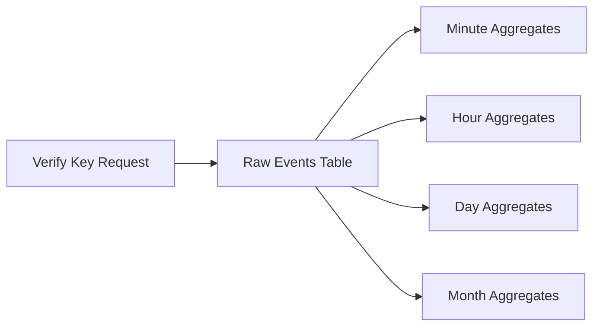

<Warning>
  **Analytics is currently in private beta and opt-in only.**

  To request access, please email us at [support@unkey.dev](mailto:support@unkey.dev) with your workspace ID.
</Warning>

## What is Unkey Analytics?

Unkey Analytics provides a powerful SQL interface to query your API key verification data. Instead of building your own analytics pipeline, you can leverage Unkey's built-in data warehouse to:

- **Build custom dashboards** for internal teams or end-users
- **Power usage-based billing** by querying verification counts per user/organization
- **Generate reports** on API usage patterns, top users, and performance metrics
- **Monitor and alert** on verification outcomes, rate limits, and errors

## Why SQL?

We chose SQL because it's:
- **Universal** - developers already know it
- **Powerful** - complex aggregations, joins, and filters
- **Flexible** - adapt queries to your specific needs
- **Future-proof** - easily add new metrics without API changes

## How it Works

Every key verification request is automatically stored and aggregated across multiple time-series tables:



You can query these tables using standard SQL

## Quick Example

Get the total number of valid verifications in the last 7 days:

```sql
SELECT COUNT(*) as total_verifications
FROM key_verifications
WHERE outcome = 'VALID'
  AND time >= toUnixTimestamp64Milli(now() - INTERVAL 7 DAY)
```

This query is automatically rewritten to:
1. Add your workspace_id filter for security
2. Use the correct table name
3. Apply resource limits

## Available Data

Every verification event contains:

| Field | Type | Description |
|-------|------|-------------|
| `request_id` | String | Unique identifier for each request |
| `time` | Int64 | Unix millisecond timestamp |
| `workspace_id` | String | Your workspace identifier (automatically filtered) |
| `api_id` | String | Your API identifier (e.g., `api_1234`) |
| `external_id` | String | Your user's identifier (e.g., `user_abc`) |
| `key_id` | String | Individual key identifier |
| `outcome` | String | Verification result: `VALID`, `RATE_LIMITED`, `INVALID`, `EXPIRED`, `DISABLED`, `INSUFFICIENT_PERMISSIONS`, `FORBIDDEN`, `USAGE_EXCEEDED` |
| `region` | String | Geographic region of the request |
| `ip_address` | String | IP address of the requester |
| `user_agent` | String | User agent string |
| `tags` | Array(String) | Custom tags added during verification |

## Next Steps

<CardGroup cols={2}>
  <Card title="Getting Started" icon="rocket" href="/analytics/getting-started">
    Learn how to request access and execute your first query
  </Card>
  <Card title="Query Examples" icon="code" href="/analytics/query-examples">
    Explore common SQL patterns for analytics and billing
  </Card>
  <Card title="Schema Reference" icon="table" href="/analytics/schema-reference">
    Browse available tables, columns, and data types
  </Card>
  <Card title="Security" icon="shield" href="/analytics/security">
    Understand workspace isolation and query security
  </Card>
</CardGroup>
