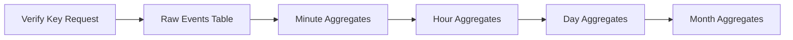

<Warning>
  **Analytics is currently in private beta and available by request only.**

See [Getting Started](/analytics/getting-started) for access instructions.

</Warning>

## What is Unkey Analytics?

Unkey Analytics provides a powerful SQL interface to query your API key verification data. Instead of building your own analytics pipeline, you can leverage Unkey's built-in data warehouse to:

- **Build custom dashboards** for internal teams or end-users
- **Power usage-based billing** by querying verification counts per user/organization
- **Generate reports** on API usage patterns, top users, and performance metrics
- **Monitor and alert** on verification outcomes, rate limits, and errors

## How it Works

Every key verification request is automatically stored and aggregated across multiple time-series tables:

You can query these tables using standard SQL to:

- Aggregate verification counts by time period
- Group by API, user, or outcome
- Filter by region, tags, or custom criteria
- Calculate metrics for billing or monitoring

## Available Data

Every verification event contains:

| Field           | Type          | Description                                                                                                                               |
| --------------- | ------------- | ----------------------------------------------------------------------------------------------------------------------------------------- |
| `request_id`    | String        | Unique identifier for each request                                                                                                        |
| `time`          | Int64         | Unix millisecond timestamp                                                                                                                |
| `workspace_id`  | String        | Your workspace identifier (automatically filtered)                                                                                        |
| `key_space_id`  | String        | Your KeySpace identifier (e.g., `ks_1234`). Find this in your API settings.                                                               |
| `external_id`   | String        | Your user's identifier (e.g., `user_abc`)                                                                                                 |
| `key_id`        | String        | Individual key identifier                                                                                                                 |
| `outcome`       | String        | Verification result: `VALID`, `RATE_LIMITED`, `INVALID`, `EXPIRED`, `DISABLED`, `INSUFFICIENT_PERMISSIONS`, `FORBIDDEN`, `USAGE_EXCEEDED` |
| `region`        | String        | Unkey region that handled the verification                                                                                                |
| `tags`          | Array(String) | Custom tags added during verification                                                                                                     |
| `spent_credits` | Int64         | Number of credits spent on this verification (0 if no credits were spent)                                                                 |

## Use Cases

<CardGroup cols={3}>
  <Card
    title="Billing Teams"
    icon="credit-card"
    href="/analytics/query-examples#billing-usage-based-pricing"
  >
    Usage-based billing and credit tracking
  </Card>
  <Card
    title="Monitoring "
    icon="chart-line"
    href="/analytics/query-examples#usage-analytics"
  >
    API health and performance monitoring
  </Card>
  <Card
    title="Product Teams"
    icon="users"
    href="/analytics/query-examples#usage-by-user"
  >
    User behavior and engagement insights
  </Card>
</CardGroup>
