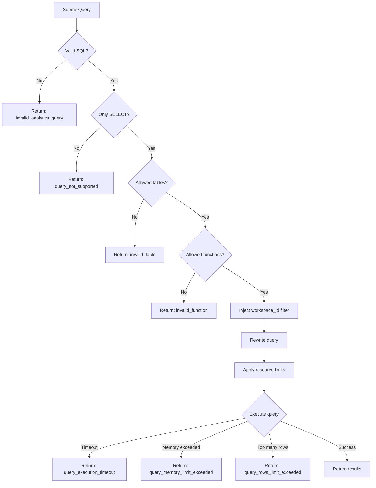

Unkey Analytics is designed with security-first principles to ensure your data remains isolated and protected. This page explains the security controls and query restrictions.

## Workspace Isolation

Every query is automatically scoped to your workspace. You can only access data that belongs to your workspace.

### Automatic Filtering

When you execute a query, Unkey automatically injects a `workspace_id` filter to ensure you can only access your own data.

### Injection Protection

Even if you try to bypass workspace filtering, it's impossible. Any attempt to access another workspace's data will return empty results.

## Query Restrictions

### Only SELECT Allowed

Only `SELECT` queries are permitted. All other SQL statement types return a `query_not_supported` error.

**Allowed query patterns:**

- `SELECT` statements
- `WITH` (Common Table Expressions)
- `UNION`
- Subqueries
- Joins
- Aggregations
- Window functions

**Not allowed:** `INSERT`, `UPDATE`, `DELETE`, `DROP`, `ALTER`, `CREATE`, `TRUNCATE`, `GRANT`, `REVOKE`

### Table Access Control

Only explicitly allowed analytics tables are accessible. Any attempt to access tables not on the allow list (including `system.*` or `information_schema.*`) will return an `invalid_table` error.

### Function Allow List

Only explicitly approved functions are allowed. Any function not on this list will be rejected with an `invalid_function` error.

#### Allowed Functions

<AccordionGroup>

<Accordion title="Aggregates">
`count`, `sum`, `avg`, `min`, `max`, `any`, `groupArray`, `groupUniqArray`, `uniq`, `uniqExact`, `quantile`, `countIf`
</Accordion>

<Accordion title="Date/Time">
`now`, `now64`, `today`, `toDate`, `toDateTime`, `toDateTime64`, `toStartOfDay`, `toStartOfWeek`, `toStartOfMonth`, `toStartOfYear`, `toStartOfHour`, `toStartOfMinute`, `date_trunc`, `formatDateTime`, `fromUnixTimestamp64Milli`, `toUnixTimestamp64Milli`, `toIntervalDay`, `toIntervalWeek`, `toIntervalMonth`, `toIntervalYear`, `toIntervalHour`, `toIntervalMinute`, `toIntervalSecond`
</Accordion>

<Accordion title="String">
`lower`, `upper`, `substring`, `concat`, `length`, `trim`, `startsWith`, `endsWith`
</Accordion>

<Accordion title="Math">
`round`, `floor`, `ceil`, `abs`
</Accordion>

<Accordion title="Conditional">
`if`, `case`, `coalesce`
</Accordion>

<Accordion title="Type Conversion">
`toString`, `toInt32`, `toInt64`, `toFloat64`
</Accordion>

<Accordion title="Array">
`has`, `hasAny`, `hasAll`, `arrayJoin`, `arrayFilter`, `length`
</Accordion>

</AccordionGroup>

<Note>
  If you need a function that's not listed, please contact us at
  [support@unkey.dev](mailto:support@unkey.dev) and we'll review it for
  inclusion.
</Note>

## Using Friendly IDs

You can use familiar identifiers directly in your queries:

- **`key_space_id`** - The identifier for your API (e.g., `ks_1234`). Find this in your API settings.
- **`external_id`** - Your own user identifiers (e.g., `user_abc123`) from your application

Unkey automatically handles the internal mapping securely. All comparison operators are supported: `=`, `!=`, `<`, `>`, `<=`, `>=`, `IN`, `NOT IN`

## Resource Limits

To ensure fair usage and prevent abuse, queries are subject to resource limits:

### Execution Limits

| Resource                        | Limit                 | Purpose                       |
| ------------------------------- | --------------------- | ----------------------------- |
| Max execution time              | 30 seconds            | Prevent long-running queries  |
| Max execution time (per window) | 1800 seconds (30 min) | Total execution time per hour |
| Max memory usage                | 1 GB                  | Prevent memory exhaustion     |
| Max rows to read                | 10 million            | Limit data scanned            |
| Max result rows                 | 10 million            | Limit result set size         |

### Query Quotas

| Quota                 | Limit | Window   |
| --------------------- | ----- | -------- |
| Queries per workspace | 1000  | Per hour |

<Note>
  If you need higher limits for your use case, please contact us at
  [support@unkey.dev](mailto:support@unkey.dev).
</Note>

### Error Codes

When limits are exceeded, you'll receive specific error codes:

| Error Code                         | Description                       | Solution                                                   |
| ---------------------------------- | --------------------------------- | ---------------------------------------------------------- |
| `query_execution_timeout`          | Query took longer than 30 seconds | Add more filters, reduce time range, use aggregated tables |
| `query_memory_limit_exceeded`      | Query used more than 1GB memory   | Reduce result set size, add LIMIT clause, use aggregation  |
| `query_rows_limit_exceeded`        | Query scanned more than 10M rows  | Add time filters, use aggregated tables (hour/day/month)   |
| `query_result_rows_limit_exceeded` | Query returned more than 10M rows | Add LIMIT clause, aggregate data                           |
| `query_quota_exceeded`             | Exceeded 1000 queries per hour    | Wait for quota to reset, optimize query frequency          |

## Table Access Control

Access is restricted to an allow list of approved analytics tables only. Any table not on this list will return an `invalid_table` error.

### Allowed Tables

- `default.key_verifications_raw_v2` (alias: `key_verifications_v1`)
- `default.key_verifications_per_minute_v2` (alias: `key_verifications_per_minute_v1`)
- `default.key_verifications_per_hour_v2` (alias: `key_verifications_per_hour_v1`)
- `default.key_verifications_per_day_v2` (alias: `key_verifications_per_day_v1`)
- `default.key_verifications_per_month_v2` (alias: `key_verifications_per_month_v1`)

All other tables (including system tables, information schema, and internal tables) are not accessible.

## Authentication

Analytics queries require a root key with specific permissions:

### Required Permissions

You need to grant analytics access for per API or for all APIs:

**Workspace-level access** (all APIs):

```
api.*.read_analytics
```

**Per-API access** (specific API):

```
api.<api_id>.read_analytics
```

Choose workspace-level for broad access or per-API for fine-grained control.

### Best Practices

1. **Use environment variables** - Never hardcode root keys
2. **Rotate keys regularly** - Create new keys and revoke old ones
3. **Limit permissions** - Only grant `read_analytics` permission
4. **Use separate keys** - Different keys for different services
5. **Monitor usage** - Track which keys are making queries

### Creating an Analytics Root Key

1. Go to **Settings** → **Root Keys** in the Unkey dashboard
2. Click **Create New Root Key**
3. Name it (e.g., "Analytics API Key")
4. Select permission: `api.*.read_analytics` or `api.<api_id>.read_analytics`
5. Copy and store securely

## Query Validation Flow

When you submit a query, Unkey performs these security checks:



## Best Practices

To optimize query performance and avoid hitting resource limits:

1. **Filter by time** - Always include time-based filters to reduce data scanned
2. **Use aggregated tables** - Query hourly/daily/monthly tables for longer time ranges
3. **Add LIMIT clauses** - Prevent large result sets

## Next Steps

<CardGroup cols={2}>
  <Card title="Query Examples" icon="code" href="/analytics/query-examples">
    See secure query patterns in action
  </Card>
  <Card
    title="Schema Reference"
    icon="table"
    href="/analytics/schema-reference"
  >
    Browse available tables and columns
  </Card>
  <Card title="Error Codes" icon="triangle-exclamation" href="/errors/overview">
    View all error codes and responses
  </Card>
</CardGroup>
