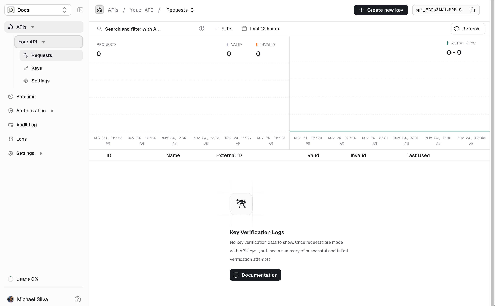
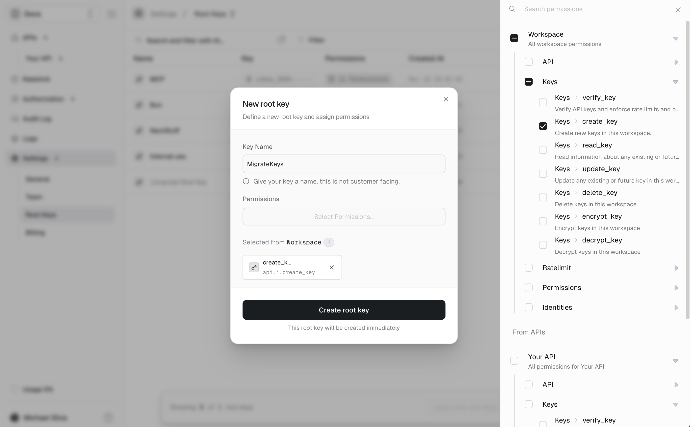

## Prerequisites

- Created your [Unkey account](https://app.unkey.com/auth/sign-up).
- Create a `Workspace` and `API`. Save the `workspaceId` and `apiId` for later use.
  - The workspaceId can be found in the upper right corner after navigating to `Settings/General` in the side menu.
    <Frame>
    
    </Frame>
  - The apiId can be found in the upper right corner after navigating to `APIs/<Your API>` in the side menu.
    <Frame>
    
    </Frame>
- Create a `Root Key` under the Settings menu. It will need the `api.*.create_key` permission or `api.<api_id>.create_key` to migrate to a specific API.
    <Frame>
    
    </Frame>
- Email us to get a `migrationId` at [support@unkey.dev](mailto:support@unkey.dev) with:
  - Your workspace ID.
  - What service the keys will be migrated from.
  
Extracting keys from your current system is likely the hardest part. It depends on how your keys are stored and how you can access them.
Some providers have APIs to list all keys, while others require you to manually export them.

You will need to provide the hash of your keys, as well as other settings to Unkey via the [keys.migrateKeys](/api-reference/v2/keys/migrate-api-keys) endpoint.


## Node.js Example

```js
const { createHash } = require("node:crypto")

function hash(key) {
  return {
    value: createHash("sha256").update(key).digest("base64"),
    variant: "sha256_base64",
  }
}

const request = {
  migrationId: "<UNKEY_MIGRATION_ID>", // the id of the migration you created
  apiId: "<UNKEY_API_ID>", // the id of the API you created
  keys: [
    {
      hash: hash("my-secret-key"),
      //... other settings
    },
    {
      hash: hash("my-other-secret-key"),
      //... other settings
    },
  ]
}

fetch("https://api.unkey.com/v2/keys.migrateKeys", {
  method: "POST",
  headers: {
    "Content-Type": "application/json",
    Authorization: "Bearer <UNKEY_ROOT_KEY>",
  },
  body: JSON.stringify(request)
})
.then(res => res.json())
.then(res => {
  console.log("Migrated keys:", res.data.migrated)
  console.log("Failed hashes:", res.data.failed)
})
```


## Response

The endpoint returns a list of successfully migrated keys and any failed hashes:

```json
{
  "meta": {
    "requestId": "req_123"
  },
  "data": {
    "migrated": [
      {
        "hash": "abc123...",
        "keyId": "key_123"
      }
    ],
    "failed": []
  }
}
```

Failed hashes indicate Hashes that could not be migrated (e.g., already exist in the system).
