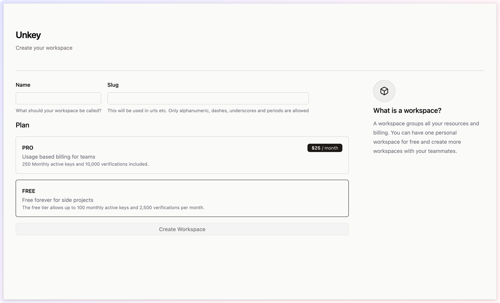
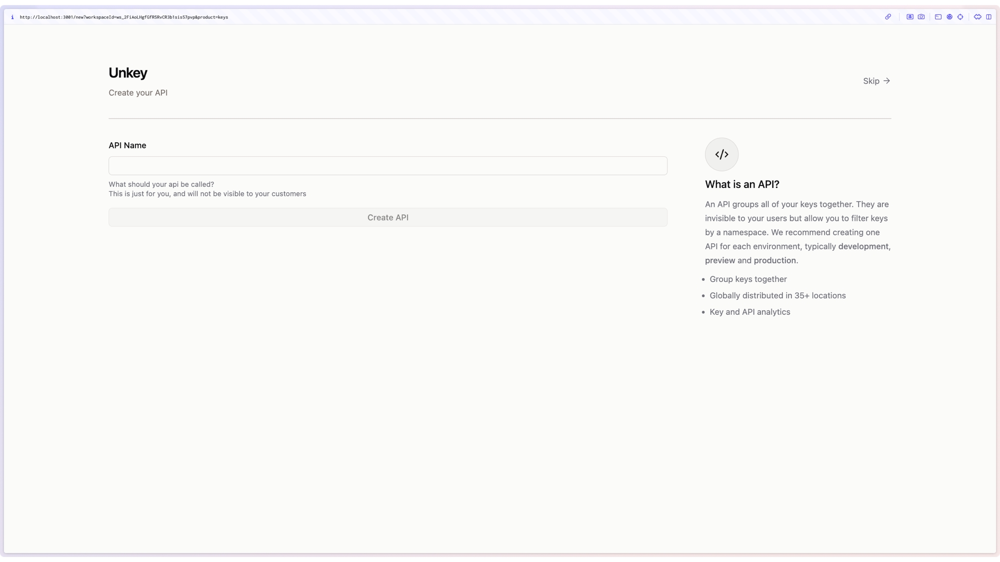

## 1. Create your Unkey account

The first step to using Unkey is to create an account. You can do this by visiting [unkey.dev](https://unkey.dev/app) or by clicking the Dashboard button in the top right of your screen.
<Frame caption="Create your account">
  
</Frame>

## 2. Create your first workspace

As soon as you create your account you will be asked to create your workspace. Give it a name, and a slug.

<Frame caption="Create your workspace">
  
</Frame>

## 3. Create your first API

Next we will get you to create your first API. This is the API that you will be protecting with Unkey. You can create as many APIs as you like, but for now we'll just create one.

<Frame caption="Create your API">
  
</Frame>

## 4. Follow the Unkey getting started guide

Next up we will walk you through the process of using Unkey to protect your API. Including creating your first key, and using it to make a request to verify it.

<Check>Congratulations, you have Unkey'd your API development</Check>

## 6. Next Steps

You should get to know our [API reference](/api-reference/authentication), as you can add additonal fields to your request when issuing a key.

You can also check out the [Features](/features/ratelimiting) section for more information on how to use Unkey.
