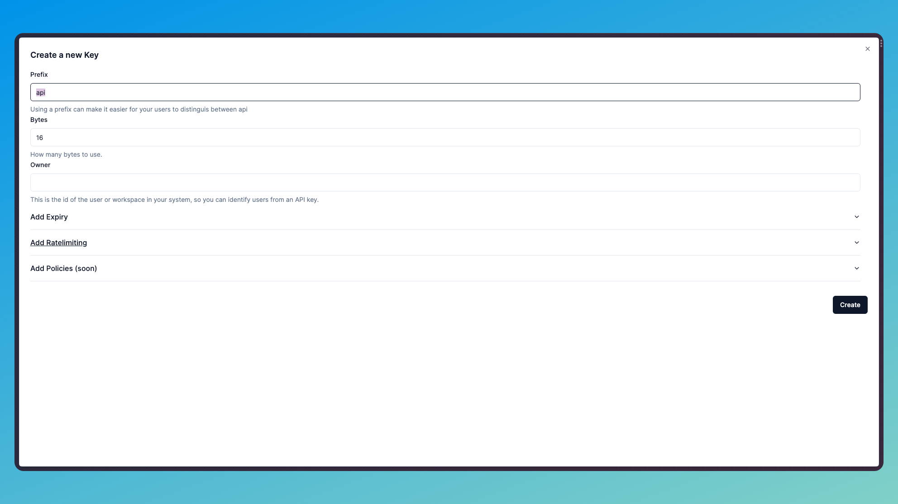

## 1. Create your Unkey account

The first step to using Unkey is to create an account. You can do this by visiting [unkey.dev](https://unkey.dev/app) or by clicking the Dashboard button in the top right of your screen.
<Frame caption="Create your account">
  
</Frame>

## 2. Create your first workspace

As soon as you create your account you will be asked to create your workspace. Give it a name, and a slug. Currently the name and slug cannot be changed, so choose wisely!

<Frame caption="Create your workspace">
  
</Frame>

## 3. Create a root API Key

A root API Key is a special API Key that allows you full read and write access to all current and future resources. It's important to keep this API Key safe, as it allows you to create, revoke, validate and delete API Keys.

Select "Keys" from the sidebar and click the "Create New Key" button.

<Frame caption="Create your root API Key">
  
  </Frame>

Check out the [API Reference](/api-reference/authentication) for more information on how to use your root API Key.

## 3. Create your first API

Now you are ready to create your first API. Select APIs from the left hand menu and click the Create API button.

<Frame caption="Create your API">
  
</Frame>

Give it a name, don't worry the name isn't visible to your users, it's just for you to keep track of your APIs.

## 4. Create your first API Key

Now that you have your API created, you can create your first API Key. Select Create Keys from the top right of the screen. You can create as many keys as you like, but for now we'll just create one.

When you select Create Keys, you'll be asked to enter a prefix for your API Key. This is the part of the API Key that is visible to your users. For example, if you enter `unkey` as your prefix, your users will see API Keys that look like this: `unkey_xxx`.

You will also be asked how many bytes you want to use for your API Key. The more bytes you use, the more secure your API Key will be. We recommend using at least 16 bytes.

Finally the last required field is Owner, this is an id of your tenant or user in your system. This allows you to both identify the owner of the API Key, and also to validate the API Key when it is used.

<Frame caption="Create your API Key">
  
</Frame>

## 5. Verify your API Key

Now you have a working API key for your users to use. You can verify your API Key by using the following cURL command:

```bash
curl --request POST \
  --url https://api.unkey.dev/v1/keys/verify \
  --header 'Content-Type: application/json' \
  --data '{
	"key":"xyz_AS5HDkXXPot2MMoPHD8jnL"
}'
```

You should get a response that looks like this:

```json
{
	"valid": true,
	"ownerId": "unkey-james",
}
```
Using the response you can now identify the owner of the API Key, and also validate that the API Key is valid.

<Check>Congratulations, you have Unkey'd your API development</Check>

## 6. Next Steps

You should get to know our [API reference](/api-reference/authentication), as you can add additonal fields to your request when issuing a key.

You can also check out the [Features](/features/ratelimiting) section for more information on how to use Unkey.
