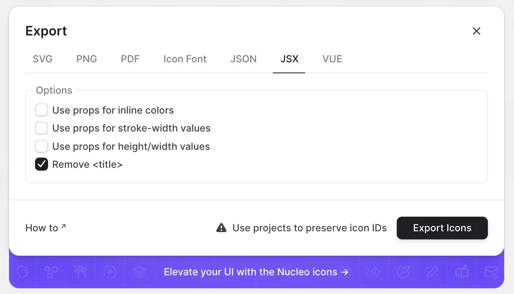

import { RenderComponentWithSnippet } from "@/app/components/render";
import { Row } from "@/app/components/row";

import { Icon } from "@/app/components/icon-swatch";
import { TypeTable } from 'fumadocs-ui/components/type-table';
import { Step, Steps } from 'fumadocs-ui/components/steps';

import {Bolt,BookBookmark,Check,ChevronExpandY,Nodes,ShieldCheck,Sparkle3,TaskChecked, TaskUnchecked   } from "@unkey/icons"


<Callout type="warn">
  **Nucleo icons is a paid product.**

  Unkey owns a license to use up to 100 icons in our open source application.

  See [https://nucleoapp.com/license](https://nucleoapp.com/license).

</Callout>


<TypeTable
  type={{
    className: {
      description:
        'A className applied to the icon to override the styling in edge cases. In most cases you should not change the size of the icon.',
      type: 'string | undefiend',
      default: undefined
    },
  }}
/>


## Customize

As a rule of thumb, you should only customize the color, but there's always an edge case.

<RenderComponentWithSnippet customCodeSnippet={`<Row>
    <Nodes className="text-error-9"/>
    <Sparkle3 className="text-warning-9 size-16"/>
    <TaskUnchecked className="size-[12px]"/>
</Row>`}>
<Row>
  <Nodes className="text-error-9"/>
  <Sparkle3 className="text-warning-9 size-16"/>
  <TaskUnchecked className="size-[12px]"/>
</Row>
</RenderComponentWithSnippet>
## Icons

These are all the icons available to import.
```tsx
import { IconName } from "@unkey/icons"
```

<div className="grid grid-cols-1 md:grid-cols-2 lg:grid-cols-3 xl:grid-cols-4 gap-8">

<Icon  name="Bolt"><Bolt/></Icon>
<Icon  name="BookBookmark"><BookBookmark/></Icon>
<Icon  name="Check"><Check/></Icon>
<Icon  name="ChevronExpandY"><ChevronExpandY/></Icon>
<Icon  name="Nodes"><Nodes/></Icon>
<Icon  name="ShieldCheck"><ShieldCheck/></Icon>
<Icon  name="Sparkle3"><Sparkle3/></Icon>
<Icon  name="TaskUnchecked"><TaskUnchecked/></Icon>
<Icon  name="TaskChecked"><TaskChecked/></Icon>
</div>


## Importing Icons

Importing icons is a manual process.
<Steps>

<Step>
  Open the icon in the `Nucleo UI Essential` collection and select the icon(s) you want to export.
</Step>
<Step>
  Export it as `jsx`, and remove the title.
  
</Step>

<Step>
  Update the code to match our guidelines.

<Steps>
  <Step>
    Rename the file to `.tsx`
  </Step>
  <Step>
    Replace the function syntax with: `export const INSERT_ICON_NAME: React.FC<IconProps> = (props) => {`
  </Step>
  <Step>
    Remove the default export
  </Step>
  <Step>
    Update all color references to `currentColor`
  </Step>
  <Step>
    Add `{...props}` to the root `svg` element.
  </Step>
  <Step>
    Export it in the `/internal/icons/src/index.ts` barrel file.
  </Step>
  <Step>
    Import and add it in in this file under [#icons](/design/icons#icons) in alphabetic order.
  </Step>
</Steps>

</Step>


</Steps>
