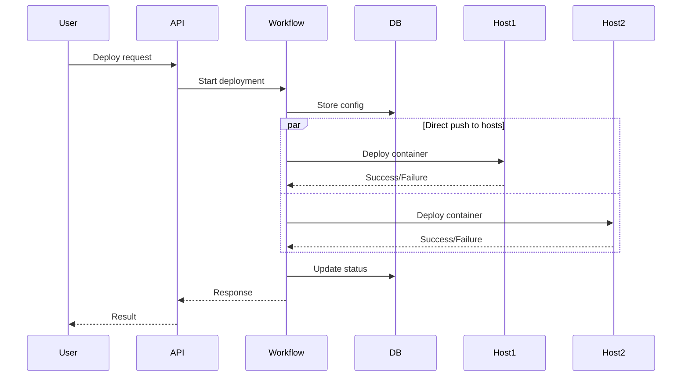
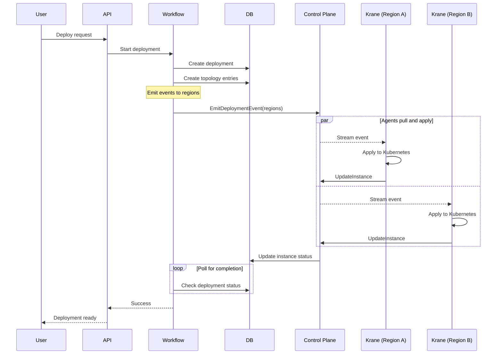
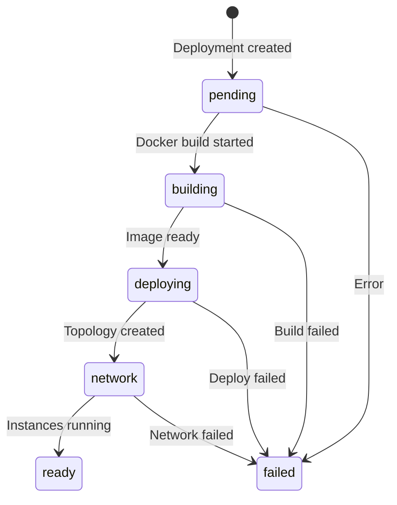
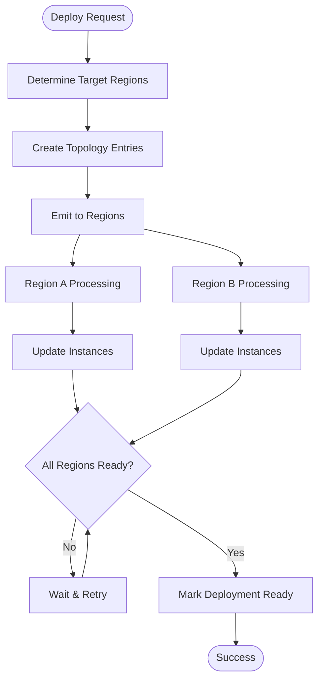
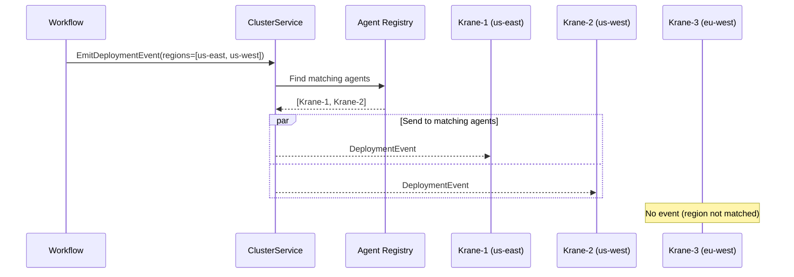
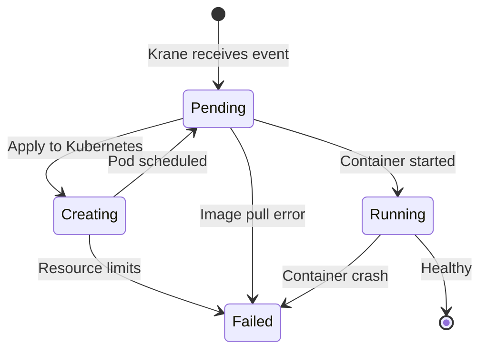
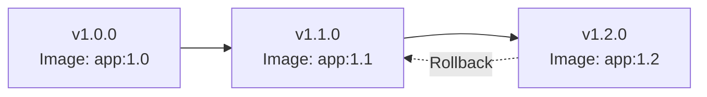
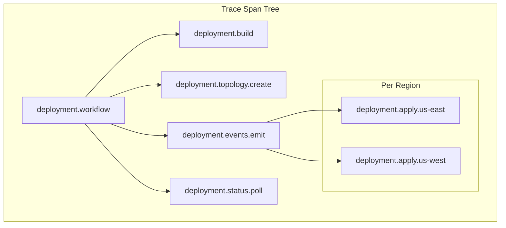
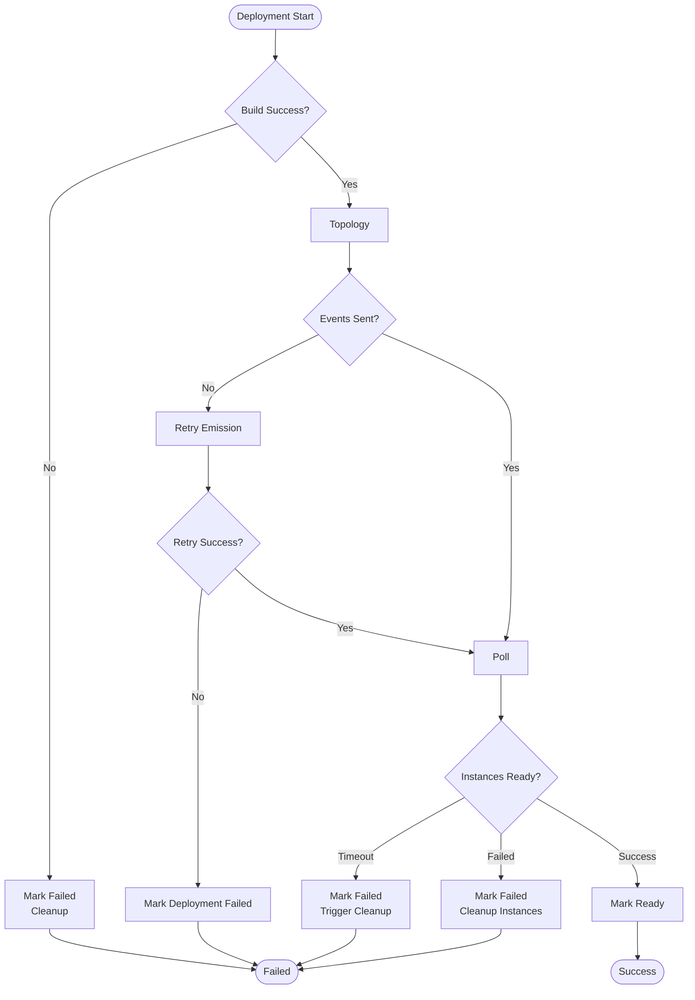
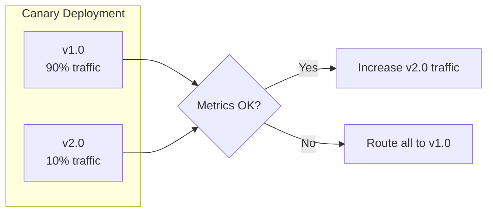

# Deployment Workflow - Pull-Based Architecture

## Overview

The deployment workflow has been redesigned to work with the pull-based infrastructure model. Instead of the control plane directly pushing to hosts, it now creates deployment topology entries and emits events that are pulled by Krane agents in each region.

## Architecture Changes

### Previous Push-Based Workflow



### New Pull-Based Workflow



## Database Schema

### Deployment Topology

The new `deployment_topology` table tracks regional deployment distribution:

```sql
CREATE TABLE deployment_topology (
    workspace_id VARCHAR(256) NOT NULL,
    deployment_id VARCHAR(256) NOT NULL,
    region VARCHAR(256) NOT NULL,
    replicas INT NOT NULL,
    status ENUM('starting','started','stopping','stopped') NOT NULL,
    created_at BIGINT NOT NULL,
    updated_at BIGINT,
    PRIMARY KEY (deployment_id, region)
);
```

### Deployment Status Tracking



## Workflow Implementation

### Deploy Handler

The deploy handler in `go/apps/ctrl/workflows/deploy/deploy_handler.go`:

```go
func (w *Workflow) Deploy(ctx restate.ObjectContext, req *hydrav1.DeployRequest) (*hydrav1.DeployResponse, error) {
    // 1. Find deployment and validate
    deployment, err := restate.Run(ctx, func(stepCtx restate.RunContext) (db.Deployment, error) {
        return db.Query.FindDeploymentById(stepCtx, w.db.RW(), req.GetDeploymentId())
    })
    
    // 2. Build Docker image if needed
    if req.GetBuildContextPath() != "" {
        dockerImage = w.buildImage(ctx, req)
    }
    
    // 3. Create deployment topology for target regions
    regions := w.determineTargetRegions(deployment)
    for _, region := range regions {
        err := restate.Run(ctx, func(stepCtx restate.RunContext) error {
            return db.Query.InsertDeploymentTopology(stepCtx, w.db.RW(), db.InsertDeploymentTopologyParams{
                DeploymentID: deployment.ID,
                Region:       region,
                Replicas:     deployment.Replicas,
                Status:       db.DeploymentTopologyStatusStarting,
            })
        })
    }
    
    // 4. Emit deployment events to regions
    w.cluster.EmitDeploymentEvent(&ctrlv1.DeploymentEvent{
        Action: ctrlv1.DeploymentEvent_ACTION_APPLY,
        Deployment: &ctrlv1.Deployment{
            Id:           deployment.ID,
            Image:        dockerImage,
            CpuMillicores: deployment.CpuMillicores,
            MemoryMib:    deployment.MemoryMib,
        },
    }, regions)
    
    // 5. Poll for deployment completion
    return w.pollDeploymentStatus(ctx, deployment.ID)
}
```

### Topology Management



### Status Polling

The workflow polls for deployment completion:

```go
func (w *Workflow) pollDeploymentStatus(ctx restate.ObjectContext, deploymentID string) (*hydrav1.DeployResponse, error) {
    maxAttempts := 300 // 5 minutes with 1s intervals
    
    for attempt := 0; attempt < maxAttempts; attempt++ {
        status, err := restate.Run(ctx, func(stepCtx restate.RunContext) (DeploymentStatus, error) {
            // Check topology status
            topology, err := db.Query.ListDeploymentTopology(stepCtx, w.db.RO(), deploymentID)
            if err != nil {
                return DeploymentStatus{}, err
            }
            
            // Check instance status
            instances, err := db.Query.FindInstancesByDeploymentId(stepCtx, w.db.RO(), deploymentID)
            if err != nil {
                return DeploymentStatus{}, err
            }
            
            return w.calculateDeploymentStatus(topology, instances)
        })
        
        switch status.State {
        case "ready":
            return &hydrav1.DeployResponse{Success: true}, nil
        case "failed":
            return nil, fmt.Errorf("deployment failed: %s", status.Message)
        case "pending", "deploying":
            // Continue polling
            restate.Sleep(ctx, time.Second)
        }
    }
    
    return nil, fmt.Errorf("deployment timeout after %d attempts", maxAttempts)
}
```

## Event Flow

### Deployment Event Structure

```proto
message DeploymentEvent {
    enum Action {
        ACTION_UNSPECIFIED = 0;
        ACTION_APPLY = 1;
        ACTION_DELETE = 2;
    }
    
    Action action = 1;
    Deployment deployment = 2;
}

message Deployment {
    string id = 1;
    string workspace_id = 2;
    string project_id = 3;
    string environment_id = 4;
    string image = 5;
    int32 cpu_millicores = 6;
    int32 memory_mib = 7;
    int32 replicas = 8;
    map<string, string> env_vars = 9;
}
```

### Event Emission



## Instance Lifecycle

### Instance Creation Flow



### Instance Status Updates

```go
func (k *KraneAgent) handlePodEvent(pod *v1.Pod) {
    status := k.podStatusToInstanceStatus(pod.Status)
    
    update := &ctrlv1.UpdateInstanceRequest{
        Change: &ctrlv1.UpdateInstanceRequest_Create{
            Create: &ctrlv1.UpdateInstanceRequest_Create{
                DeploymentId:  pod.Labels["deployment-id"],
                PodName:       pod.Name,
                Address:       pod.Status.PodIP,
                CpuMillicores: pod.Spec.Containers[0].Resources.Requests.Cpu().MilliValue(),
                MemoryMib:     pod.Spec.Containers[0].Resources.Requests.Memory().Value() / (1024 * 1024),
                Status:        status,
            },
        },
    }
    
    k.syncEngine.InstanceUpdateBuffer.Put(update)
}
```

## Rollback Mechanism

### Version Tracking

Each deployment maintains version history:



### Rollback Workflow

```go
func (w *Workflow) Rollback(ctx restate.ObjectContext, req *hydrav1.RollbackRequest) error {
    // 1. Find target version
    targetDeployment, err := db.Query.FindDeploymentByVersion(ctx, req.Version)
    
    // 2. Create new deployment with old config
    newDeployment := targetDeployment
    newDeployment.ID = uid.New("dep")
    newDeployment.CreatedAt = time.Now()
    
    // 3. Trigger deployment with old image
    return w.Deploy(ctx, &hydrav1.DeployRequest{
        DeploymentId: newDeployment.ID,
    })
}
```

## Monitoring and Observability

### Key Metrics

```yaml
# Workflow metrics
deployment_workflow_duration_seconds: histogram
deployment_workflow_status: counter
deployment_build_duration_seconds: histogram
deployment_polling_attempts: histogram

# Topology metrics
deployment_topology_regions: gauge
deployment_topology_status: gauge

# Instance metrics
deployment_instances_total: gauge
deployment_instances_by_status: gauge
deployment_instance_startup_time_seconds: histogram
```

### Deployment Tracing



## Error Handling

### Failure Scenarios



### Cleanup on Failure

```go
func (w *Workflow) cleanupFailedDeployment(ctx context.Context, deploymentID string) error {
    // 1. Emit delete events to all regions
    topology, err := db.Query.ListDeploymentTopology(ctx, w.db.RO(), deploymentID)
    if err != nil {
        return err
    }
    
    for _, entry := range topology {
        w.cluster.EmitDeploymentEvent(&ctrlv1.DeploymentEvent{
            Action: ctrlv1.DeploymentEvent_ACTION_DELETE,
            Deployment: &ctrlv1.Deployment{
                Id: deploymentID,
            },
        }, []string{entry.Region})
    }
    
    // 2. Mark topology as stopped
    for _, entry := range topology {
        db.Query.UpdateDeploymentTopologyStatus(ctx, w.db.RW(), 
            deploymentID, entry.Region, db.DeploymentTopologyStatusStopped)
    }
    
    // 3. Delete instance records
    return db.Query.DeleteInstancesByDeploymentId(ctx, w.db.RW(), deploymentID)
}
```

## Configuration

### Deployment Parameters

```yaml
# Default deployment configuration
deployment:
  defaultReplicas: 2
  defaultCpuMillicores: 500
  defaultMemoryMib: 512
  
  polling:
    interval: 1s
    maxAttempts: 300  # 5 minutes
  
  regions:
    - us-east-1
    - us-west-2
    - eu-west-1
```

### Feature Flags

```go
type DeploymentFeatures struct {
    MultiRegion         bool
    AutoScaling         bool
    BlueGreenDeployment bool
    CanaryRollout       bool
}

func (w *Workflow) getFeatures(workspaceID string) DeploymentFeatures {
    // Check workspace tier and enabled features
    return DeploymentFeatures{
        MultiRegion: w.isFeatureEnabled(workspaceID, "multi_region"),
        // ...
    }
}
```

## Future Enhancements

### Progressive Rollout



### Multi-Version Support

Support for running multiple versions simultaneously:

```go
type DeploymentStrategy struct {
    Type string // "rolling", "blue-green", "canary"
    Config map[string]interface{}
}

func (w *Workflow) deployWithStrategy(
    ctx context.Context, 
    deployment *Deployment,
    strategy DeploymentStrategy,
) error {
    switch strategy.Type {
    case "canary":
        return w.deployCanary(ctx, deployment, strategy.Config)
    case "blue-green":
        return w.deployBlueGreen(ctx, deployment, strategy.Config)
    default:
        return w.deployRolling(ctx, deployment)
    }
}
```