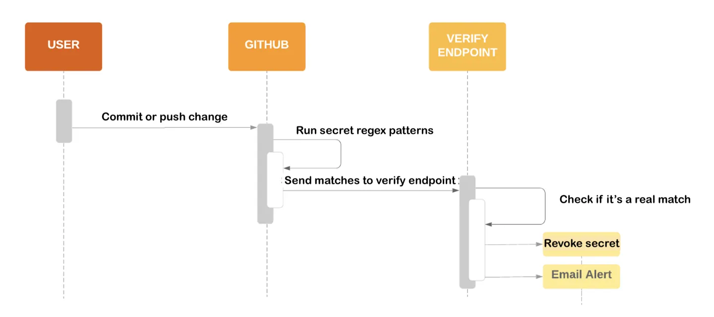

## Changelog

- Unkey now offers automated alerts when root keys are checked in to Github.
    - Unkey has partnered with Github to offer secret scanning for root keys.
    - Root keys all take the shape `unkey_xxx`. Whenever you check in code to a public Github repository, Github will scan for this pattern and notify us.
    - Unkey will automatically invalidate the key, notify you that this has taken place, and ask you to generate a new key to replace it.
    - Currently, this is only offered for root keys – not for API keys that you generate in Unkey for your users. Stay tuned as we look to expand our partnership with Github in future.

## Context

Github offer a secret scanning program. Whenever code is checked in to a public repository, Github will scan the code for secrets that match a list of patterns published by official Github partners. If they detect that a secret matches that pattern, they notify the partner. The provider validates the string and decides if they should revoke the secret, issue a new secret, or contact the customer that published the secret.



*Example flow*

Unkey has registered as a partner with Github, meaning that we can enable this protection for our customers’ root keys. Currently we can’t offer the same protection to non-root keys:

- This is against Github’s term of service since Unkey does not own the infra that the API key belongs to ([source: Slack thread](https://unkey.slack.com/archives/C05SYU6P2DC/p1707492833527049)). This will change once Unkey offer a gateway product, which is why Zuplo are already able to offer this.
- Currently there is no identifier that marks an Unkey API key as having been created by Unkey. This could change in the future: [MRFC: Key shape](https://www.notion.so/MRFC-Key-shape-0dc89f8cfa60422a9830cfeff94efd47?pvs=21)

So only root keys are in scope for this RFC. However, we should avoid making assumptions that keys are root keys in our implementation to make future refactors easier.

## Implementation

### Steps

- [x]  Contact Github to register as a partner
- [x]  Identify the secrets we want to scan for, and create regular expressions to capture them
- [ ]  Create a secret alert service which accepts webhooks containing the secret scanning payload
- [ ]  Implement signature verification in the secret scanning service
- [ ]  Implement secret revocation and user notification in the secret scanning service

### Secret identification

As per above, only root keys are in scope for now.

```json
{
	"name" : "Unkey",
	"regex": "unkey_[a-zA-Z0-9]+$",
	"webhook_endpoint": "https://secrets.unkey.dev/api/v1/github_secrets"
}
```

### Create secret alert service and implement signature verification

The secret alert service will receive payloads from Github with the following shape:

```jsx
[
  {
    "token":"NMIfyYncKcRALEXAMPLE",
    "type":"mycompany_api_token",
    "url":"https://github.com/octocat/Hello-World/blob/12345600b9cbe38a219f39a9941c9319b600c002/foo/bar.txt",
    "source":"content" // where it was found on Github: code, PR title, etc
  }
]
```

We should verify the signature of requests from Github:

```tsx

const crypto = require("crypto");
const GITHUB_KEYS_URI = 'https://api.github.com/meta/public_keys/secret_scanning';

async function verifySignature(payload: string, signature: string, keyID: string): Promise<void> {
  if (!payload) {
    throw new Error('Invalid payload');
  }
  if (!signature) {
    throw new Error('Invalid signature');
  }
  if (!keyID) {
    throw new Error('Invalid keyID');
  }

  const response = await fetch(GITHUB_KEYS_URI);
  const data = await response.json();
  const keys = data.public_keys;

  if (!(keys instanceof Array) || keys.length === 0) {
    throw new Error('No public keys found');
  }

  const publicKey = keys.find((k: { key_identifier: string }) => k.key_identifier === keyID) ?? null;
  if (!publicKey) {
    throw new Error('No public key found matching key identifier');
  }

  const verifier = crypto.createVerify('SHA256').update(payload);
  if (!verifier.verify(publicKey.key, Buffer.from(signature, 'base64'))) {
    throw new Error('Signature does not match payload');
  }
}
```

Sample POST request from Github:

```tsx
POST / HTTP/2
Host: HOST
Accept: */*
Content-Length: 104
Content-Type: application/json
Github-Public-Key-Identifier: bcb53661c06b4728e59d897fb6165d5c9cda0fd9cdf9d09ead458168deb7518c
Github-Public-Key-Signature: MEQCIQDaMKqrGnE27S0kgMrEK0eYBmyG0LeZismAEz/BgZyt7AIfXt9fErtRS4XaeSt/AO1RtBY66YcAdjxji410VQV4xg==

[{"source":"commit","token":"some_token","type":"some_type","url":"https://example.com/base-repo-url/"}]
```

### Implement key revocation and user notification in the service

```tsx
// /api/v1/github_secrets.ts

export async function handler(request: Request) {
	try {
		const payload = await extractPayload(request);
		log("Github secret scanning webhook", payload);
		await verifySignature(payload);
		const hash = await hash(payload.token);
		const user = await getUserByKeyHash(hash);
		const team = await getTeam(user);
		await deleteKey(hash);
		await notifyTeam(team);
		log("User automatic key revocation event", user);
	} catch (error) {
		log("Github webhook verification error", error)
	}
}
```

## Questions

- Should this run in a [trigger.dev](http://trigger.dev) background job? Github say that it needs to be able to “handle requests with a large number of matches without timing out”
