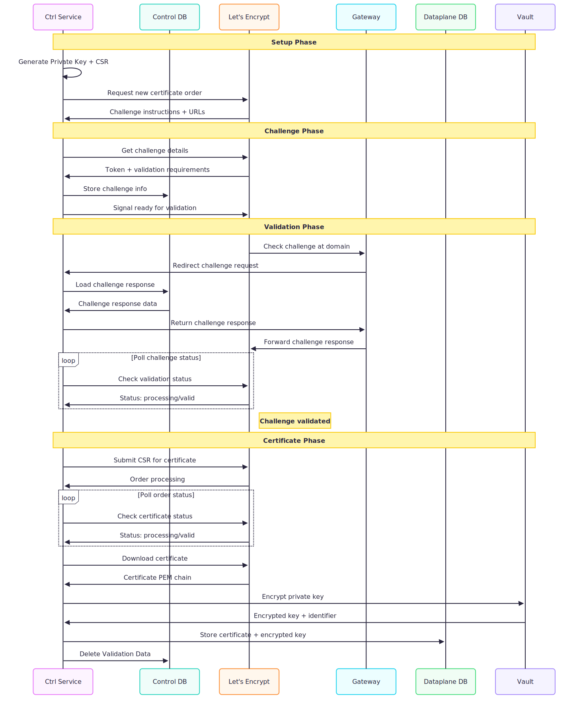
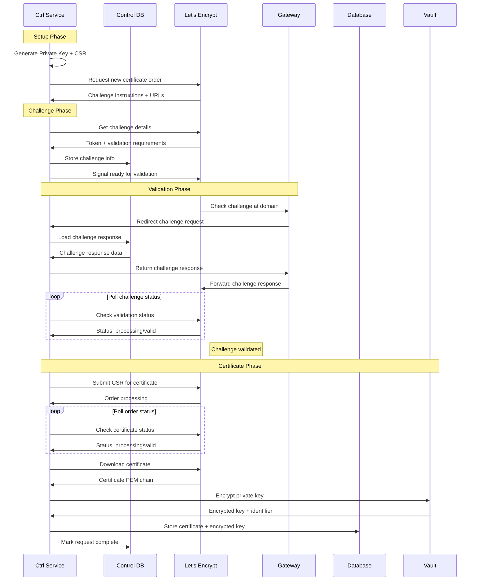

## What is Let's Encrypt?

Let's Encrypt is a free, automated Certificate Authority (CA) that provides SSL certificates to enable HTTPS on websites. Unlike traditional CAs that require manual processes and fees, Let's Encrypt uses an automated protocol called ACME (Automatic Certificate Management Environment) to verify domain ownership and issue certificates programmatically.

## Why Do We Need Domain Validation?

Before issuing an SSL certificate, Let's Encrypt must verify that you actually control the domain you're requesting a certificate for. This prevents malicious actors from getting certificates for domains they don't own. Let's Encrypt offers several challenge types to prove domain control - we use the HTTP-01 challenge.

## How HTTP-01 Challenge Works

The HTTP-01 challenge is simple but effective:

1. **You request a certificate** for `example.com`
2. **Let's Encrypt gives you a unique token** like `abc123`
3. **You must serve a specific response** at `http://example.com/.well-known/acme-challenge/abc123`
4. **Let's Encrypt checks that URL** and verifies you can control what's served there
5. **If verification succeeds**, Let's Encrypt issues your certificate

This proves you control the domain because only someone with access to the web server can serve content at that specific path.

## Our Architecture Approach

We chose HTTP-01 challenges because they provide the best user experience. Customers only need to add a single CNAME record pointing their domain to us. We handle all the certificate complexity behind the scenes.

### System Components

Our SSL certificate management system has several key components:

**Ctrl Service (Control Plane)**
- Communicates with Let's Encrypt using the ACME protocol
- Generates private keys and certificate signing requests
- Manages certificate lifecycle (issuance and renewal)
- Runs a validation server to respond to HTTP-01 challenges

**Per-Tenant Gateways (Dataplane)**
- Each tenant/environment has dedicated gateway instances
- Handle incoming HTTPS traffic using certificates
- Redirect challenge requests to the ctrl service validation server
- Completely independent of control plane for serving user traffic

**Database**
- Stores custom domains, certificate request tracking, challenge state, certificates and encrypted private keys for runtime use

**Vault**
- Encrypts all private keys before database storage
- Provides secure key management and rotation

### Why This Architecture?

This separation ensures that customer HTTPS traffic continues working even if our control plane has issues. Only new certificate requests are affected by control plane outages - existing traffic keeps flowing normally. With per-tenant gateways, issues are isolated to individual tenants rather than affecting all customers.

## Database Design

The database design maintains strict separation between control plane operations and dataplane runtime requirements.

**Database (`unkey`):**
- `custom_domains` - Stores user-owned custom domains
- `ingress_routes` - Maps hostnames to deployments with sticky behavior
- `certificate_requests` - Tracks ACME workflow state and metadata for certificate provisioning and renewal
- `challenges` - Stores ACME challenge responses and metadata
- `certificates` - Production certificates and encrypted private keys for gateway TLS termination

The ctrl service uses the database for certificate request lifecycle management and ACME protocol state tracking, including storing challenge responses. Gateways query the same database for certificates during TLS handshakes and cache them in memory.

## Certificate Provisioning

Certificate provisioning involves coordination between multiple services and databases to complete the Let's Encrypt ACME workflow. The process begins with user requests and results in certificates available for gateway TLS termination.

### Certificate Request Process

When we need to get a certificate for a domain, here's what happens step by step:

#### 1. Initial Setup
- Our ctrl service generates a private key and certificate signing request (CSR)
- This happens entirely within our system - no external communication yet

#### 2. Starting the ACME Process
- We send a "new order" request to Let's Encrypt
- Let's Encrypt responds with challenge instructions and URLs we need later to complete the process

#### 3. Challenge Preparation
- We fetch the challenge details (like the token we need to serve)
- We generate and store the challenge response in our control database
- We tell Let's Encrypt we're ready to begin validation

#### 4. Domain Validation
- Let's Encrypt makes a request to `http://yourdomain.com/.well-known/acme-challenge/token`
- Our gateway redirects this request to our ctrl service
- Our ctrl service looks up the challenge response from our control database
- Our ctrl service responds with the correct challenge response
- Let's Encrypt verifies the response matches what they expect

#### 5. Certificate Issuance
- Once validation succeeds, we send our CSR to Let's Encrypt
- Let's Encrypt processes the request and generates the certificate
- We download the finished certificate

#### 6. Secure Storage
- We encrypt the private key using Vault
- We store both the certificate and encrypted private key in our dataplane database
- Gateways can now use this certificate for HTTPS traffic




### Technical Implementation Details

**IMPORTANT:**
These details are here to get a better understanding of what requests are necessary and what the payloads look like.
We may end up using a library to handle most of this implementation. But I had troubles understanding what actually happens without knowing the payloads.

Trust the [RFC 8555](https://tools.ietf.org/html/rfc8555) for details, not this document.

**1. New Order Response:**
When requesting a new certificate order, Let's Encrypt returns an order object with authorization URLs and finalization endpoint. Importantly, the response includes a `Location` header containing the order URL for subsequent polling:

```http
POST /acme/newOrder
→ 201 Created
Location: https://example.com/acme/order/TOlocE8rfgo

{
  "status": "pending",
  "expires": "2016-01-05T14:09:07.99Z",
  "notBefore": "2016-01-01T00:00:00Z",
  "notAfter": "2016-01-08T00:00:00Z",
  "identifiers": [
    { "type": "dns", "value": "www.example.org" },
    { "type": "dns", "value": "example.org" }
  ],
  "authorizations": [
    "https://example.com/acme/authz/PAniVnsZcis",
    "https://example.com/acme/authz/r4HqLzrSrpI"
  ],
  "finalize": "https://example.com/acme/order/TOlocE8rfgo/finalize"
}
```

The ctrl service must save the order URL from the `Location` header for later use in the certificate finalization phase.

**2. Authorization Fetching:**
The ctrl service must then fetch each authorization URL from the `authorizations` array to retrieve the challenge details:

```http
POST-as-GET https://example.com/acme/authz/PAniVnsZcis
```

This returns an authorization object containing the challenges:

```json
{
  "identifier": {"type": "dns", "value": "example.org"},
  "status": "pending",
  "challenges": [
    {
      "type": "http-01",
      "url": "https://acme-v02.api.letsencrypt.org/acme/chall/prV_B7yEyA4",
      "status": "pending",
      "token": "LoqXcYV8q5ONbJQxbmR7SCTNo3tiAXDfowyjxAjEuX0"
    }
  ]
}
```

**3. Ready for Validation:**
Once the ctrl service has stored the challenge details, it signals readiness by POSTing to the challenge URL with an empty JSON object as the JWS payload:

```http
POST https://acme-v02.api.letsencrypt.org/acme/chall/prV_B7yEyA4
Content-Type: application/jose+json

{
  "protected": base64url({
    "alg": "ES256",
    "kid": "https://example.com/acme/acct/evOfKhNU60wg",
    "nonce": "Q_s3MWoqT05TrdkM2MTDcw",
    "url": "https://acme-v02.api.letsencrypt.org/acme/chall/prV_B7yEyA4"
  }),
  "payload": base64url({}),  // Empty JSON object means "ready"
  "signature": "9cbg5JO1Gf5YLjjz...SpkUfcdPai9uVYYQ"
}
```

Let's Encrypt responds with the challenge now in "processing" state and begins validation asynchronously.

**Polling Challenge Status:**
The ctrl service then polls the same challenge URL to monitor validation progress:

```http
POST-as-GET https://acme-v02.api.letsencrypt.org/acme/chall/prV_B7yEyA4
```

Response progression during validation:
```json
// Still validating
{"status": "processing", "type": "http-01", "token": "...", "url": "..."}

// Validation complete
{"status": "valid", "type": "http-01", "token": "...", "url": "..."}
```

Note that the challenge URL serves dual purposes: POST with empty payload signals readiness, while POST-as-GET checks the current validation status.

**After Validation Success:**
Once the challenge status returns "valid", the ctrl service switches to polling the order URL (saved from the initial `/newOrder` response `Location` header) to check if the order is ready for finalization:

```http
POST-as-GET https://example.com/acme/order/TOlocE8rfgo
→ {"status": "ready", "finalize": "https://example.com/acme/order/TOlocE8rfgo/finalize"}
```

**4. Order Finalization:**
When the order status is "ready", the ctrl service sends the Certificate Signing Request to the finalize URL.

```http
POST /acme/order/TOlocE8rfgo/finalize
Content-Type: application/jose+json

{
  "protected": base64url({
    "alg": "ES256",
    "kid": "https://example.com/acme/acct/evOfKhNU60wg",
    "nonce": "MSF2j2nawWHPxxkE3ZJtKQ",
    "url": "https://example.com/acme/order/TOlocE8rfgo/finalize"
  }),
  "payload": base64url({
    "csr": "MIIBPTCBxAIBADBFMQ...FS6aKdZeGsysoCo4H9P"
  }),
  "signature": "uOrUfIIk5RyQ...nw62Ay1cl6AB"
}
```

**5. Order Status Polling:**
After finalization, the ctrl service polls the order URL until certificate issuance completes. Possible status values:

- `"processing"`: Certificate is being issued, continue polling
- `"valid"`: Certificate issued, download from `certificate` field
- `"invalid"`: Certificate will not be issued, process abandoned

**6. Certificate Download:**
When order status becomes "valid", the response includes a certificate URL:

```json
{
  "status": "valid",
  "expires": "2016-01-20T14:09:07.99Z",
  "identifiers": [...],
  "authorizations": [...],
  "finalize": "https://example.com/acme/order/TOlocE8rfgo/finalize",
  "certificate": "https://example.com/acme/cert/mAt3xBGaobw"
}
```

The certificate is downloaded via POST-as-GET to the certificate URL. Per RFC 8555 Section 7.4.2, the default format is `application/pem-certificate-chain` where the first certificate MUST be the end-entity certificate, and each following certificate SHOULD directly certify the one preceding it.

The ctrl service generates ECDSA P-256 private keys locally and creates certificate signing requests without transmitting private keys to external services. Per RFC 8555, DNS identifiers in the CSR MUST appear either in the commonName portion of the requested subject name or in an extensionRequest attribute requesting a subjectAltName extension, or both. Upon successful validation, the ctrl service retrieves the issued certificate and encrypts the private key through Vault, storing both the certificate and encrypted key material in the dataplane database.

### Certificate Renewal

Certificates expire after 90 days, so we automatically renew them before they expire. Our controlplane runs a cron job with hydra that:

- Check which certificates are expiring in the next 30 days
- Run the same certificate request process described above
- Replace the old certificate with the new one in our database
- Gateways automatically pick up the new certificate for future requests

This happens completely automatically - no manual intervention required.

## How Gateways Handle Traffic

Our gateway servers have two main responsibilities: serve customer HTTPS traffic and help with certificate validation.

### Serving HTTPS Traffic

When a customer visits your site over HTTPS, here's what happens:

1. **TLS Handshake**: The gateway looks up the certificate for the domain in our dataplane database
2. **Key Decryption**: The private key is decrypted using Vault and cached in memory
3. **Secure Connection**: The HTTPS connection is established using the certificate
4. **Traffic Forwarding**: Your traffic is forwarded to your application

This process is completely independent of our certificate management system - even if our control plane has issues, existing HTTPS traffic keeps working normally.

### Challenge Validation Support

Gateways also help with certificate validation by listening on port 80 for Let's Encrypt's challenge requests:

- **Challenge Requests**: When Let's Encrypt validates a domain, it makes requests to `http://yourdomain.com/.well-known/acme-challenge/token`
- **Redirect to Control Plane**: Our gateways redirect these requests to our ctrl service, which looks up the challenge response from the control database
- **Normal Traffic**: All other port 80 traffic gets redirected to HTTPS

This is the only coupling between our gateways and certificate management system - and it only affects new certificate requests, not your production traffic.

## Security & Privacy

Security is critical when handling SSL certificates and private keys. Here's how we protect everything:

### Private Key Protection

**Never Stored in Plain Text**: Private keys are always encrypted before being stored in our database. We use Vault (our encryption service) to encrypt them immediately after generation.

**Decryption Only When Needed**: Private keys are only decrypted in memory during TLS handshakes. They're never written to disk or transmitted unencrypted between services.

### Separation of Concerns

**Challenge Data Isolation**: Challenge tokens and responses are stored in our control plane database - they never touch customer traffic systems.

**Independent Traffic Serving**: Customer HTTPS traffic operates completely independently of our certificate management processes.

**Database Separation**: Certificate management data and runtime certificate data are kept in separate databases with different access patterns.

## System Benefits & Limitations

### What Works Well

**Fully Automated**: Once set up, certificates are requested and renewed automatically without any manual intervention.

**High Availability**: Customer HTTPS traffic continues working even if our certificate management system has issues.

**Scalable**: We can add more gateway servers without making certificate management more complex.

**Secure**: Private keys are never stored unencrypted and challenge data is isolated from production systems.

### Trade-offs We Made

**Operational Complexity**: Having separate databases for certificate management and serving adds operational overhead compared to a single-database approach.

**Control Plane Dependency**: New certificate requests depend on our ctrl service being available, though existing traffic is unaffected.

**Vault Dependency**: Certificate operations require Vault to be available for encryption/decryption, though this provides better security than handling encryption ourselves. This is the only dependency I am unhappy with.

---

## Appendix: Technical Reference

### Database Schema

For developers implementing this system, here are ideas for the database table definitions:

**Control Plane Database (`unkey`)**
```sql
CREATE TABLE certificate_requests (
    id BIGINT PRIMARY KEY AUTO_INCREMENT,
    workspace_id VARCHAR(255) NOT NULL,
    domain VARCHAR(255) NOT NULL,
    status VARCHAR(50) NOT NULL DEFAULT 'pending',
    acme_order_url TEXT,
    created_at BIGINT NOT NULL
);

CREATE TABLE challenges (
    id BIGINT PRIMARY KEY AUTO_INCREMENT,
    certificate_request_id BIGINT NOT NULL,
    token VARCHAR(255) NOT NULL,
    key_authorization TEXT NOT NULL,
    domain VARCHAR(255) NOT NULL,
    status VARCHAR(50) NOT NULL DEFAULT 'pending',
    created_at BIGINT NOT NULL
);

CREATE INDEX idx_certificate_requests_domain ON certificate_requests(domain);
CREATE INDEX idx_certificate_requests_status ON certificate_requests(status);
CREATE UNIQUE INDEX idx_challenges_token ON challenges(token);
CREATE INDEX idx_challenges_domain ON challenges(domain);
CREATE INDEX idx_challenges_cert_request ON challenges(certificate_request_id);
```

**Database (`unkey`)**
```sql
CREATE TABLE certificates (
    id BIGINT PRIMARY KEY AUTO_INCREMENT,
    workspace_id VARCHAR(255) NOT NULL, -- needed as keyring identifier in vault
    domain VARCHAR(255) NOT NULL,
    cert_pem TEXT NOT NULL,
    encrypted_private_key TEXT NOT NULL,
    dek_id VARCHAR(255) NOT NULL, -- returned by vault when encrypting the private key
    expires_at BIGINT NOT NULL,
    created_at BIGINT NOT NULL,
    updated_at BIGINT NOT NULL
);

CREATE UNIQUE INDEX idx_certificates_domain ON certificates(domain);
CREATE INDEX idx_certificates_expires ON certificates(expires_at);
```

The system tracks certificate request workflow state and stores challenge responses for ACME validation, while also storing production certificates and encrypted keys for runtime use. All timestamps use Unix milliseconds (unixmilli) format.

### Mermaid Diagram
This is the one from above


