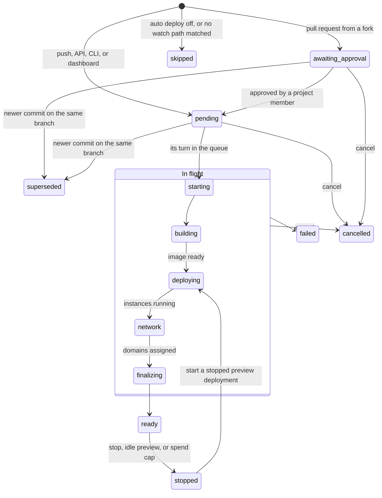

A <Tooltip tip="One built and running version of an app in one environment.">deployment</Tooltip> is one built version of an <Tooltip tip="A Compute app: a deployable service inside a project. Not 'your application' in general.">app</Tooltip> in one <Tooltip tip="A production or preview environment of a Compute app, not the dashboard label on a key.">environment</Tooltip>. You can't change a deployment once it's created. It keeps the image, runtime settings, environment variables, and gateway policies it started with, so a change to any of them applies from the next deployment.

## Create a deployment

A push to a connected GitHub repository creates one for you. See [GitHub integration](/compute/build/github).

To deploy by hand, open the app and click **Create Deployment**, or click **Redeploy** on an existing deployment. From the CLI or API, use [`unkey api deployments create-deployment`](/compute/cli/deployments/create-deployment) or `deployments.createDeployment` with the project, app, and environment. With no source, a git app builds its default branch and an image app deploys its default image. To deploy something else, pass one source:

- `git`: build from the connected repository. Set `branch` for the latest commit on a branch, `commitSha` for an exact commit, or `repository` with a `commitSha` to build a fork.
- `oci`: run a prebuilt image as it is. Give it a tag or a digest, or you get `latest`. The deployment keeps the image the tag pointed to when you deployed, so moving the tag later doesn't change it.
- `deployment`: run an existing deployment again. A git app rebuilds the same commit, and an image app reuses the same image. This is what **Redeploy** does.

The dashboard shows a badge for how each deployment was started: GitHub, API, CLI, or dashboard.

<Frame>
  
</Frame>

## Statuses

A deployment moves through these statuses. Six of them are final: `ready`, `failed`, `skipped`, `stopped`, `superseded`, and `cancelled`. The other seven mean it's still in progress.

| Status | What's happening |
| --- | --- |
| `pending` | Waiting for its turn. See [Why a deployment is waiting](#why-a-deployment-is-waiting). |
| `awaiting_approval` | A pull request from a fork, held until a project member approves it. |
| `starting` | Its turn has come and it's getting started. |
| `building` | Building the image from your repository. A deployment from a prebuilt image has nothing to build, so it passes through quickly. |
| `deploying` | Starting instances in each of the environment's regions and waiting for them to become healthy. |
| `network` | Assigning the deployment's domains. The dashboard labels this **Assigning Domains**. |
| `finalizing` | Finishing up and, for production, making it the live deployment. |

A production deployment that stops being the live one also becomes `stopped`, after a 30-minute standby. See [Production and preview](/compute/concepts/production-and-preview).

The deployment's page shows each step with its start and end time as it runs. A deployment from a prebuilt image has no build log. See [Build logs](/compute/observe/build-logs).

## Why a deployment is waiting

A workspace runs one deployment at a time on every plan, from build through rollout. The next one sits in `pending` until the one ahead finishes. Deployments from a prebuilt image queue too, even though they don't build. Production deployments jump ahead of preview deployments, so a hot-fix doesn't wait behind a backlog of pull request builds.

A deployment that has waited an hour for its turn fails rather than waiting longer. Deploy again once the queue has drained. See [Builds](/compute/build/overview#why-your-build-is-waiting).

## Why a deployment was superseded or skipped

If you push a second commit to a branch while the first commit's deployment is still `pending` or `awaiting_approval`, the first one becomes `superseded` and the newer commit builds instead. Once a deployment has left `pending`, it finishes even if newer commits arrive.

`skipped` means we saw the push but didn't build it. Either auto deploy is off for the environment, or no changed file matched the environment's [watch paths](/compute/configure/build-settings). The deployments list shows the reason.

## Awaiting approval

A pull request from a fork runs outside code with your environment variables, so it never builds on its own. It waits in `awaiting_approval` until a project member approves it in the dashboard. GitHub shows a check named **Unkey Deploy Authorization** on the commit while it waits. Pushes from people with write access don't need approval. See [GitHub integration](/compute/build/github).

## Cancel a deployment

To cancel a deployment that's still in progress, open its menu in the deployments list and click **Cancel deployment**. The current step is marked "Cancelled by user", the deployment ends as `cancelled`, and the next deployment in the queue can start. A finished deployment can't be canceled.

## Rollouts across regions

During `deploying`, we wait for each region to reach its minimum number of instances. The deployment goes live once all regions but one are healthy, so one region that fails to start doesn't block the release. A single-region environment waits for that one region. If enough regions aren't healthy within 15 minutes, the deployment fails. See [Regions](/compute/concepts/regions).

## Why a deployment failed

The deployment's page shows the step that failed and a message. In the API, a `failed` deployment has an `error` object with a `code`, the `step` that failed, and a `message`. The codes are:

| Code | Meaning |
| --- | --- |
| `no_schedulable_regions` | The environment has no region that can currently be scheduled. Configure at least one region. |
| `invalid_runtime_settings` | The port is outside 1 to 65535, the CPU is below 0.25 vCPU, or the memory is below 256 MiB. |
| `cpu_quota_exceeded` | Starting this deployment would push the workspace past its CPU limit across all running deployments. |
| `memory_quota_exceeded` | The same for memory. |
| `storage_quota_exceeded` | The same for ephemeral disk. |
| `build_failed` | The image build did not complete. The build log names the failing step. |
| `unknown` | We couldn't classify the failure. Read `message`. |

For the quota codes, we add what your running deployments already use to this deployment's CPU, memory, and disk at its maximum instance count in every region, and compare that to your workspace [limits](/platform/billing/limits). So a wide autoscaling range counts at its maximum. Scale down or remove a deployment to make room.

## What you can do with a deployment

You can promote and roll back production deployments, and stop and start preview deployments. See [Production and preview](/compute/concepts/production-and-preview). The dashboard also offers **Redeploy** for any deployment that's `ready`, `stopped`, `failed`, `superseded`, or `cancelled`, and **Cancel deployment** for anything in progress.

In the API, a deployment's `availableActions` field lists the actions that will work right now, so you can check before you call.

## When the deployment isn't serving

What callers get depends on why:

- **The deployment is stopped:** `503` with [`deployment_offline`](/errors/frontline/capacity/deployment_offline).
- **It should be running, but no instance is up yet:** `503` with [`no_running_instances`](/errors/frontline/capacity/no_running_instances).
- **The workspace hit its Compute spend budget with the stop option on:** every deployment returns `402` with [`spend_limit_reached`](/errors/frontline/capacity/spend_limit_reached) until you raise or remove the budget.
