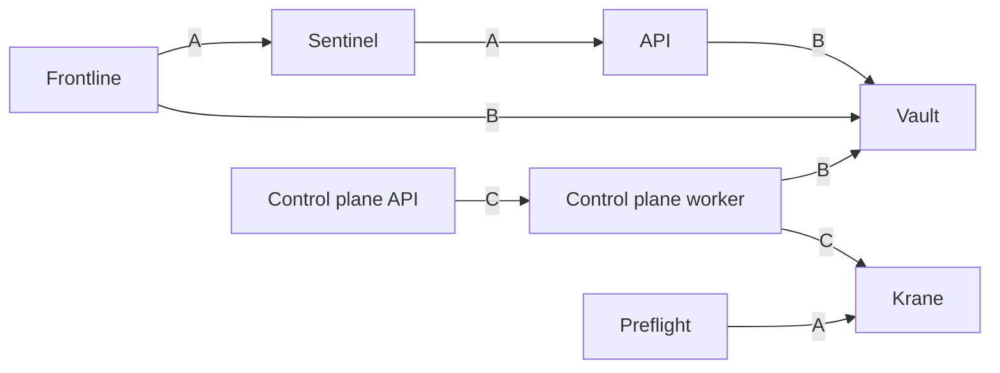

This section documents system architecture, service workflows, and RFCs. Content is maintained separately from service-level runbooks and configuration guides.

## Service map

### Legend

- **A**: HTTP or HTTPS request.
- **B**: RPC or service call.
- **C**: Asynchronous workflow trigger.

## Sections

- [Services](/architecture/services)
- [Workflows](/architecture/workflows)
- [RFCs](/architecture/rfcs)
