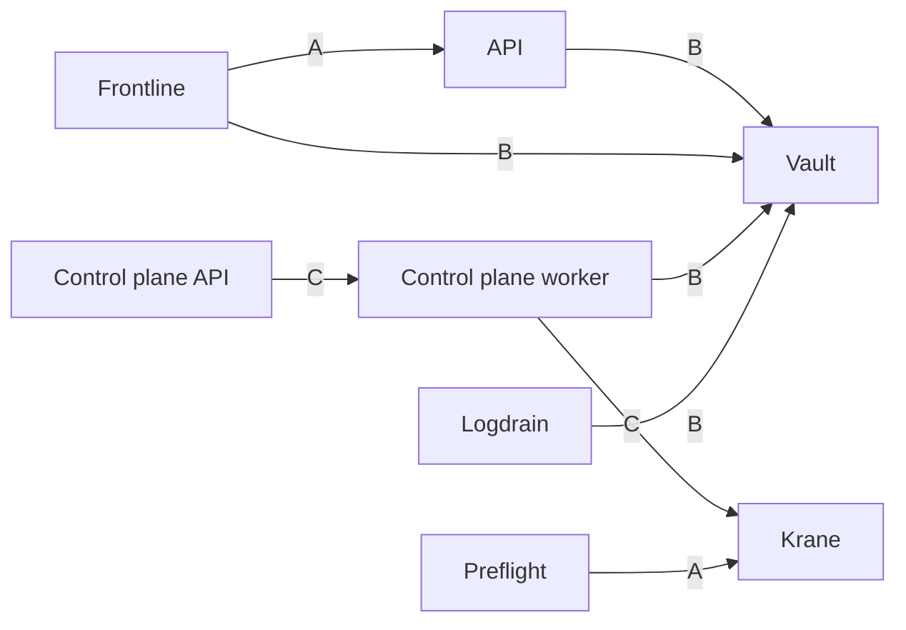

This section documents system architecture, service workflows, and RFCs. Content is maintained separately from service-level runbooks and configuration guides.

## Service map

```mermaid
flowchart LR
  Frontline[Frontline]
  API[API]
  Vault[Vault]
  ControlAPI[Control plane API]
  ControlWorker[Control plane worker]
  Krane[Krane]
  Preflight[Preflight]

  Frontline -->|A| API
  API -->|B| Vault
  Frontline -->|B| Vault

  ControlAPI -->|C| ControlWorker
  ControlWorker -->|C| Krane
  ControlWorker -->|B| Vault

  Preflight -->|A| Krane

  Logdrain[Logdrain]
  Logdrain -->|B| Vault
```

### Legend

- **A**: HTTP or HTTPS request.
- **B**: RPC or service call.
- **C**: Asynchronous workflow trigger.

Two services work mostly through shared datastores instead of service calls:
logdrain reads audit logs from ClickHouse and coordinates through MySQL, and
heimdall writes per-node metering checkpoints to ClickHouse. The
[services index](/architecture/services) lists every service with its purpose
and code location.

## Sections

- [Services](/architecture/services)
- [RFCs](/architecture/rfcs)
