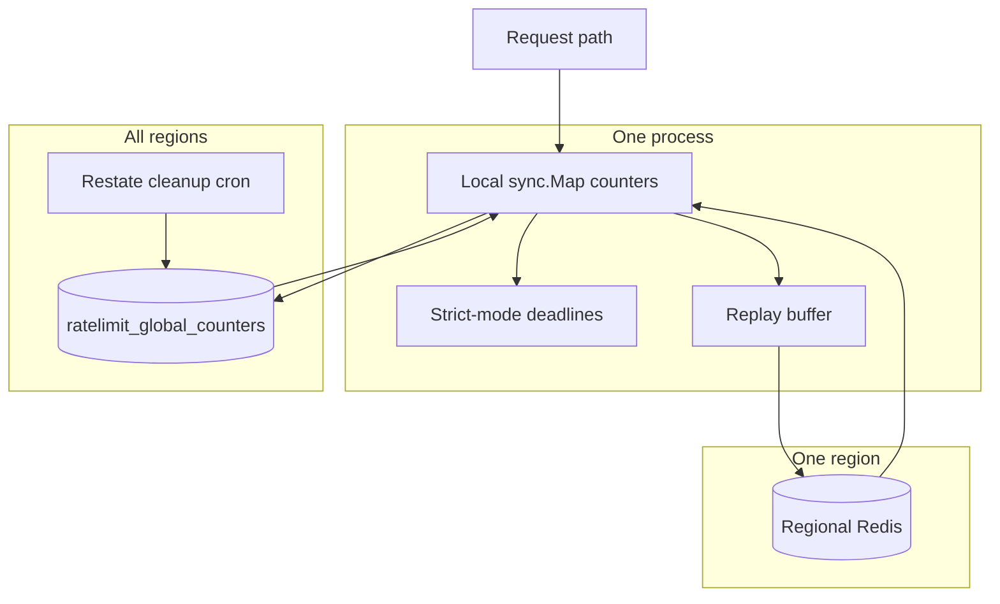
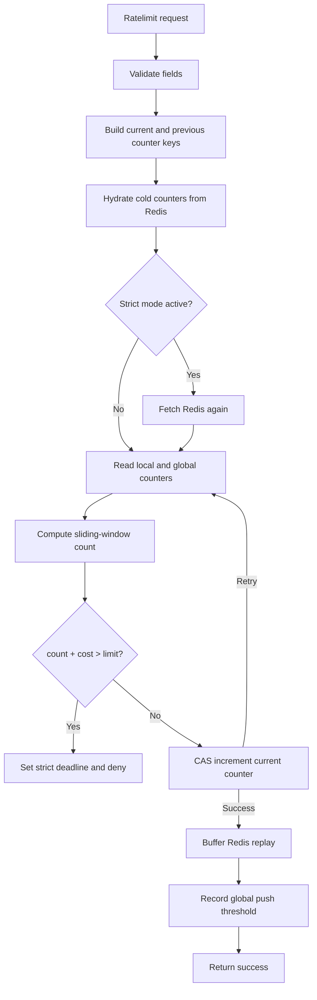
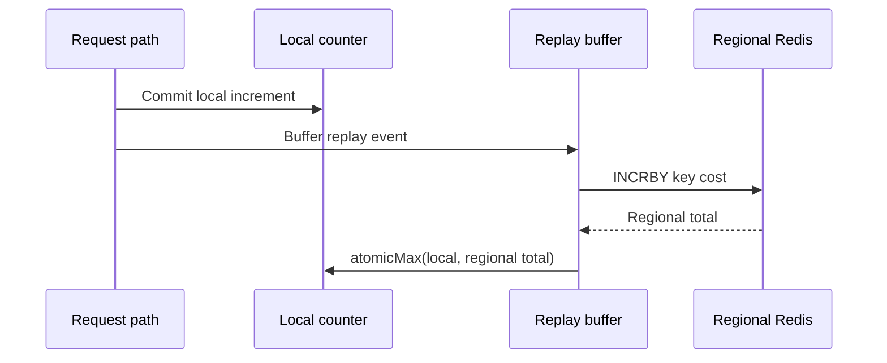
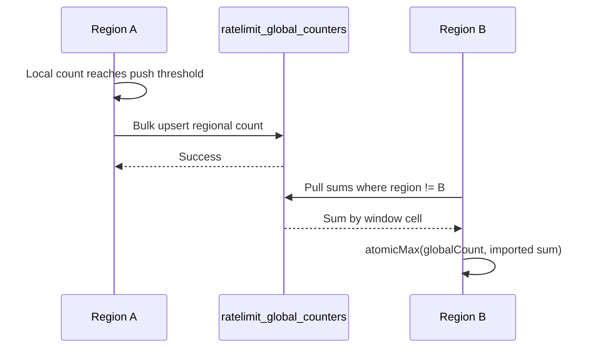
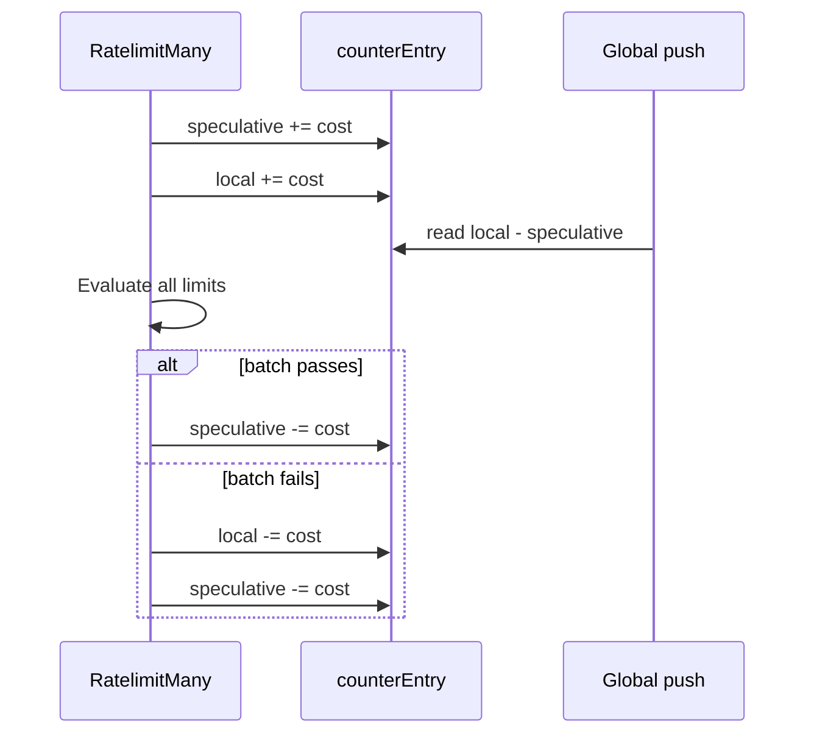

Rate limiting lives in [`internal/services/ratelimit`](https://github.com/unkeyed/unkey/tree/main/internal/services/ratelimit) and is embedded into request-serving processes such as API and Frontline. Each process can make decisions from local memory using atomic counters.

The design aims for a shared-nothing hot path. Redis improves convergence between processes in the same region, and MySQL improves convergence between regions, but neither is a critical dependency for the normal request path. No request waits on MySQL. Redis is consulted on cold counters and after local denials, where tighter regional accuracy is worth the extra latency.

## System map

The service has three layers of state. Each layer solves a different consistency problem.



Local counters make the decision fast. Redis converges nodes within the same region. MySQL shares regional observations across regions.

## Request path

The hot path is optimized around one `counterEntry` per `(workspace, namespace, identifier, duration, sequence)` tuple. A request loads the current and previous entries, hydrates cold entries from Redis, computes the effective sliding-window count, and commits the increment if the request fits.



`RatelimitMany` uses a different shape because it must preserve all-or-nothing semantics. It applies optimistic atomic increments, evaluates every requested limit, then either keeps the full batch or rolls every increment back.

## Sliding-window math

The service stores fixed window cells but evaluates them as a sliding window. For a request at time `t`, the current sequence is `floor(t / duration)`. The previous sequence is `current - 1`.

The current window always contributes its full count. The previous window contributes only the fraction that still overlaps the sliding window. At the start of a new window, most of the previous window still counts. Near the end of the current window, almost none of the previous window counts.

The effective count is:

```plaintext
effective = current + (previous * (1 - windowElapsed)) + cost
```

`current` and `previous` include this region's local value plus the imported sum from other regions. The imported sum is stored separately in `counterEntry.globalCount` so it can affect decisions without feeding back into the next cross-region push.

## Counter entries

`counterEntry` is the core in-memory data structure. It is intentionally small and atomic because it sits on the request path.

| State | Purpose |
| --- | --- |
| Local count | This region's count for the window cell |
| Speculative count | In-flight `RatelimitMany` increments that may still roll back |
| `once` and `hydrated` | Cold-start coordination for origin hydration |
| Global count | Sum of other regions' counts from the latest successful pull |
| `globalPushThreshold` | Minimum local count that makes the entry worth sharing globally |
| `lastPushed` | Last local count successfully written to MySQL |
| `fetch` | Bound Redis fetch function for this key |

The important invariant is separation between local count and global count. Local count represents this region's own observation and is eligible for push. Global count represents other regions and is never pushed back out. Collapsing them would double-count remote traffic on the next flush.

## Origin convergence inside a region

Redis is the regional convergence point. Every successful request is buffered for async replay. Replay workers call `INCRBY`, then merge the Redis value back into the local counter with `atomicMax`.



This means nodes in the same region converge without synchronously waiting for Redis on every request. Cold entries and strict-mode entries do perform synchronous Redis fetches because they need a fresher baseline before deciding.

## Strict mode

Strict mode is the in-region convergence mechanism after a denial. When a request is denied, the service records a deadline for `(workspace, namespace, identifier, duration)`. Until that deadline passes, later requests for the same tuple fetch Redis synchronously before making a decision.

The deadline key excludes `sequence` on purpose. A denial in sequence `N` can affect the weighted previous-window term in sequence `N+1`, so strict mode must survive the sequence rollover.

Strict mode doesn't write cross-region state. Cross-region convergence comes from global counters.

## Global counters across regions

`ratelimit_global_counters` stores one row per region and window cell. The unique key is `(workspace_id, namespace, identifier, duration_ms, sequence, region)`. Each row's `count` is that region's latest local observation for the cell.



The table is a G-Counter by region. A row only moves forward within a sequence because upserts use `GREATEST(count, VALUES(count))`. Pulls sum all foreign-region rows for each window cell and merge the sum into `counterEntry.globalCount` with `atomicMax`.

### Push loop

The push loop runs every 10 seconds with jitter. On each tick, it walks the local counter map and builds a bulk upsert batch for entries that pass all filters.

An entry is eligible when its local count, minus speculative batch increments, is positive, has reached `globalPushThreshold`, and is greater than `lastPushed`. The threshold is `ceil(limit * globalUtilizationFloor)`, with `globalUtilizationFloor = 0.5`.

The threshold is stored instead of a boolean latch. This matters because a request can create an entry below the floor, then Redis replay can converge that entry above the floor later. The push loop evaluates the live count against the stored threshold, so converged regional totals still get shared.

`expires_at` is sequence-derived: `(sequence + 2) * duration_ms`. A row matters until the originating window has fully aged out of sliding-window math. Receivers filter expired rows even if cleanup has not deleted them yet.

### Pull loop

The pull loop also runs every 10 seconds with jitter. It asks MySQL for active rows grouped by `(workspace_id, namespace, identifier, duration_ms, sequence)`, excluding rows from the current region. MySQL returns the summed foreign count for each cell.

When the local process has never seen a pulled key before, the loop creates the `counterEntry` and increments `RatelimitGlobalEntriesCreated`. Traffic-created entries use `RatelimitWindowsCreated` instead, so cardinality from local traffic and cardinality from global imports stay separate.

### Cleanup

Expired rows are deleted by the Restate handler in `svc/ctrl/worker/ratelimitglobalcountercleanup`. Cleanup bounds storage and keeps pull scans small. Correctness does not depend on immediate cleanup because pull queries filter on `expires_at`.

## Speculative batch increments

`RatelimitMany` temporarily increments every requested counter before it knows whether the batch passes. That creates a short interval where local counters include increments that may roll back.

The speculative count prevents those temporary increments from leaking into MySQL. The push loop writes local count minus speculative count, not the raw local count. If a batch fails, both counts are decremented before the method returns.



This preserves the all-or-nothing batch contract and keeps cross-region state from publishing uncommitted work.

## Failure handling

The rate limiter falls back to local decisions and recovers convergence later. Dependency failures do not take down request-serving processes.

| Failure | Behavior | Signal |
| --- | --- | --- |
| Redis fetch fails | Cold or strict fetch returns `0`, and the local counter continues from its current value | `unkey_ratelimit_origin_errors_total{op="fetch"}` |
| Redis replay fails | Local decision already returned, and regional convergence lags until replay recovers | `unkey_ratelimit_origin_errors_total{op="sync"}` |
| MySQL push fails | Batch is dropped for that tick. Entries remain eligible if their count still exceeds `lastPushed` | `unkey_ratelimit_global_push_errors_total` |
| MySQL pull fails | Existing `globalCount` values remain. New remote counts are not imported until a later tick | `unkey_ratelimit_global_pull_errors_total` |
| Cleanup fails | Expired rows remain in storage, but pull queries ignore them by `expires_at` | Worker logs and cleanup response |
