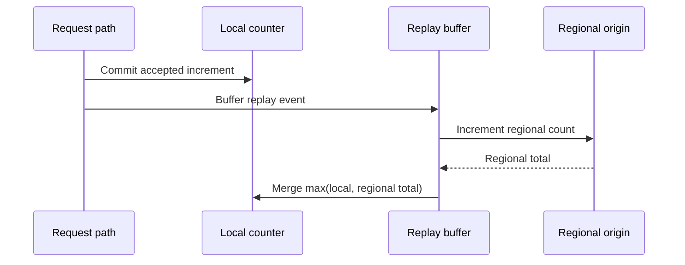

Rate limiting is intentionally not a single synchronous global counter. The system converges in layers so the request path stays fast even when shared dependencies are slow or unavailable.

## Convergence layers

Each layer handles a different scope.

| Layer | Scope | Purpose |
| --- | --- | --- |
| Local memory | One process | Make the immediate decision without a network round trip |
| Regional origin | One region | Converge multiple processes serving the same region |
| Global counters | All regions | Share meaningful regional usage with other regions |

The lower layer always remains useful when a higher layer lags. A process can continue making local decisions if regional convergence is delayed. A region can continue enforcing regional limits if global convergence is delayed.

## Regional convergence

After a request is accepted, the process buffers a replay event for the regional origin. Replay merges the regional value back into local memory with `max`, so processes in the same region converge toward the same count without waiting on every request.



Cold counters and strict-mode counters read the regional origin synchronously before deciding. This makes the first decision for a key and the decisions after a denial use a fresher regional baseline.

## Strict mode

Strict mode is regional. When a request is denied, the service records a deadline for the `(workspace, namespace, identifier, duration)` tuple. Until that deadline passes, later requests for the same tuple refresh from the regional origin before evaluating the limit.

The strict-mode key excludes the sequence. A denial in one fixed window can still affect the weighted previous-window term in the next fixed window, so strict mode survives the sequence rollover.

Strict mode does not publish cross-region state. Global convergence is handled by global counters.

## Global convergence

Global convergence is eventual. A region publishes its own regional count when the count becomes meaningful for remote decisions. Other regions import the sum of foreign regional counts and include that imported count in future decisions.

```plaintext
Region A accepts traffic
        │
        ▼
Region A converges its local nodes
        │
        ▼
Region A publishes its regional count
        │
        ▼
Region B imports Region A's count
        │
        ▼
Region B includes that count in later decisions
```

This model means simultaneous traffic in multiple regions can briefly pass before every region has imported the latest remote usage. The tradeoff is deliberate: request-serving processes do not wait for cross-region coordination on the hot path.

Windows shorter than 60 seconds are effectively regional because the global convergence cadence is too coarse to provide useful cross-region accuracy. Longer windows can include global convergence before the window expires.

## Failure behavior

Failures degrade toward local decisions and recover when the affected layer becomes available again.

| Failure | Behavior |
| --- | --- |
| Regional read fails | The process continues from its local count |
| Regional replay lags | Other nodes in the region converge later |
| Global publish lags | Other regions do not see the new count yet |
| Global import lags | The region continues with its existing imported counts |

Correctness does not depend on making every layer synchronous. The invariant is that accepted local work is monotonic within a window cell, so delayed convergence can merge later without subtracting or rewriting history.
