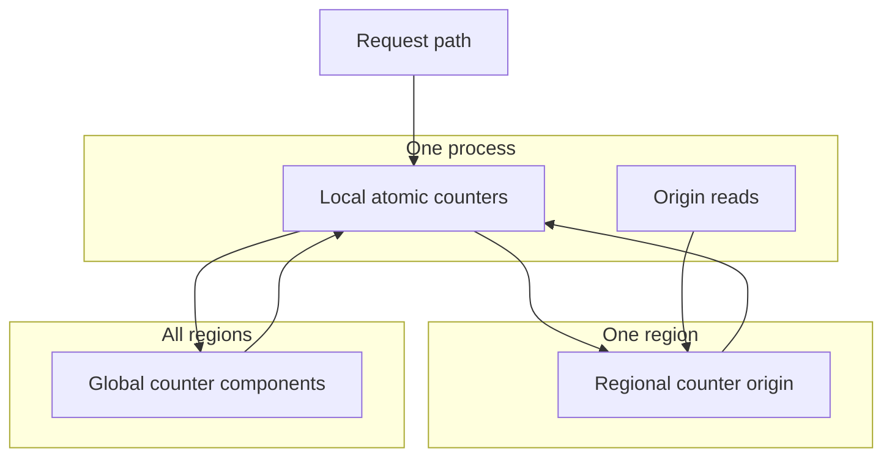

Rate limiting is a shared runtime subsystem used by API and Frontline policy execution. The implementation lives in [`internal/services/ratelimit`](https://github.com/unkeyed/unkey/tree/main/internal/services/ratelimit).

The system is designed to protect request-serving paths first. Accuracy improves as state converges, but no normal request depends on a synchronous global counter.

## Design goals

The rate limiter optimizes for these goals, in this order:

1. Keep the hot path local. A process must be able to make a decision from memory without waiting on cross-region state.
2. Preserve availability. Shared dependencies can improve accuracy, but a dependency failure must degrade toward local enforcement instead of taking down requests.
3. Converge where it matters. Nodes in one region converge quickly. Regions share counts when usage is high enough to affect remote decisions.
4. Avoid double counting. A region's own count and imported foreign counts stay separate so remote usage is never republished as local usage.
5. Smooth reset boundaries. Fixed window cells are evaluated as a sliding window so callers cannot spend a full limit on both sides of a boundary.

## Tradeoffs

These goals create deliberate tradeoffs:

| Choice | Benefit | Cost |
| --- | --- | --- |
| Local-memory decision first | Low latency and high availability | Simultaneous traffic in different processes can briefly see different views |
| Async regional convergence | Requests don't wait on the regional origin | A neighboring node may lag until replay, stale refresh, or strict mode catches up |
| Async global convergence | No request waits on cross-region coordination | Multi-region bursts can briefly pass before imported counts arrive |
| Publish only meaningful regional usage | Cross-region writes stay proportional to useful signal | Low regional usage may remain regional only |
| Sliding-window evaluation over fixed cells | Smooths boundary bursts without per-request histories | Requires reading the current and previous window cells |

The intended shape is shared-nothing on the hot path, with shared systems used as convergence accelerators. Regional and cross-region state improve accuracy, but they are not critical dependencies for serving the request.

## Core idea

The rate limiter stores fixed window cells and evaluates them as a sliding window. Each request updates the current cell if the effective count is still under the limit.

State converges in layers:

Local counters keep the hot path fast. The regional origin converges nodes inside one region through asynchronous replay, stale-entry refreshes, and strict-mode reads after denials. Global counters converge regional observations across regions for longer windows and can also raise same-region local counts as a safety net when a node has not yet seen the latest regional-origin value.

## Pages

- [Request path](/architecture/ratelimiting/request-path) explains how one request is evaluated, including sliding-window math and batch semantics.
- [Consistency model](/architecture/ratelimiting/consistency-model) explains what converges locally, regionally, and globally.
- [Global counters](/architecture/ratelimiting/global-counters) explains the G-Counter model used for cross-region convergence.

## Invariants

These invariants shape the implementation:

- The request path must not wait on cross-region state.
- A local count represents only this region's own observations.
- Imported global count represents other regions and must not be pushed back out.
- Own-region global-counter imports may raise local count but must not mark regional origin state fresh.
- A fixed window cell is grow-only while it is active.
- Sliding-window behavior comes from weighting the previous cell, not from decrementing the current cell.
- Batch requests must preserve all-or-nothing semantics.

## Scope boundaries

This subsystem owns counting, convergence, and the rate limit decision. It does not own how callers choose identifiers, configure limits, or translate denial responses into protocol-specific errors.

API uses the subsystem for standalone rate limits, key verification limits, and workspace API throttling. Frontline uses it for policy execution. Sharing the subsystem keeps these paths on the same counter semantics instead of creating service-specific rate limit behavior.
