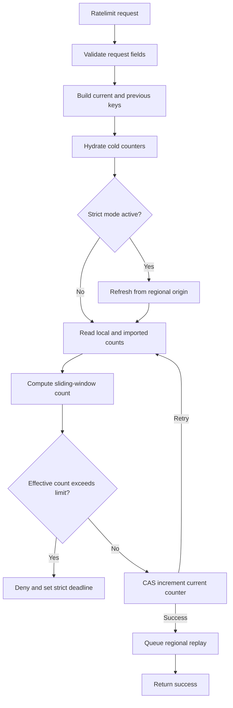
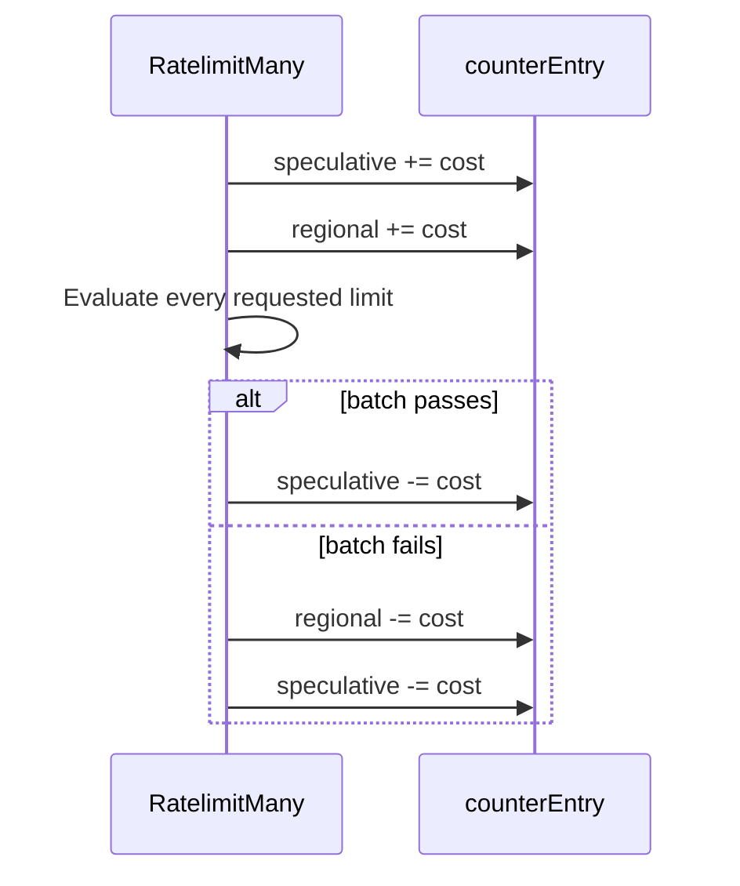

The rate limit request path turns a `(workspace, namespace, identifier, duration)` tuple into a sliding-window decision. The normal path is local-memory first and only reaches regional state when a counter is cold or strict mode is active.

## Single request flow

Each request builds two counter keys: the current fixed window cell and the previous fixed window cell. The previous cell is needed because the public behavior is a sliding window.



The compare-and-swap loop protects the local counter from concurrent accepted requests in the same process. If another goroutine changes the current counter between the read and the commit, the request recomputes the effective count before trying again.

## Sliding-window math

The implementation stores fixed window cells, but the decision behaves like a sliding window.

For a request at time `t`, the current sequence is:

```plaintext
currentSequence = floor(t / duration)
previousSequence = currentSequence - 1
```

The current cell contributes its full count. The previous cell contributes only the fraction that still overlaps the sliding window.

```plaintext
current = currentRegionalCount + currentGlobalCount
previous = previousRegionalCount + previousGlobalCount
effective = current + (previous * previousWindowWeight) + cost
```

The weight starts near `1` at the beginning of a new fixed window and moves toward `0` as the current fixed window advances.

```plaintext
previous window          current window
┌────────────────┐┌────────────────┐
                 ▲
                 request near boundary

Most of the previous window still overlaps the sliding window.

previous window          current window
┌────────────────┐┌────────────────┐
                              ▲
                              request near end

Very little of the previous window still overlaps the sliding window.
```

This prevents a caller from using the full limit at the end of one fixed window and immediately using the full limit again at the start of the next one.

## Counter entries

`counterEntry` is the in-memory state for one window cell. It is intentionally small because it sits on the request path.

| State | Purpose |
| --- | --- |
| Regional count | This region's count for the window cell |
| Speculative count | In-flight `RatelimitMany` increments that may roll back |
| Hydration state | Cold-start coordination for regional origin reads |
| Global count | Imported count from other regions |
| Global push threshold | Minimum regional count worth sharing globally |
| Last pushed count | Last regional count published for global convergence |

The key invariant is that regional count and global count stay separate. Regional count can be published outward. Global count is imported from other regions and must not be published again.

## Batch requests

`RatelimitMany` evaluates multiple limits with all-or-nothing semantics. The method temporarily increments each requested counter, evaluates the full batch, then either keeps every increment or rolls every increment back.



Global publishing reads regional count minus speculative count. That prevents temporary batch state from leaking into cross-region convergence before the batch is committed.
