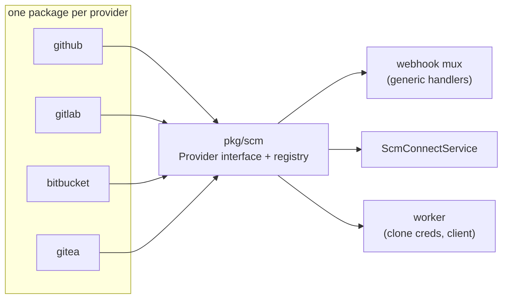
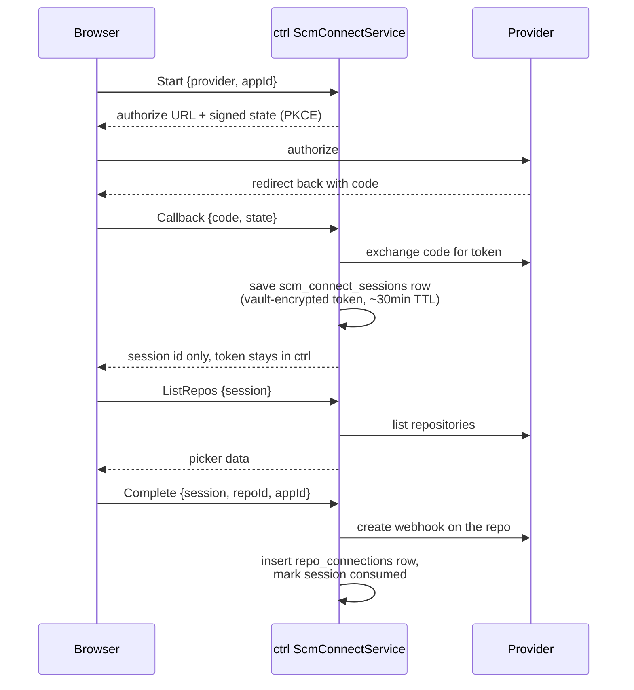
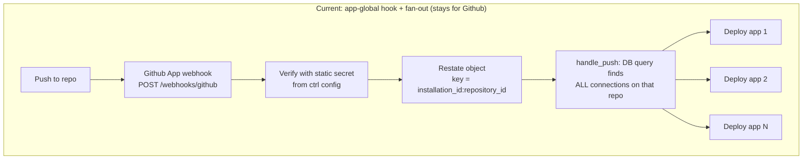
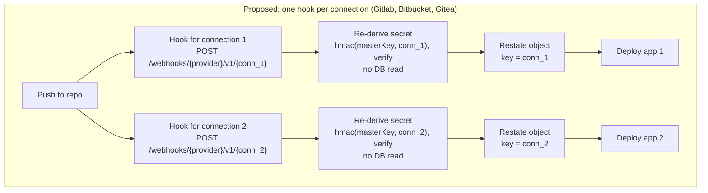

## Goals

We have two goals here, first one is to make the Git flow as generic as possible so when we need new providers they become easy to add.
Second one is the connect flow, other providers don't offer easy connect like Github does, so we design that part ourselves here and every provider goes through it, even Github.
People can still use other Git providers through the CLI, they add `unkey deploy` as a step in their own CI and every push deploys through that. But that's not a great DX, they have to set up and maintain that pipeline themselves. Our priority as Unkey is to offer the best DX that can be offered.

<Callout type="info">
  Gitlab, Bitbucket and Gitea are not the deliverable here, we use them to prove
  the refactor actually works.
</Callout>

### Definition of done

When is this refactor actually done? When adding a new provider feels like adding a handler/endpoint
to our API. Basically one package that implements `Provider` interface and one line in the registry,
same process as a new endpoint in `svc/api/routes`. No need to jump between worker, webhook mux and
connect service. Even the "Connect" UI works for the new provider without a dashboard PR.

## Background

Today the Git integration is very coupled to Github. Sadly, we couldn't foresee the days we would need other providers.
When we started building Deploy, Github was the most popular and the best answer. And, still there are alternatives but not a replacement.
Before this RFC I did a POC to see how easy it is to add new providers into our existing setup: [POC](https://github.com/unkeyed/unkey/tree/git-provider-poc).
Surprisingly, adding new providers wasn't really that hard, but we need to make our logic provider agnostic.
Of course, Github will have some extra love, because compared to the others it has some unique features like fork-PR.

I did three end-to-end POCs, and each provider does the same things slightly differently:

| Aspect                        | GitHub                                                                                                      | GitLab           | Bitbucket                                   | Gitea                 |
| ----------------------------- | ----------------------------------------------------------------------------------------------------------- | ---------------- | ------------------------------------------- | --------------------- |
| Connect style                 | [App install](https://github.com/unkeyed/unkey/blob/main/svc/api/routes/v2_github_install_app/handler.go)   | OAuth            | OAuth                                       | Instance URL + token  |
| Credential                    | [Minted per build, repo-scoped](https://github.com/unkeyed/unkey/blob/main/svc/ctrl/worker/deploy/build.go) | Long-lived token | Rotating refresh token (persist before use) | Long-lived PAT        |
| Repo identity                 | [Numeric id](https://github.com/unkeyed/unkey/blob/main/web/internal/db/src/schema/github_app.ts)           | Numeric id       | UUID string only                            | Numeric, per-instance |
| Host                          | [Fixed](https://github.com/unkeyed/unkey/blob/main/pkg/github/client.go)                                    | Fixed            | Fixed                                       | Per connection        |
| Webhook                       | [App-global](https://github.com/unkeyed/unkey/blob/main/svc/ctrl/api/webhooks/github/github.go)             | Per repo         | Per repo                                    | Per repo              |
| Changed files in push payload | [Yes](https://github.com/unkeyed/unkey/blob/main/pkg/github/interface.go)                                   | Yes              | No                                          | Yes                   |
| Fork-PR security story        | [Yes](https://github.com/unkeyed/unkey/blob/main/svc/ctrl/worker/githubwebhook/block_deployment.go)         | No               | No                                          | No                    |

<Callout type="warn">
  For Gitea, we must be able to reach the customer's self-hosted instance from
  the public internet.
</Callout>

See below for the existing Github setup if you need a refresher or if you haven't touched any Github related code.

### Where the Github code lives

- [`pkg/github`](https://github.com/unkeyed/unkey/blob/main/pkg/github/doc.go): GitHub App client, plus the [`GitHubClient`](https://github.com/unkeyed/unkey/blob/main/pkg/github/interface.go) interface every caller depends on.
- [`pkg/webhook/verifiers/github`](https://github.com/unkeyed/unkey/blob/main/pkg/webhook/verifiers/github/github.go): Webhook signature verification.
- [`svc/ctrl/api/webhooks/github`](https://github.com/unkeyed/unkey/blob/main/svc/ctrl/api/webhooks/github/github.go): Inbound webhook route at `POST /webhooks/github`.
- [`svc/ctrl/worker/githubwebhook`](https://github.com/unkeyed/unkey/blob/main/svc/ctrl/worker/githubwebhook/handle_push.go): Turns a verified push into a deployment.
- [`svc/ctrl/worker/deploy/build.go`](https://github.com/unkeyed/unkey/blob/main/svc/ctrl/worker/deploy/build.go): Mints the scoped clone token for BuildKit.
- [`web/internal/db/src/schema/github_app.ts`](https://github.com/unkeyed/unkey/blob/main/web/internal/db/src/schema/github_app.ts): The `github_app_installations` and `github_repo_connections` tables.

### Where we are coupled to Github

These are the places where we assumed everything is Github, and we fix all of them with this refactor:

- `fillFromGitHub` and `hasAuth` in `create_deployment.go` assume every connection is a Github
  installation. If we pass them a Gitlab project id or a Bitbucket hash, they still call the public
  Github API with it.
- The worker looks up connections by `(installation_id, repository_id)` and that's a Github
  specific identity. The query is `github_repo_connection_list_deploy_context.sql`, we call it from
  `handle_push.go`. Bitbucket doesn't even have a numeric repo id, and Gitea ids are per-instance,
  so two customers' self-hosted instances can collide.
- We write connection rows in three different places: `svc/ctrl`, `svc/api`, and the dashboard
  directly via Drizzle. So when we add a new column, it's easy to miss one of them.

## Design

Everything in this section is a proposal, not a final decision. Column names, signatures and RPC
shapes are all open to discussion.

Here is what we want to end up with. Every provider is its own package on the left, they all talk
to the interface in the middle, and the rest of the system only talks to the interface. Adding a
provider means adding one more package on the left, nothing else changes, just like adding an API
endpoint:



Almost all Git providers follow these steps:

- User clicks on Connect in the onboarding
- They grant us access to their repositories on the provider's side
- We list the granted repositories and the user selects one
- User makes a change in the repository
- Provider calls us via Webhook
- We verify the webhook and parse the event
- And route the call to our build pipeline

For Github it was easy because Github already covers some of these steps, but the others, at least the ones I POCed, don't offer the connect, repo access grant, and repo selection steps. So we have to build some of these steps ourselves.

To achieve this goal, the first step is to make the `github_repo_connections` table provider agnostic. Eventually we'll call it `repo_connections`, but it's fine to do it later.

### Current one

```sql
github_repo_connections
  installation_id       bigint
  repository_id         bigint
  repository_full_name  varchar
  app_id (unique), project_id, workspace_id, timestamps
  index on (installation_id)
```

### Proposed one

```sql
repo_connections
  id                    varchar    -- uid.New("conn"), the {connection_id} in the webhook path
  provider              varchar    -- 'github' | 'gitlab' | 'bitbucket' | 'gitea'
  provider_host         varchar    -- set for self-hosted, null for cloud providers
  provider_repo_id      varchar    -- some providers use string compared to GH's int
  provider_hook_id      varchar    -- the hook id the provider gave us, to delete it on disconnect. empty for GH
  installation_id       bigint     -- GH needs it
  repository_id         bigint     -- GH needs it -> We can migrate this later
  repository_full_name  varchar
  provider_token        text       -- vault-encrypted. empty for GH, long-lived token or Bitbucket rotating refresh token
  app_id (unique), project_id, workspace_id, timestamps
```

Most of the columns are pretty clear, but two of them need a proper explanation, `id` and `provider_token`.

We need `id` because the webhook design below puts the connection id into the hook URL, and that
URL is the only thing that tells us which connection a delivery belongs to, the payload has no
Unkey ids in it. Since the URL sits in the customer's provider settings, the id has to be safe to expose. We can't use `pk`,
because people can do malicious stuff and try to guess other people's webhooks. We can't use `app_id`
either, because then we would leak people's `app_id`. That's why every connection gets a fresh `conn_` uid.

`provider_token` is empty for Github on purpose. Github doesn't give us a token to keep, it gives
us an installation, and we generate a short-lived, repo-scoped token from the App key every time we
build a customer's deployment. The other providers give us a token once and we have to save it, so it goes there.
For Github `CloneCredential` (will be explained below) generates a fresh token, for Gitlab and Gitea it reads the
stored token, for Bitbucket it refreshes and persists.

After the connect and repository selection every provider behaves the same. We verify the webhook,
parse the push, resolve a clone credential, and talk to the provider through a client.

If something is provider specific it goes into `Descriptor`, like which connect UI to show or how to mount their webhooks. See below for examples.

```go
type Provider interface {
    Descriptor() Descriptor // what the provider needs, connect style and webhook scope

    // connect flow, every provider does these
    ListRepos(ctx context.Context, sess Session) ([]Repo, error)
    // CreateHook returns the provider's hook id, we store it so we can delete it on disconnect
    CreateHook(ctx context.Context, sess Session, repo RepoID, hookURL, secret string) (hookID string, err error)
    DeleteHook(ctx context.Context, sess Session, repo RepoID, hookID string) error

    // today: pkg/webhook/verifiers/github
    VerifyWebhook(r *http.Request, secret string) (Event, error)
    // today: the parsing half of svc/ctrl/api/webhooks/github
    ParsePush(event Event) (PushInfo, error)

    // today: GetScopedInstallationToken in worker deploy/build.go
    CloneCredential(ctx context.Context, conn Connection) (Credential, error)

    // today: the GitHubClient interface in pkg/github
    Client(creds Credential) Client
}

// oauth providers (gitlab, bitbucket) also implement this
type OAuthConnector interface {
    AuthorizeURL(state string) string
    ExchangeCode(ctx context.Context, code string) (token string, err error)
}

// token+url providers (gitea) implement this instead
type TokenConnector interface {
    Validate(ctx context.Context, instanceURL, token string) error
}
```

The connect ops live on the provider too, so `ScmConnectService` stays generic and just delegates.
Not every provider does every step though, so the oauth-only and token+url-only parts go on their
own interfaces, and the service picks which one from `Descriptor().ConnectStyle`.

`CreateHook` returns the provider's hook id (gitlab `hook_id`, bitbucket `uid`, gitea `id`) and we
store it on the connection, so a disconnect can delete the hook again.

```go
type Descriptor struct {
    ConnectStyle        ConnectStyle
    WebhookScope        WebhookScope
    NeedsWorkspaceInput bool // Bitbucket: ask workspace slug
    NeedsInstanceURL    bool // Gitea: ask "where is your server?"
}
```

Dashboard uses `Descriptor` for connect wizard:

```tsx
switch (descriptor.connectStyle) {
  case "app_install":
    return <InstallRedirect provider={provider} />;
  case "oauth":
    return <OAuthButton provider={provider} />;
  case "token+url":
    return (
      <TokenForm
        askInstanceURL={descriptor.needsInstanceURL}
        askWorkspace={descriptor.needsWorkspaceInput}
      />
    );
}
```

The registry itself is a map in `pkg/scm`:

```go
// pkg/scm
var registry = map[string]Provider{}

func Register(name string, p Provider) {
    registry[name] = p
}

func Registered() map[string]Provider {
    return registry
}
```

Ctrl fills it at startup for every provider that has config, and this is the "one line in the
registry" from the definition of done.

```go
scm.Register("github", github.New(cfg.GitHub, store))
scm.Register("gitlab", gitlab.New(cfg.GitLab, store))
scm.Register("bitbucket", bitbucket.New(cfg.Bitbucket, store))
scm.Register("gitea", gitea.New(cfg.Gitea, store))
```

And ctrl mounts webhook routes by iterating registered providers:

```go
for name, p := range scm.Registered() {
    switch p.Descriptor().WebhookScope {
    case scm.WebhookScopeAppGlobal: // GitHub only
        mux.Handle("POST /webhooks/"+name, appGlobalHandler(p))
    case scm.WebhookScopePerConnection:
        // v1 is a secret key version, explained in "Webhook ingress" below
        mux.Handle("POST /webhooks/"+name+"/v1/{connection_id}", perConnectionHandler(p))
    }
}
```

`ConnectStyle` and `WebhookScope` become typed string constants.

```go
type ConnectStyle string

const (
    ConnectStyleAppInstall ConnectStyle = "app_install" // Github
    ConnectStyleOAuth      ConnectStyle = "oauth"       // GitLab, Bitbucket
    ConnectStyleTokenURL   ConnectStyle = "token+url"   // Gitea
)

type WebhookScope string

const (
    WebhookScopeAppGlobal     WebhookScope = "app_global"     // Github only
    WebhookScopePerConnection WebhookScope = "per_connection" // everyone else
)
```

### How the dashboard receives the descriptor

There are two ways to do it, we either let the dashboard RPC it, or we define another set of
`ProviderDescriptor` in the dashboard.

The first way, ScmConnectService on ctrl exposes a `ListProviders` RPC, and the dashboard calls it via tRPC or the API:

```proto
enum ConnectStyle {
  CONNECT_STYLE_UNSPECIFIED = 0;
  CONNECT_STYLE_APP_INSTALL = 1;
  CONNECT_STYLE_OAUTH = 2;
  CONNECT_STYLE_TOKEN_URL = 3;
}

message ProviderDescriptor {
  string provider = 1;             // "github" | "gitlab" | "bitbucket" | "gitea"
  ConnectStyle connect_style = 2;
  bool needs_workspace_input = 3;
  bool needs_instance_url = 4;
}

rpc ListProviders(ListProvidersRequest) returns (ListProvidersResponse);
```

```ts
providers: t.procedure.query(() => ctrl.scmConnect.listProviders());
// OR
api.scm.listProviders(); // Not the final shape
```

The second way would look like this:

```ts
const PROVIDERS: Record<string, ProviderDescriptor> = {
  github: {
    connectStyle: "app_install",
    needsWorkspaceInput: false,
    needsInstanceURL: false,
  },
  gitlab: {
    connectStyle: "oauth",
    needsWorkspaceInput: false,
    needsInstanceURL: false,
  },
  bitbucket: {
    connectStyle: "oauth",
    needsWorkspaceInput: true,
    needsInstanceURL: false,
  },
  gitea: {
    connectStyle: "token+url",
    needsWorkspaceInput: false,
    needsInstanceURL: true,
  },
};
```

No RPC, and descriptors don't change often. But every new provider needs a dashboard PR too. The `ScmConnectService`
has to exist for the connect flow anyway, so `ListProviders` is just another convenient method we
can add. I'd go with the first way.

### Connect flow

The connect flow is our own version of "Github Installation" in a nutshell. Github gives us the
install page, the repository listing and the callback. The other providers don't, so we
build those steps ourselves, once, and every provider goes through them.

The dashboard just calls the new ctrl `ScmConnectService` and renders the results.
The OAuth exchange and the repo listing are implemented on ctrl, so the dashboard has
no provider logic in it. Today the Github connect completion is a dashboard tRPC that writes to
the DB directly, with this refactor that write moves to ctrl too.

The whole service is seven RPCs.

```proto
service ScmConnectService {
  rpc ListProviders(...) returns (...);  // descriptors for the wizard
  rpc Start(...)         returns (...);  // oauth: authorize URL + signed state
  rpc Callback(...)      returns (...);  // oauth: code -> session
  rpc Validate(...)      returns (...);  // token+url: creds -> session
  rpc ListRepos(...)     returns (...);  // session -> picker data
  rpc Complete(...)      returns (...);  // session + repo + app -> hook + connection row
  rpc Disconnect(...)    returns (...);  // connectionId -> delete hook, then drop the row
}
```

I believe we can understand these better if we map them to the Github flow we already run today:

- `Start` is basically our `createGithubConnection`, it generates the authorize URL with the
  signed state. The only difference is Github hosts the install page, here the button takes the
  user to the provider's authorize page.
- `Callback` is the redirect Github does back to the dashboard after the install. Same job, verify
  the state and handle the result. Here the result is a token, so it goes into a session row and
  never reaches the browser.
- `ListRepos` is the "select repositories" screen of the Github install. Github renders that
  picker for us, here we render it ourselves using the session's token.
- `Complete` is the `connectRepo` write we already do today, plus creating the webhook on the
  repo.
- `Disconnect` is the delete we already do today, plus removing the webhook from the repo first.
- `Validate` and `ListProviders` have no Github example. `Validate` replaces the whole redirect dance
  for token+url providers, `ListProviders` just tells the wizard what to render.

The oauth flow (Gitlab, Bitbucket):



The token+url flow (Gitea, Gitlab self-managed and Forgejo) skips the redirect process
completely. There is no OAuth app here, the user already created a token on their own instance.
They give us `{provider, instanceUrl, token}`, `Validate` checks if it actually works and creates
the same session row `Callback` would. After that it goes through the same steps as the oauth flow, session then repos then complete.
Github (app_install) touches none of this, its install flow already works and we leave it alone.

One thing to be careful about here is that `instanceUrl` comes from the user, and ctrl runs inside our
cluster, so a URL like `http://10.0.0.5:7091` would make ctrl call our own internal services for
them. Checking the URL once isn't enough, a redirect can point it somewhere
private after the check passes. So we have to validate every request, not just at `Validate`, refuse redirects, and only allow https.
While researching this I found [`code.dny.dev/ssrf`](https://pkg.go.dev/code.dny.dev/ssrf), and I believe we can use something like it instead of rolling
our own.

Sessions are DB rows. For the POC I kept them in memory, for production use that won't work because
as soon as a pod restarts we would lose all the state. It also breaks with more than one replica,
the callback can land on pod A and the repo listing on pod B.
So sessions get their own table.

```sql
scm_connect_sessions
  id             varchar     -- uid.New("scs"), the only thing the browser holds
  workspace_id   varchar
  provider       varchar     -- 'gitlab' | 'bitbucket' | 'gitea'
  provider_host  varchar     -- set for self-hosted, null for cloud providers
  token          text        -- vault-encrypted, never leaves ctrl
  consumed       boolean     -- complete is single-use
  expires_at     bigint      -- ~30min TTL
  created_at     bigint
```

### Webhook ingress

We go with one webhook per connection, not per repo. Each connection gets its own hook and its own
secret. Github is unique because its webhook is configured on the App itself, not per repo.





We create one webhook per connection using the `/webhooks/{provider}/v1/{conn_2}` format. During
the "Connect" step we create the secret and give it to the provider inside the hook config, so the
provider holds it. The secret looks like this "da5455..." and it's not stored anywhere on
our side, not even in the DB. We own the `masterKey`, so we can re-derive it any time with
`hmac(masterKey, conn_2)`. On every delivery we re-derive it from the conn id in the path and
verify, zero DB reads. We already use the same trick today, the Github install `state` is HMAC
signed and never stored, we just verify it when Github sends it back, see
[`v2_github_install_app/state.go`](https://github.com/unkeyed/unkey/blob/main/svc/api/routes/v2_github_install_app/state.go).

Why not keep the flat `/webhooks/{provider}` routes? Because that means one shared secret per
provider. Say customer A self-hosts Gitea. A is the admin, so the shared secret is sitting in A's
own Gitea settings. Now A signs a fake push for customer B's repo, sends it to `/webhooks/gitea`,
and we deploy B's app. A never touched B's Gitea or B's repo.

With the conn id in the path every connection gets its own secret, and we still verify without a
DB read. If a secret leaks, the attacker can only forge deliveries for that one connection, which
they already control. Github stays flat because no customer can read its App secret.

The `v1` in the path is the version of the `masterKey`. One day we might have to swap the key,
maybe for a SOC2 rotation, maybe for a leak. The problem is the old secrets still sit in the
provider's hook configs, and updating them is one API call per hook. If the path had no version,
swapping the key would break every hook at once. The version lets both keys work at the same time,
so rotation day looks like this:

- We add `masterKey_v2` next to v1, ctrl now accepts both `/v1/` and `/v2/` deliveries.
- A background job walks all connections, for each one it calls the provider's update-hook API
  with the new `/v2/{conn_id}` URL and the new secret `hmac(masterKey_v2, conn_id)`.
- Deliveries move to `/v2/` as the hooks get updated and `/v1/` traffic drains to zero.
- We delete `masterKey_v1` and the `/v1/` routes.

### Github moves onto the interface too

Github becomes just another `Provider`. Its descriptor says `app_install` and `app_global`, and
those two values are the only places the rest of the code learns Github is different. The fork-PR
logic stays as a worker special case, there is no point abstracting it for one provider.

Nothing about Github's behavior should change here, same routes, same secrets, same deployments,
we just route them through `pkg/scm`. If we can't move Github onto the interface without changing
its behavior, that means the interface design is not well thought, so we adjust the interface.

## Rollout

Each PR is shippable on its own. Shipping these PRs also doesn't mean launching Gitlab, Bitbucket
and Gitea, the POCs already proved they fit the interface. A provider only turns on when we give
ctrl its config and register it, so launching each one is up to us. We can add them whenever
customers ask for it.

The refactor itself:

- First make the `pkg/scm` package, the `Provider` interface, `Descriptor` and the registry.
- Then the db changes, backfills and migration scripts. We add `provider_repo_id` and backfill it
  from `repository_id` for the existing Github rows.
- Then convert the existing Github code to the `pkg/scm` shapes and protos.
- Finally rename the table to `repo_connections`.

When we decide to launch the first non-Github provider:

- We build the per-connection webhook ingress with derived secrets.
- We build `ScmConnectService`.
- We build the connect wizard on the dashboard, it renders whatever the descriptors say.

## Alternatives Considered

### Do nothing and point people at the CLI

Everything already works today if the customer uses `unkey deploy` in their own CI, but it's not the best DX.

### Flat webhook routes with one shared secret per provider

This is what the POC did, the simplest possible ingress. A self-hosted Gitea admin can read the
shared secret on their own instance and forge deliveries for every other customer. Full reasoning
in Webhook ingress.

### Random webhook secret per connection, stored in a column

This gives the same isolation as deriving, but now the DB holds thousands of secrets and the receiver has to read the DB before it can verify anything.
Deriving from the `masterKey` gives us the same thing with nothing to store.

### Hardcoded descriptor map in the dashboard

We covered this in the descriptor section, every new provider would need a dashboard PR.
We don't want that, it complicates releases and the duplicated descriptors drift over time.

### A separate `scm_credentials` table

This would move the tokens into their own table instead of a column on the connection. But every
connection gets its own token from the provider and two connections can never share one,
especially the rotating Bitbucket tokens, so the extra table and join don't give us anything.
