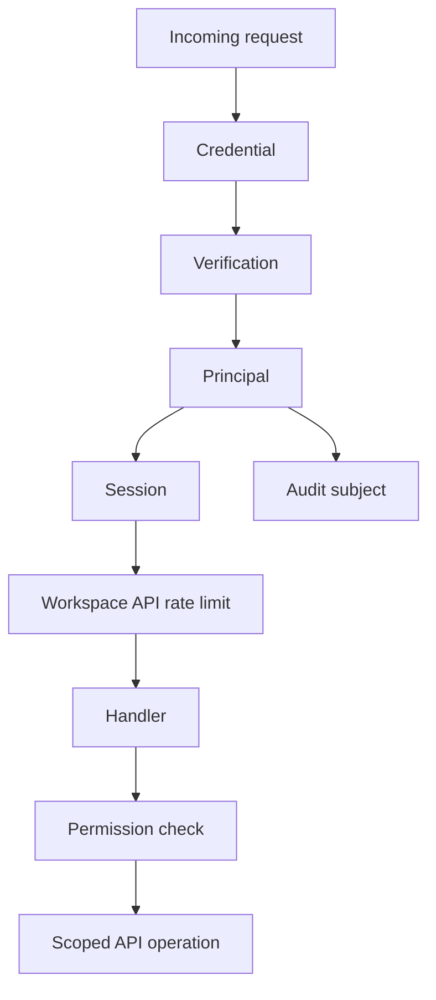
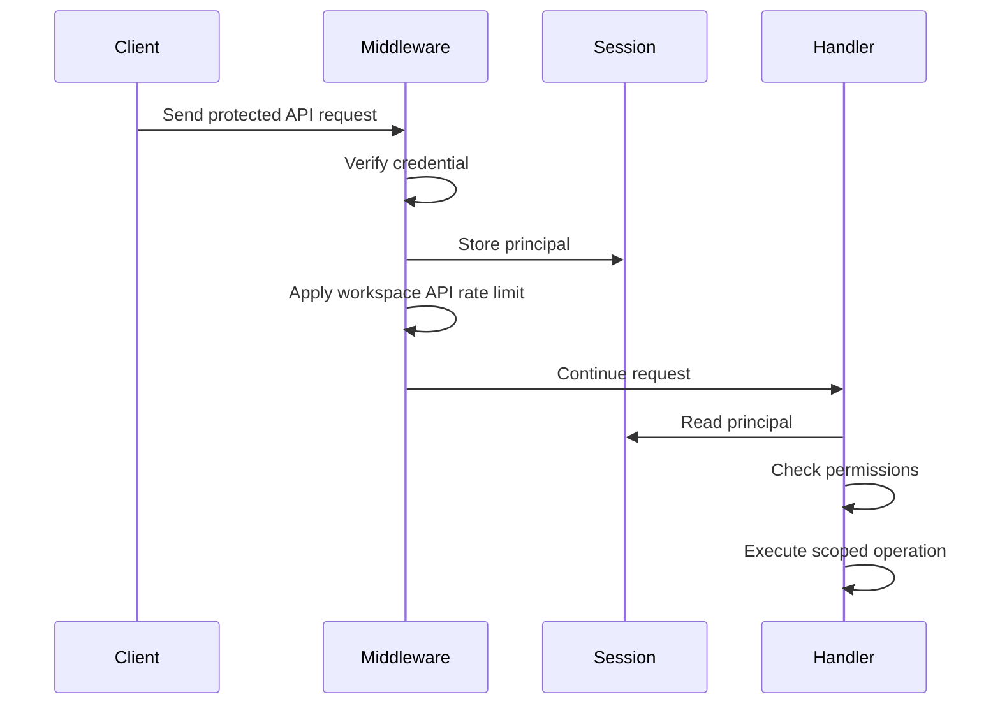
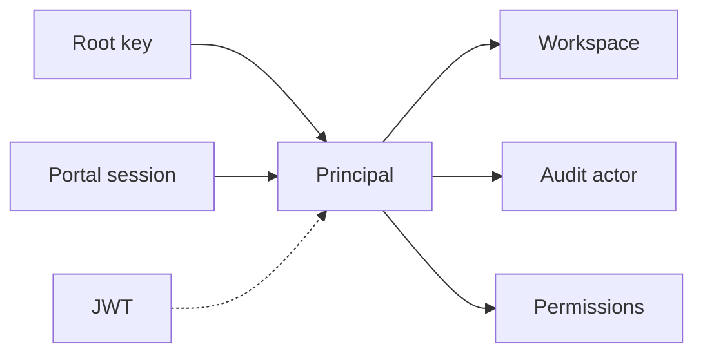
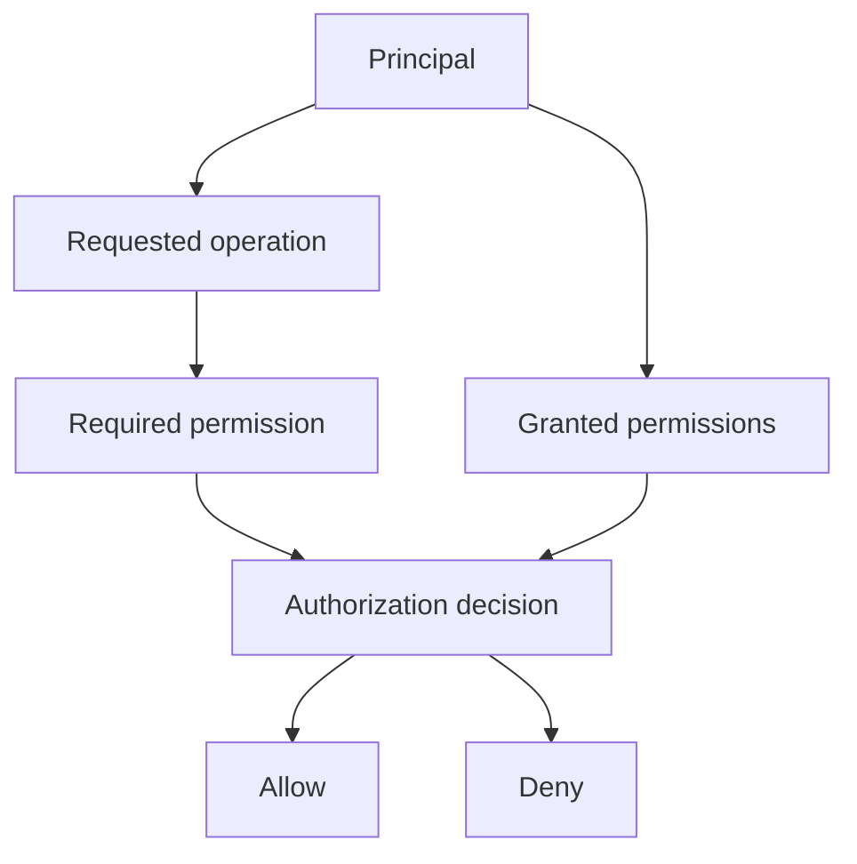

API authentication turns request credentials into a principal, then checks
whether that principal can perform the requested operation. The credential might
come from a root key, a browser session, or another credential source, but the
rest of the API can reason about the same concepts.

This design keeps authentication source details out of business logic. Handlers
read a principal from the request session, then use that principal for
permission checks, workspace scoping, and audit actor metadata. They don't need
to know how the caller proved its identity.

## How it works

The API auth flow has five conceptual steps:

1. Find a credential on the request.
2. Verify that credential with the system that owns it.
3. Normalize the verified caller into a principal.
4. Attach the principal to the request session.
5. Check the principal's permissions before data access or mutation.

The principal is the boundary between authentication and the rest of the API. It
answers three questions:

- Which workspace is this request scoped to?
- Who or what appears as the actor in audit logs?
- Which permissions can this caller use?

That boundary is the main reason the API uses a unified auth flow. It lets the
API add or change credential sources without spreading source-specific logic
through handlers.

## Request lifecycle

Protected API routes authenticate in middleware before the handler runs. The
middleware resolves the credential, stores the resulting principal on the
session, and applies workspace-level API rate limiting with the principal's
workspace scope.

Handlers do not authenticate requests. A handler reads the principal from the
session and fails closed if the protected route was registered without the auth
middleware. After it has a principal, the handler checks the permission required
for the operation and uses the principal's workspace ID for reads, writes,
cache keys, and audit logs.

The session does not store a separate workspace ID. Request metadata that needs
the workspace, such as error logs or request metrics, reads it from the stored
principal. If a request has no principal, the workspace value is empty.

## Credential sources

Credential sources differ in how they prove identity, how long they live, and
who they represent. After verification, they all produce the same principal
concept.

Root keys represent machine-to-machine access. They are long-lived credentials
owned by a workspace and are suitable for public API clients.

Portal sessions represent an end user acting through the customer portal. They
are browser-oriented credentials and grant the permissions attached to that
session.

JWT support is scaffolded for short-lived bearer authentication. The important
design constraint is that adding a credential source does not change how
handlers authorize or audit requests.

## Principal model

A principal is not the raw credential. It is the normalized identity that the API
trusts after verification.

A principal contains:

- A workspace scope for reads, writes, and limits.
- A subject for audit logs.
- A credential source type for debugging and policy decisions.
- A permission set for authorization.

The subject is deliberately separate from the source. For example, a root key
and a portal session are different sources, but both still need a stable actor
for audit logs. Keeping the audit subject inside the principal avoids coupling
authentication to the audit log implementation.

The API principal shape intentionally stays close to the frontline principal
model. Long term, the API can run behind frontline and consume the same concept
instead of maintaining a separate auth model.

The principal owns permission evaluation for API handlers. That keeps the
handler call site direct: read the authenticated principal, ask whether it can
perform the required operation, then execute the operation. The permission
system still owns RBAC query evaluation and error semantics.

## Permission checks

Authentication only proves who the caller is. Authorization decides what that
caller can do.

The API keeps permission checks after authentication so every operation can ask
for the permission that matches the resource and action it is about to perform.
This keeps broad authentication success from becoming broad API access.

Most operations check a concrete resource and action. Some operations need a
broader predicate, such as "does this caller have any permission to verify keys
for API resources?" Those predicates still belong to the permission system
because they answer an authorization question, not an authentication question.

Permission checks must happen before the handler performs data access or
mutation that depends on the requested operation. Authentication middleware
only proves the request's identity and enforces workspace-level request policy.
It does not grant access to every operation in that workspace.

## Workspace API rate limiting

Workspace API rate limiting is a protected-route middleware concern. It runs
after authentication because the rate limit key is the authenticated principal's
workspace ID, and it runs before the handler because the limit applies to every
protected API operation.

The implementation is bundled with authentication middleware instead of a
separate middleware layer. This keeps the ordering invariant local:
authentication must produce a principal before workspace-level request policy
can run. If more post-auth request policies accumulate, the API can split this
into a separate workspace policy middleware.

## Audit logging

Audit logging records the action performed by an authenticated principal. It
does not need to record the act of verifying the root key itself.

This distinction matters because credential verification can happen as a
mechanical step on many requests, while audit logs are meant to capture
security-relevant product actions. The action audit uses the principal's subject
as the actor.

## Tradeoffs

A unified principal adds a small normalization layer, but it removes repeated
credential-specific branching from handlers. That makes it easier to add new
credential sources without changing every API operation.

Putting permission checks on the principal makes handler code read in the same
order as the request lifecycle: get the principal, authorize the operation, and
execute the operation. The tradeoff is that the principal package depends on
RBAC query evaluation. That dependency is acceptable because the principal
already carries the permission set, and the method is a thin fail-closed wrapper
around the permission system.

The model also keeps audit logging separate from authentication. Authentication
produces the subject that audit logging needs, but the audit system owns how
actions are recorded.
