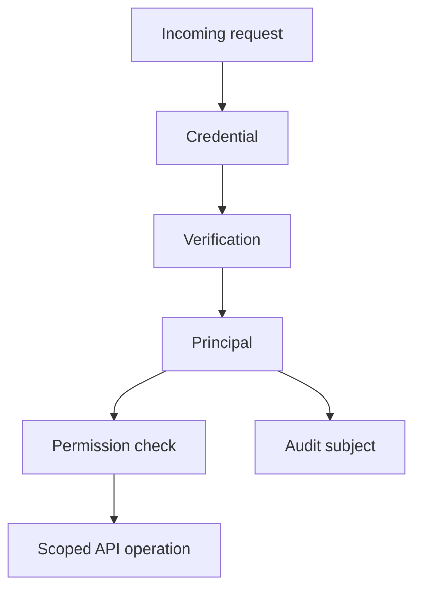
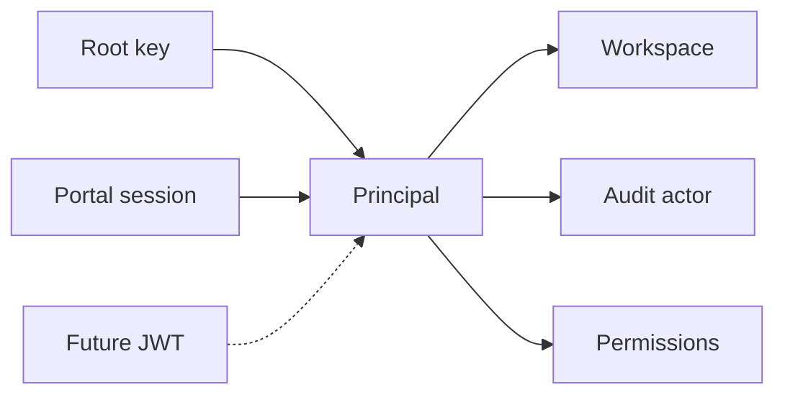
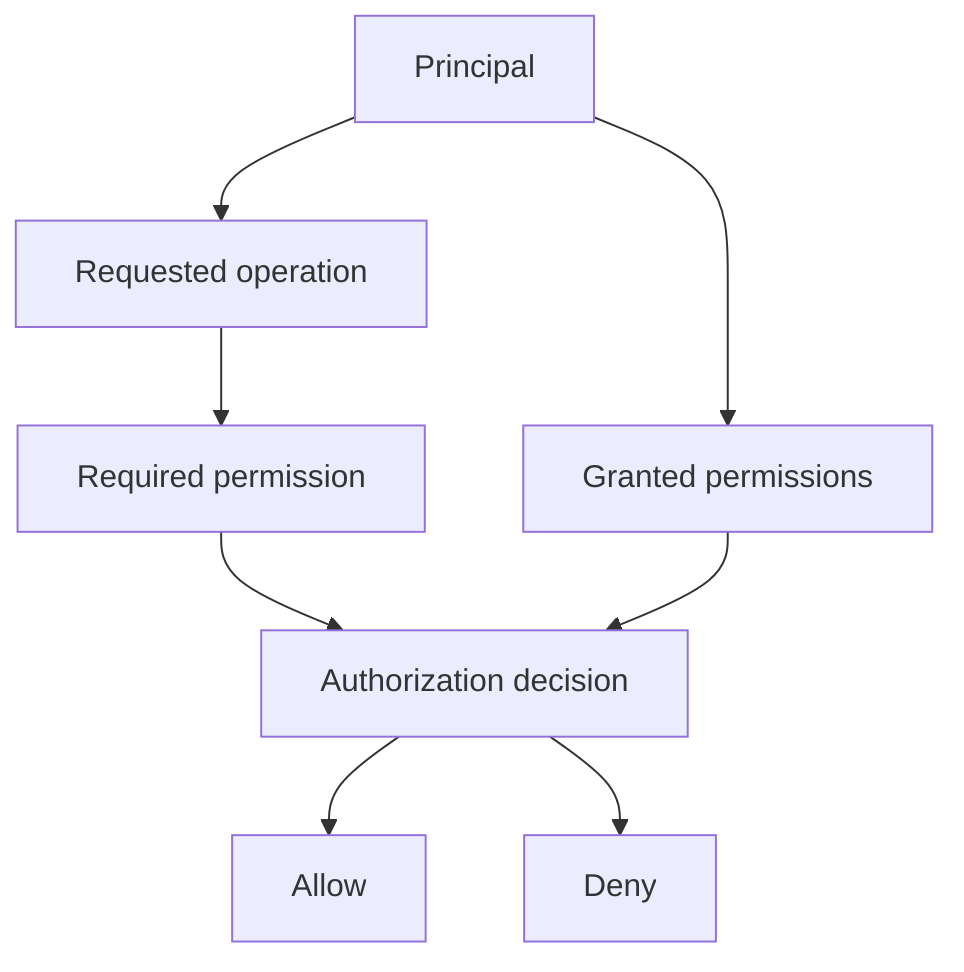

API authentication turns request credentials into a principal, then checks
whether that principal can perform the requested operation. The credential might
come from a root key, a browser session, or another source in the future, but
the rest of the API can reason about the same concepts.

This design keeps authentication source details out of business logic. Handlers
receive a workspace scope, an audit subject, and a permission set. They don't
need to know how the caller proved its identity.

## How it works

The API auth flow has four conceptual steps:

1. Find a credential on the request.
2. Verify that credential with the system that owns it.
3. Normalize the verified caller into a principal.
4. Check the principal's permissions before data access or mutation.

The principal is the boundary between authentication and the rest of the API. It
answers three questions:

- Which workspace is this request scoped to?
- Who or what appears as the actor in audit logs?
- Which permissions can this caller use?

That boundary is the main reason the API uses a unified auth flow. It lets the
API add or change credential sources without spreading source-specific logic
through handlers.

## Credential sources

Credential sources differ in how they prove identity, how long they live, and
who they represent. After verification, they all produce the same principal
concept.

Root keys represent machine-to-machine access. They are long-lived credentials
owned by a workspace and are suitable for public API clients.

Portal sessions represent an end user acting through the customer portal. They
are browser-oriented credentials and grant the permissions attached to that
session.

JWTs are a future source for short-lived bearer authentication. The important
design constraint is that adding JWTs does not change how handlers authorize
or audit requests.

## Principal model

A principal is not the raw credential. It is the normalized identity that the API
trusts after verification.

A principal contains:

- A workspace scope for reads, writes, and limits.
- A subject for audit logs.
- A credential source type for debugging and policy decisions.
- A permission set for authorization.

The subject is deliberately separate from the source. For example, a root key
and a portal session are different sources, but both still need a stable actor
for audit logs. Keeping the audit subject inside the principal avoids coupling
authentication to the audit log implementation.

The API principal shape intentionally stays close to the frontline principal
model. Long term, the API can run behind frontline and consume the same concept
instead of maintaining a separate auth model.

## Permission checks

Authentication only proves who the caller is. Authorization decides what that
caller can do.

The API keeps permission checks after authentication so every operation can ask
for the permission that matches the resource and action it is about to perform.
This keeps broad authentication success from becoming broad API access.

Most operations check a concrete resource and action. Some operations need a
broader predicate, such as "does this caller have any permission to verify keys
for API resources?" Those predicates still belong to the permission system
because they answer an authorization question, not an authentication question.

## Audit logging

Audit logging records the action performed by an authenticated principal. It
does not need to record the act of verifying the root key itself.

This distinction matters because credential verification can happen as a
mechanical step on many requests, while audit logs are meant to capture
security-relevant product actions. The action audit uses the principal's subject
as the actor.

## Tradeoffs

A unified principal adds a small normalization layer, but it removes repeated
credential-specific branching from handlers. That makes it easier to add new
credential sources without changing every API operation.

Keeping authorization with the authentication boundary makes the call site
explicit: authenticate the request, then authorize the operation. The
alternative is to put permission methods on the principal, but that makes the
principal depend on authorization behavior. The API treats the principal as data
and keeps policy evaluation in the authentication and permission layers.

The model also keeps audit logging separate from authentication. Authentication
produces the subject that audit logging needs, but the audit system owns how
actions are recorded.
