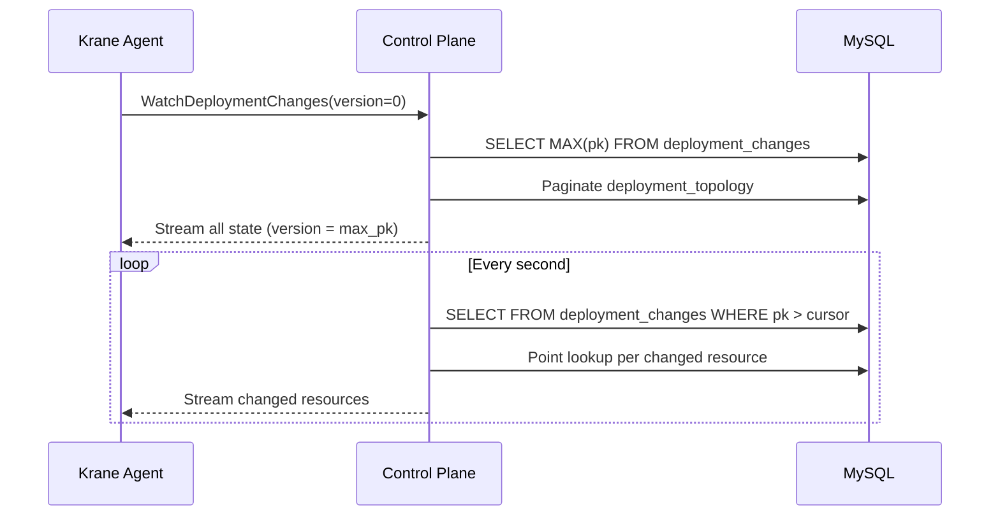

The deployment sync system delivers desired state from the control plane to krane agents running in each Kubernetes cluster. When a deploy workflow creates or updates deployment topologies, agents must learn about those changes so they can converge their cluster to match.

Key components:

- The `deployment_changes` MySQL table ([`pkg/mysql/schema/deployment_changes.sql`](https://github.com/unkeyed/unkey/blob/main/pkg/mysql/schema/deployment_changes.sql)), a change notification log.
- The `WatchDeploymentChanges` RPC ([`svc/ctrl/services/cluster/rpc_watch_deployment_changes.go`](https://github.com/unkeyed/unkey/blob/main/svc/ctrl/services/cluster/rpc_watch_deployment_changes.go)), a streaming endpoint that delivers changes to agents.
- The krane watcher ([`svc/krane/internal/watcher`](https://github.com/unkeyed/unkey/blob/main/svc/krane/internal/watcher)), which consumes the stream and dispatches events to controllers.

## Why this exists

The control plane and krane agents are separate processes in separate clusters. When a deploy workflow writes new state to MySQL, agents need to discover that change and apply it to Kubernetes. The deployment sync system bridges this gap with a pull-based streaming model similar to Kubernetes LIST+WATCH.

Previously, a Restate virtual object generated monotonic version numbers that were stamped onto state table rows. This coupled version generation to Restate and required a cross-system round-trip on every write. The `deployment_changes` table replaces this with a pure MySQL solution: writes and notifications happen in a single transaction, and the system can be tested and operated without Restate.

## How it works

### The `deployment_changes` table

Every mutation to deployment state (topology inserts, desired status changes) writes a row to `deployment_changes` in the same MySQL transaction as the state change itself. The row contains no state, just a pointer:

| Column | Purpose |
| --- | --- |
| `pk` | Auto-increment primary key. Acts as the streaming cursor. |
| `resource_type` | Enum value `deployment_topology`. The schema also defines `cilium_network_policy` and `sentinel`, both legacy values that are no longer produced or dispatched. Per-deployment Cilium policies are now installed by krane during deployment apply. |
| `resource_id` | The ID of the changed resource in its state table. |
| `region_id` | The region this change applies to. |
| `created_at` | Timestamp for TTL-based cleanup. |

A composite index on `(region_id, resource_type, pk)` makes polling efficient.

### The unified stream

Krane agents open a single `WatchDeploymentChanges` stream per region. The stream operates in two modes:

**Full sync (version_last_seen = 0).** On first connection or periodic resync, the server:

1. Reads `MAX(pk)` from `deployment_changes` to establish the cursor.
2. Paginates through all rows in `deployment_topology` for the region.
3. Streams every resource as a `DeploymentChangeEvent` with the version set to the max cursor.

This ensures agents see all current state regardless of how old the `deployment_changes` entries are.

**Incremental (version_last_seen > 0).** The server polls `deployment_changes` for rows with `pk > version_last_seen`, does a point lookup for each row to load current state from the relevant table, wraps it in a `DeploymentChangeEvent`, and streams it. Polling happens every second when idle.

### Event dispatch in krane

The krane watcher receives `DeploymentChangeEvent` messages carrying deployment state and dispatches each to the deployment controller:

- `DeploymentState` → `deployment.Controller.ApplyDeployment` or `DeleteDeployment`

Unrecognized or nil events are treated as errors to prevent silently skipping changes. The cursor only advances past successfully dispatched events.

### Periodic full resync

The watcher resets its cursor to 0 every 5 minutes, triggering a full sync. This acts as a consistency safety net: if a change was missed (e.g., a `deployment_changes` row was cleaned up before the agent processed it), the periodic full sync will reconcile the drift.

## Writing changes

Every code path that mutates deployment state must insert a `deployment_changes` row in the same transaction. The current write sites are:

- [`deploy_handler.go`](https://github.com/unkeyed/unkey/blob/main/svc/ctrl/worker/deploy/deploy_handler.go), `createTopologies` (bulk insert + deployment_changes per region).
- [`deployment_state.go`](https://github.com/unkeyed/unkey/blob/main/svc/ctrl/worker/deployment/deployment_state.go), `ChangeDesiredState` (topology status update + deployment_changes per region).

If you add a new mutation to any of these tables, you must also insert a `deployment_changes` row or the change will be invisible to krane until the next periodic full sync.

## Cleanup

Old `deployment_changes` rows can be cleaned up with TTL-based deletion since full syncs read directly from state tables. The cleanup query deletes rows older than a threshold in batches of 10,000 to avoid long-running transactions.

## Related docs

- [Deployment workflows](/architecture/services/control-plane/worker/workflows/deployments)
- [Worker overview](/architecture/services/control-plane/worker/overview)
