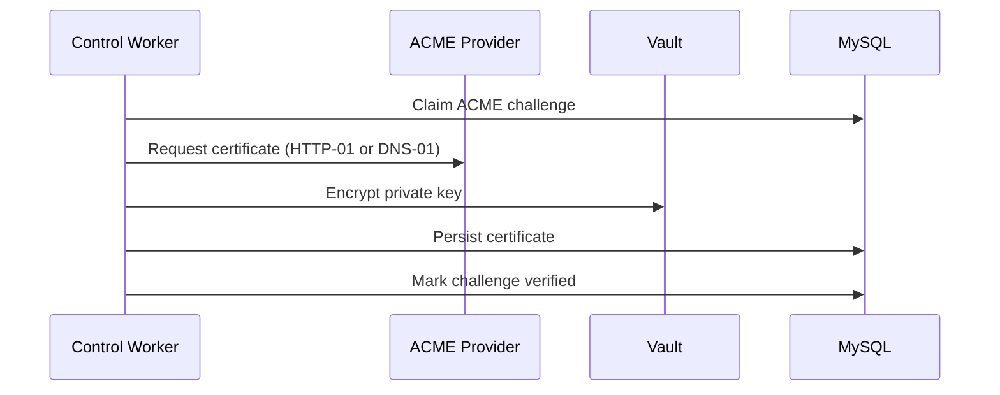
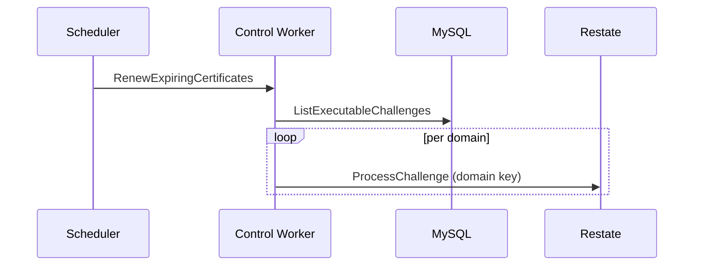

Certificate issuance is handled by the control worker certificate service. Workflows are keyed by domain name to avoid duplicate issuance.

Key components:

- Certificate service (<a href="https://github.com/unkeyed/unkey/blob/main/svc/ctrl/worker/certificate" target="_blank">`svc/ctrl/worker/certificate`</a>).
- ACME providers (<a href="https://github.com/unkeyed/unkey/blob/main/svc/ctrl/services/acme" target="_blank">`svc/ctrl/services/acme`</a>).
- Vault for encrypting private keys.
- Restate virtual object keyed by domain.

## Flow: issue or renew certificate

## Challenge types

- Wildcard domains use DNS-01.
- Regular domains use HTTP-01.

## Renewal workflow

Certificates are renewed through a Restate handler that scans `acme_challenges` for challenges that are waiting or expiring within 30 days. It triggers `ProcessChallenge` per domain. The renewal handler is intended to be invoked on a schedule via GitHub Actions.

## Notes

`ProcessChallenge` uses Restate durable sleep when Let's Encrypt returns a rate-limit retry-after value.

TODO: Document challenge routing, HTTP-01 provider details, and renewal scheduling intervals.
