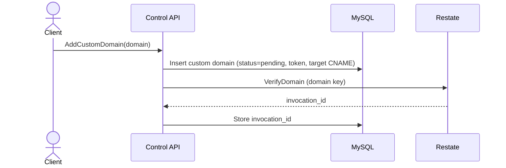
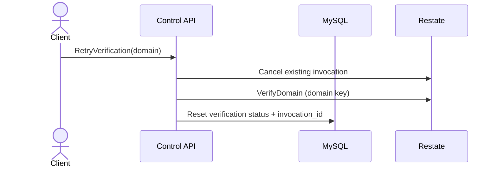
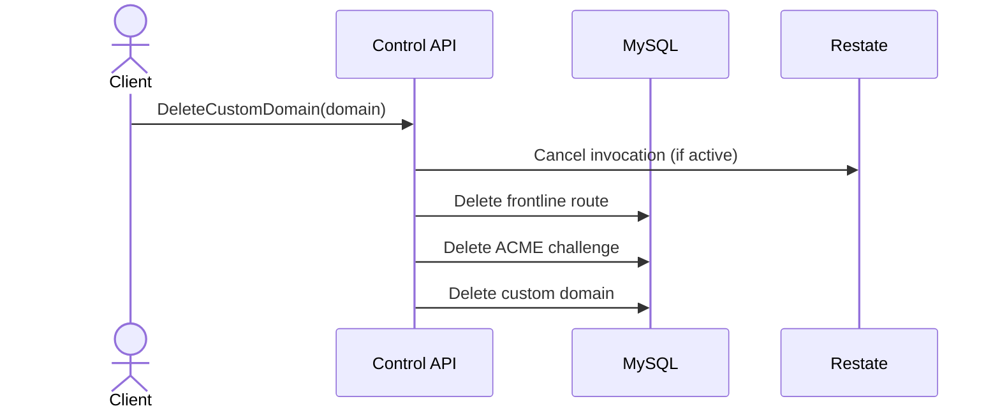

Custom domains are registered through the control API and verified through Restate workflows. Each domain is keyed by its hostname to prevent duplicate workflows.

Key components:

- Custom domain service (<a href="https://github.com/unkeyed/unkey/blob/main/svc/ctrl/services/customdomain" target="_blank">`svc/ctrl/services/customdomain`</a>).
- Restate verification workflow (`hydrav1.CustomDomainService`).
- Database records for domain state.

## Flow: add custom domain

## Flow: retry verification

## Flow: delete domain

## Notes

Verification checks run every minute for up to 24 hours. Both checks must pass before the domain is marked verified:

- TXT ownership record at `_unkey.<domain>` with value `unkey-domain-verify=<token>`.
- CNAME record pointing to the stored target CNAME.

Once verified, the workflow creates an ACME challenge (HTTP-01) and a frontline route. It triggers certificate issuance asynchronously.
