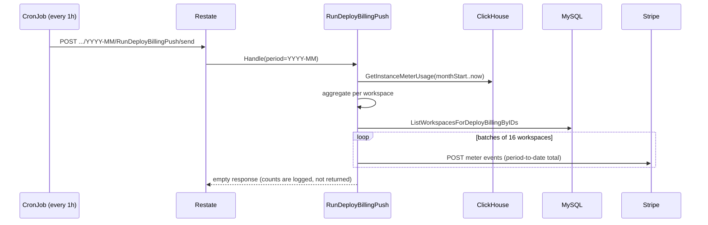

## Why this exists

Customers running Deploy workloads are billed for CPU, memory, disk, and egress. The raw usage lives in ClickHouse as per-pod counter checkpoints written by [heimdall](/infra/metering/heimdall), but Stripe is the system that turns usage into an invoice. The Deploy billing push is the hourly job that bridges the two: it computes each workspace's running month-to-date total and reports it to Stripe so the monthly invoice reflects actual consumption.

The push reports the absolute period-to-date total every tick rather than per-tick deltas. That single decision removes the failure modes a delta pipeline normally has: there are no deltas to deduplicate and no exactly-once delivery requirement, because a re-send of the same or a newer total is harmless. What it does not remove is coverage of the period boundary: the last value Stripe receives before the invoice finalizes is the one it bills, so the hourly push alone leaves the final partial hour of the month unbilled. A separate close step pushes the final total for the just-closed period before the invoice finalizes; that is where end-of-month coverage is handled. See [Month-end close](#month-end-close).

## How it works

A cronjob runs every hour and calls `CronService.RunDeployBillingPush` through the Restate ingress. The invocation is keyed by billing period (`YYYY-MM`), so ticks for the same month serialize on one virtual object while different months stay independent.

Each tick does four things:

1. Reads the running month-to-date usage for every workspace from ClickHouse, windowed from the first of the month to now.
2. Aggregates the per-resource rows into per-workspace meter totals, converting each meter into the unit its Stripe meter expects.
3. Resolves each workspace's Stripe customer ID from MySQL and drops only workspaces with no customer. Disabled workspaces are still billed: usage already incurred is owed regardless of current state.
4. Pushes each remaining workspace's totals to Stripe as billing meter events, fanning the pushes out in bounded batches.



### The meter contract

Stripe billing meters are configured with `default_aggregation.formula = "last"`, so each meter keeps the last value it received during the period. The worker sends the period-to-date running total, identifies the customer with the `stripe_customer_id` payload key, and carries the total in the `value` payload key. At period close, Stripe multiplies the metered price by the last value to produce the usage line on the invoice.

The worker references Stripe only by stable meter event names, never by generated price or meter IDs:

| Meter  | Event name            | Unit              |
| ------ | --------------------- | ----------------- |
| CPU    | `cpu_seconds`         | CPU-seconds       |
| Memory | `memory_gib_seconds`  | GiB-seconds       |
| Disk   | `disk_gib_seconds`    | GiB-seconds       |
| Egress | `egress_public_gib`   | binary GiB (2^30) |

These names are the contract between the worker and the Stripe catalog managed in the infra repo. The meter definitions and prices live there, not in this service. See [Stripe catalog setup](#stripe-catalog-setup-infra-repo).

### Why it's safe to re-run

The push is idempotent because the meter aggregates with `last` and the worker always sends the absolute total:

- A missed tick self-corrects on the next send, which carries an even larger month-to-date total.
- A duplicate or overlapping tick sends the same or a newer total, and `last` keeps whichever has the newest event timestamp.
- A Restate replay or manual re-trigger re-sends the current total; `last` keeps the newest, so the billed quantity is unchanged or advances, never doubles.

The events carry no idempotency identifier on purpose. `last` aggregation already makes correctness depend only on the most recent value, so dedup is unnecessary. A stable identifier would actively hurt: Stripe rejects a duplicate identifier with a hard 400, so a re-run within the same window would fail instead of being a harmless no-op. Workspaces are pushed forward only in the sense that the billed quantity tracks the latest observed total; there is no per-event accounting that a retry could double-count.

### Fan-out

Pushing workspaces one at a time is slow once tenant counts grow, and pushing all of them at once risks Stripe's rate limits. The handler fans out with `restate.RunAsync` in batches of `pushConcurrency` (16), awaiting each batch before starting the next. Each push runs as its own journaled Restate step, so a crash retries only the incomplete batch.

## Month-end close

The hourly push leaves the final partial hour of the month unbilled: whatever total Stripe last received before the renewal invoice finalizes is the one it bills. The close covers that boundary, and it runs in ctrl-api, not the worker.

When Stripe creates a Deploy workspace's renewal invoice at the period roll it emits `invoice.created`. ctrl-api handles it at `POST /webhooks/stripe`: it claims the draft (setting `auto_advance` off so Stripe stops racing to finalize) and dispatches `CronService.RunDeployBillingClose` for the closed period over the Restate ingress. The per-customer invoice storm at the roll collapses onto one durable invocation via the idempotency key; anything that is not a Deploy renewal invoice is ignored and keeps Stripe's own finalization.

`RunDeployBillingClose` pushes every billable workspace's final full-period usage, stamped one second before period end so the `last`-formula meters bill the whole month, then finalizes the Deploy workspaces' draft renewal invoices through `svc/ctrl/internal/invoicecloser`. A workspace whose final push fails is deliberately **left in draft** rather than finalized: finalizing would freeze an under-billed `last` value onto the invoice with no way to correct it. A 00:30 UTC backup cron calls the same handler with a **distinct** idempotency key (it carries the run timestamp), so it is a genuine fresh retry, not an attachment to the webhook's invocation: it re-pushes the absolute totals and finalizes any drafts left open. It runs at 00:30 rather than later so it lands before Stripe's ~1h auto-finalization of any invoice the webhook never claimed. A full ctrl outage degrades to Stripe's own one-hour auto-finalization.

### ctrl-api configuration

The webhook verifies signatures and the close finalizes invoices through the Stripe API, so ctrl-api needs both a webhook secret and an API key in its TOML config:

```toml
[stripe]
webhook_secret = "${STRIPE_WEBHOOK_SECRET}"
secret_key = "${STRIPE_SECRET_KEY}"
```

An empty `webhook_secret` leaves `/webhooks/stripe` unregistered. Both come from the `stripe-credentials` secret (`dev/.env.stripe` in local dev).

### Testing the close locally

1. Configure ctrl-api's Stripe as above, and forward Stripe events to ctrl-api (separate from any dashboard forwarding) so the webhook fires:

   ```bash
   stripe listen --forward-to https://ctrl-api.unkey.local/webhooks/stripe
   ```

   Paste the printed `whsec_...` into `dev/.env.stripe` as `STRIPE_WEBHOOK_SECRET`.

2. Put a workspace on a Deploy plan under a Stripe test clock (the dashboard checkout creates the clocked customer) with Deploy usage in ClickHouse for the period.

3. Advance the clock past the period end so Stripe finalizes the cycle and emits `invoice.created`:

   ```bash
   mise run unkey -- dev stripe clock advance --customer cus_...
   ```

4. The webhook claims the draft and dispatches the close. Confirm in the Stripe test dashboard that the renewal invoice carries the final period total and is finalized rather than left as a draft.

## Code layout

The work is split across three packages so the cron handler stays focused on orchestration:

| Package                                  | Responsibility                                                                          |
| ---------------------------------------- | --------------------------------------------------------------------------------------- |
| `svc/ctrl/worker/cron/deploybilling`     | The cron handler: reads usage, aggregates totals, resolves customers, and fans out pushes. |
| `svc/ctrl/internal/billingmeter`         | The billing provider client: the `Pusher` interface, the Stripe implementation, and a no-op. |
| `pkg/billingperiod`                       | Parses the `YYYY-MM` period key into a typed `Period`.                                   |

The push is disabled unless `stripe_secret_key` is configured. When it is empty, the worker wires `billingmeter.NewNoop()` and the cron still runs end to end (reading and aggregating usage) without reporting anything. This keeps the cron binding and schedule uniform across environments that do not bill.

## Configuration

The worker reads its Stripe secret key from its TOML config. Never inline the
key: the config loader expands `${VAR}` from the environment, so reference an
env var and keep the secret out of the file and out of version control.

```toml
[billing]
stripe_secret_key = "${STRIPE_SECRET_KEY}"
```

Use a test-mode key (`sk_test_...`) outside production. When `STRIPE_SECRET_KEY` is unset the value expands to empty and the push is a no-op. An optional Checkly heartbeat URL (`deploy_billing_push_url`) is pinged after a successful run.

## Stripe catalog (infra repo)

The worker only sends meter events by event name. The Stripe objects those events map to (the Deploy product, the usage meters, the metered prices, and the plan-fee prices) are **managed as code in the infra repo, not here** — this service never creates or mutates Stripe objects. The catalog design, meter unit prices, plan fees, per-environment setup, and the apply workflow all live there.

For setup, see the infra guide: <a href="https://github.com/unkeyed/infra/blob/main/docs/services/stripe-billing.md" target="_blank">Stripe Billing</a>.

## Testing

### Unit tests

The aggregation, period parsing, and meter event building are pure functions with table tests:

```bash
mise exec -- bazel test //pkg/billingperiod:billingperiod_test
mise exec -- bazel test //svc/ctrl/internal/billingmeter:billingmeter_test
mise exec -- bazel test //svc/ctrl/worker/cron/deploybilling:deploybilling_test
```

These cover unit conversion, the `YYYY-MM` parser, and the decimal formatting of meter values without touching Stripe.

### End to end with a Stripe sandbox

To exercise the full path against a real Stripe test account:

1. The usage meters are managed in the infra repo and are already applied to the shared sandbox, so there's nothing to apply from here. (To stand up a fresh sandbox, follow the [infra Stripe guide](https://github.com/unkeyed/infra/blob/main/docs/services/stripe-billing.md).)

2. Give the worker a test-mode key. In local dev (`mise run dev`), copy `dev/.env.stripe.example` to `dev/.env.stripe` and set a `sk_test_...` key from the shared sandbox:

   ```bash
   cp dev/.env.stripe.example dev/.env.stripe
   # edit dev/.env.stripe: STRIPE_SECRET_KEY=sk_test_...
   ```

   Tilt loads it into the `stripe-credentials` secret, which the worker reads as `STRIPE_SECRET_KEY` (the config's `stripe_secret_key = "${STRIPE_SECRET_KEY}"` expands to it). Without the file the push stays a no-op and just logs the numbers it would send.

3. Make sure a workspace has a `stripe_customer_id` set, is enabled, and has Deploy usage checkpoints in ClickHouse for the current month.

4. Trigger the push manually through the Restate ingress, keyed by the current billing period:

   ```bash
   curl -X POST \
     "http://localhost:8080/hydra.v1.CronService/$(date -u +%Y-%m)/RunDeployBillingPush/send"
   ```

5. Verify the result. The worker logs `workspaces_pushed` and `meters_pushed` on completion. In the Stripe test dashboard, open the customer's billing meters and confirm the meter values match the month-to-date totals. Run the push again and confirm the values converge on the latest total rather than doubling, which demonstrates the `last` aggregation.

Because the push sends absolute totals, you can re-run it as many times as you like during testing without inflating the billed quantity.
