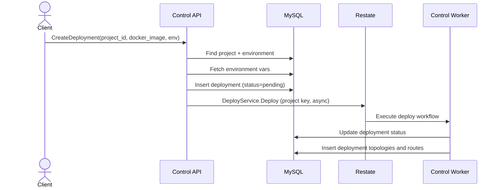
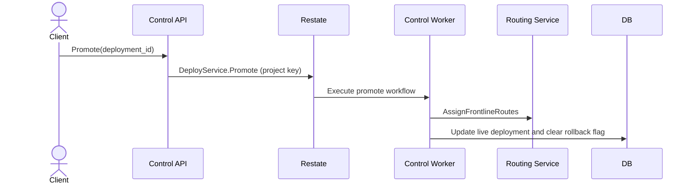
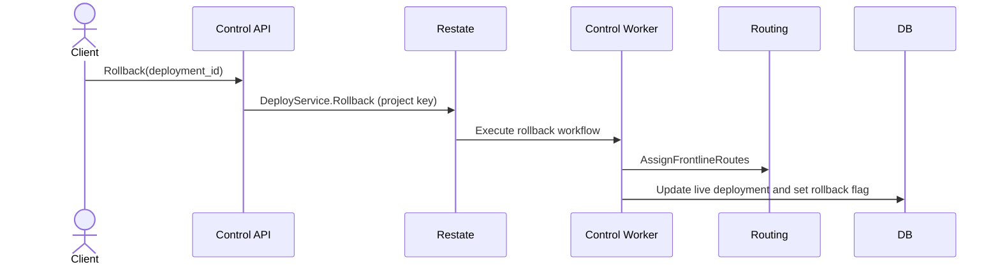

The control plane deployment service creates deployment records and delegates execution to Restate workflows. Workflows are keyed by project ID to serialize operations per project.

Key components:

- Control API deployment service (<a href="https://github.com/unkeyed/unkey/blob/main/svc/ctrl/services/deployment" target="_blank">`svc/ctrl/services/deployment`</a>).
- Restate DeployService workflows (<a href="https://github.com/unkeyed/unkey/blob/main/svc/ctrl/worker/deploy" target="_blank">`svc/ctrl/worker/deploy`</a>).
- Deployment virtual object for serialized state changes (<a href="https://github.com/unkeyed/unkey/blob/main/svc/ctrl/worker/deployment" target="_blank">`svc/ctrl/worker/deployment`</a>).

## Flow: create deployment

## Flow: promote deployment

## Flow: rollback deployment

## State serialization

Scheduled state changes are serialized via a Restate virtual object keyed by deployment ID in <a href="https://github.com/unkeyed/unkey/blob/main/svc/ctrl/worker/deployment" target="_blank">`svc/ctrl/worker/deployment`</a>. The object stores a nonce for the most recent transition so older delayed requests no-op.

## Notes

The deployment workflow supports Git sources, but the control API currently requires `docker_image`.
