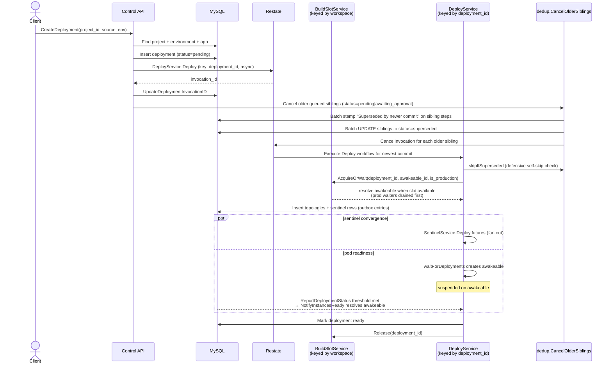
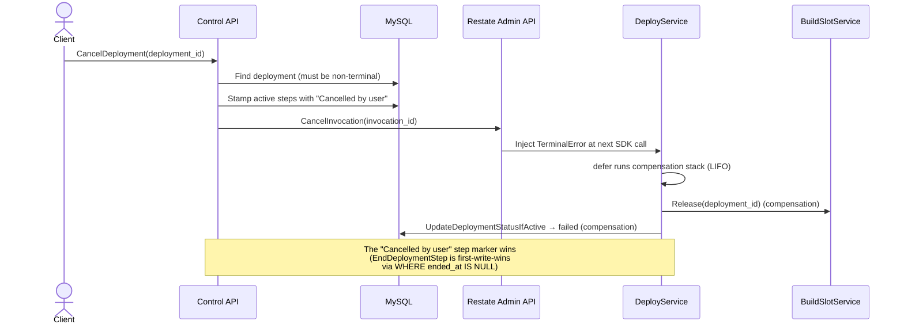
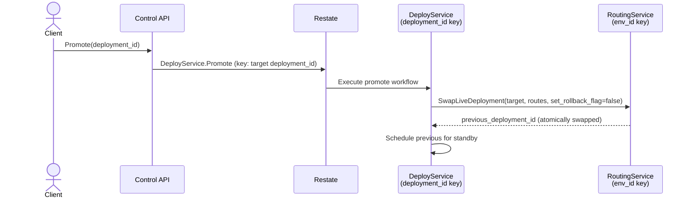
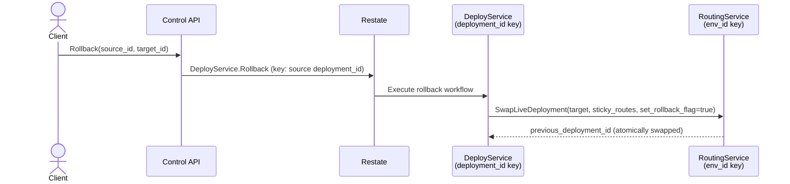

The control plane deployment service creates deployment records and delegates execution to Restate workflows.

## Virtual object keying

Each Restate VO uses the narrowest key that gives the serialization it needs:

- **`DeployService`** is keyed by `deployment_id`. Each deployment runs as its own isolated workflow, so multiple deployments in the same environment can build in parallel.
- **`RoutingService`** is keyed by `env_id`. All routing changes for an environment (frontline route assignment + the live-deployment swap) serialize here, so concurrent deploys/rollbacks/promotes for the same env can never race on `apps.current_deployment_id`.
- **`BuildSlotService`** is keyed by `workspace_id`. Caps how many deployments build at once across the workspace and prioritises production over preview waiters.
- **`DeploymentService`** (delayed desired-state transitions) is keyed by `deployment_id`.

Rollback and Promote are themselves workflows but they don't need their own env-keyed gate — the actual mutation goes through `RoutingService.SwapLiveDeployment`, which is per-env serialized.

Key components:

- Control API deployment service — [`svc/ctrl/services/deployment`](https://github.com/unkeyed/unkey/blob/main/svc/ctrl/services/deployment)
- `DeployService` Restate workflow — [`svc/ctrl/worker/deploy`](https://github.com/unkeyed/unkey/blob/main/svc/ctrl/worker/deploy)
- `RoutingService` (route assignment + live swap) — [`svc/ctrl/worker/routing`](https://github.com/unkeyed/unkey/blob/main/svc/ctrl/worker/routing)
- `DeploymentService` VO for delayed desired-state transitions — [`svc/ctrl/worker/deployment`](https://github.com/unkeyed/unkey/blob/main/svc/ctrl/worker/deployment)
- `BuildSlotService` VO for per-workspace build concurrency — [`svc/ctrl/worker/buildslot`](https://github.com/unkeyed/unkey/blob/main/svc/ctrl/worker/buildslot)
- Dedup helper for cancelling superseded queued siblings — [`svc/ctrl/dedup`](https://github.com/unkeyed/unkey/blob/main/svc/ctrl/dedup)

## Flow: create deployment

```mermaid
sequenceDiagram
  actor Client
  participant CtrlAPI as Control API
  participant DB as MySQL
  participant Restate as Restate
  participant BuildSlot as BuildSlotService<br/>(keyed by workspace)
  participant Worker as DeployService<br/>(keyed by deployment_id)
  participant Dedup as dedup.CancelOlderSiblings

  Client->>CtrlAPI: CreateDeployment(project_id, source, env)
  CtrlAPI->>DB: Find project + environment + app
  CtrlAPI->>DB: Insert deployment (status=pending)
  CtrlAPI->>Restate: DeployService.Deploy (key: deployment_id, async)
  Restate-->>CtrlAPI: invocation_id
  CtrlAPI->>DB: UpdateDeploymentInvocationID
  CtrlAPI->>Dedup: Cancel older queued siblings (status=pending|awaiting_approval)
  Dedup->>DB: Batch stamp "Superseded by newer commit" on sibling steps
  Dedup->>DB: Batch UPDATE siblings to status=superseded
  Dedup->>Restate: CancelInvocation for each older sibling
  Restate->>Worker: Execute Deploy workflow for newest commit
  Worker->>Dedup: skipIfSuperseded (defensive self-skip check)
  Worker->>BuildSlot: AcquireOrWait(deployment_id, awakeable_id, is_production)
  BuildSlot-->>Worker: resolve awakeable when slot available<br/>(prod waiters drained first)
  Worker->>DB: Insert topologies + sentinel rows (outbox entries)
  par sentinel convergence
    Worker->>Worker: SentinelService.Deploy futures (fan out)
  and pod readiness
    Worker->>Worker: waitForDeployments creates awakeable
    Note over Worker: suspended on awakeable
    DB-->>Worker: ReportDeploymentStatus threshold met<br/>→ NotifyInstancesReady resolves awakeable
  end
  Worker->>DB: Mark deployment ready
  Worker->>BuildSlot: Release(deployment_id)
```

## Flow: cancel deployment

```mermaid
sequenceDiagram
  actor Client
  participant CtrlAPI as Control API
  participant DB as MySQL
  participant RestateAdmin as Restate Admin API
  participant Worker as DeployService
  participant BuildSlot as BuildSlotService

  Client->>CtrlAPI: CancelDeployment(deployment_id)
  CtrlAPI->>DB: Find deployment (must be non-terminal)
  CtrlAPI->>DB: Stamp active steps with "Cancelled by user"
  CtrlAPI->>RestateAdmin: CancelInvocation(invocation_id)
  RestateAdmin->>Worker: Inject TerminalError at next SDK call
  Worker->>Worker: defer runs compensation stack (LIFO)
  Worker->>BuildSlot: Release(deployment_id) (compensation)
  Worker->>DB: UpdateDeploymentStatusIfActive → failed (compensation)
  Note over CtrlAPI,Worker: The "Cancelled by user" step marker wins<br/>(EndDeploymentStep is first-write-wins<br/>via WHERE ended_at IS NULL)
```

## Flow: promote

```mermaid
sequenceDiagram
  actor Client
  participant CtrlAPI as Control API
  participant Restate as Restate
  participant Worker as DeployService<br/>(deployment_id key)
  participant Routing as RoutingService<br/>(env_id key)

  Client->>CtrlAPI: Promote(deployment_id)
  CtrlAPI->>Restate: DeployService.Promote (key: target deployment_id)
  Restate->>Worker: Execute promote workflow
  Worker->>Routing: SwapLiveDeployment(target, routes, set_rollback_flag=false)
  Routing-->>Worker: previous_deployment_id (atomically swapped)
  Worker->>Worker: Schedule previous for standby
```

## Flow: rollback

```mermaid
sequenceDiagram
  actor Client
  participant CtrlAPI as Control API
  participant Restate as Restate
  participant Worker as DeployService<br/>(deployment_id key)
  participant Routing as RoutingService<br/>(env_id key)

  Client->>CtrlAPI: Rollback(source_id, target_id)
  CtrlAPI->>Restate: DeployService.Rollback (key: source deployment_id)
  Restate->>Worker: Execute rollback workflow
  Worker->>Routing: SwapLiveDeployment(target, sticky_routes, set_rollback_flag=true)
  Routing-->>Worker: previous_deployment_id (atomically swapped)
```

## BuildSlotService (workspace concurrency)

`BuildSlotService` caps concurrent builds per workspace. It is a Restate VO keyed by `workspace_id`, which makes `Acquire` and `Release` race-free across concurrent deploy handlers.

State held in the VO:

- `active_slots` — set of deployment IDs currently holding a slot
- `prod_wait_list` — FIFO of production waiters
- `preview_wait_list` — FIFO of non-production waiters

Acquire flow:

1. Deploy handler creates a Restate awakeable and calls `AcquireOrWait(deployment_id, awakeable_id, is_production)`.
2. The workspace's `max_concurrent_builds` quota is fetched. If `len(active_slots) < limit`, the deployment is added to `active_slots` and the awakeable is resolved immediately.
3. Otherwise the deployment is appended to `prod_wait_list` (if production) or `preview_wait_list` (if not). The Deploy handler stays suspended on `awakeable.Result()`.

Production deployments respect the same quota cap as preview — they don't bypass — but they get priority by going onto a separate wait list that Release drains first.

Release flow:

1. Deploy handler calls `Release(deployment_id)` — from the success path explicitly, or from the compensation stack on failure/cancel.
2. If the deployment was in `active_slots`, it is removed and a waiter is promoted: `prod_wait_list` first, then `preview_wait_list`. The promoted waiter's awakeable is resolved.
3. If the deployment was in either wait list (cancelled before it ever got a slot), it is removed.

This gives push-based slot hand-off with priority — no polling. The concurrency cap is `quota.max_concurrent_builds` per workspace.

## Commit deduplication

When a new deployment is created, `dedup.CancelOlderSiblings` looks for older deployments on the same `(app, environment, branch)` that are still in the build queue (`pending` or `awaiting_approval`) and cancels them.

Once a deployment acquires a build slot and transitions to `starting`, it is **committed** — newer commits will not supersede it. This avoids the pathological case where rapid pushes keep cancelling builds and nothing ever finishes.

Cancellation happens in three steps, all batched:

1. **One SELECT** — list older queued sibling deployments with their invocation IDs.
2. **One batch UPDATE** — stamp every sibling's in-flight steps with `"Superseded by newer commit"` (first-write-wins via `WHERE ended_at IS NULL`).
3. **One batch UPDATE** — transition every sibling to `status=superseded`.
4. **N HTTP calls** — `restateAdmin.CancelInvocation` for each sibling that has an invocation ID.

Only git-sourced deployments with a branch are deduplicated; Docker-image redeploys bypass this path.

## Instance readiness (awakeable-based)

After `createTopologies`, `ensureSentinelRows`, and `ensureCiliumNetworkPolicy`, the Deploy handler fires off `SentinelService.Deploy` RPCs as `RequestFuture`s (non-blocking) and then enters `waitForDeployments` which parks on a Restate awakeable. Both waits — sentinel convergence and pod readiness — happen in parallel on krane's side.

`waitForDeployments` flow:

1. Create `restate.Awakeable[restate.Void]`.
2. Store the `awakeable_id` in VO state under `"instances_ready_awakeable"`. (Since `DeployService` is keyed by `deployment_id`, each VO instance owns the awakeable for exactly one deployment — no cross-deployment guard needed.)
3. Do an initial DB check — if instances are already healthy (e.g. a redeploy against already-running pods), resolve the awakeable immediately.
4. `WaitFirst(awakeable, After(regionReadyTimeout))` — races ready-notification vs 15-minute timeout.
5. On any failure path the compensation stack clears the state key.

The awakeable is resolved by `DeployService.NotifyInstancesReady`, a `SHARED` handler that runs concurrently with the suspended Deploy.

Caller: `cluster.Service.ReportDeploymentStatus` (the RPC krane calls to report instance state) runs a thundering-herd gate after the upsert transaction:

1. Deployment must be in an active status (`starting | building | deploying | network | finalizing`).
2. Look up per-region min replicas via `FindDeploymentTopologyMinReplicas`.
3. Count running instances per region; require `numRegions - 1` healthy regions (minimum 1 — tolerates one regional outage).
4. Dedup the notification via an in-process `sync.Map` so we don't re-fire on every subsequent status report once the threshold is met.
5. If threshold met (and not yet notified), send `DeployService.NotifyInstancesReady(deployment_id)` via the ingress client, keyed by `deployment_id`.

This mirrors the sentinel pattern (`ReportSentinelStatus` → `SentinelService.NotifyReady`).

## Self-skip (belt-and-suspenders dedup)

In addition to the proactive cancel above, the Deploy handler checks `HasNewerActiveDeployment` at the top of its workflow. If a newer sibling on the same `(app, env, branch)` is already `pending`, `starting`, `building`, `deploying`, `network`, `finalizing`, `ready`, or `awaiting_approval`, the current deployment self-skips. This catches races where the proactive cancel didn't land (e.g. the newer deployment hadn't persisted its invocation ID yet).

## State serialization (desired state)

Scheduled state changes are serialized via a Restate virtual object keyed by deployment ID in [`svc/ctrl/worker/deployment`](https://github.com/unkeyed/unkey/blob/main/svc/ctrl/worker/deployment). The object stores a nonce for the most recent transition so older delayed requests no-op.

## Retry policy

The `DeployService` is registered with an exponential-backoff retry policy: `30s → 1m → 2m → 4m → 5m` (capped), 10 attempts total (~30 minutes). If a deploy can't make progress after 10 retries (persistent MySQL connection errors, Depot outage), Restate kills the invocation, the compensation stack runs, and the deployment is marked failed. This replaces an older 150-attempt policy that could leave a deploy stuck retrying for ~24 hours.

## Compensation stack

The Deploy handler maintains a LIFO compensation stack registered via `Compensation.Add` (for side-effects wrapped in `restate.RunVoid`) and `Compensation.AddCtx` (for raw `ObjectContext` operations like `BuildSlotService.Release().Send`). The stack fires on any error or cancellation:

- Release the build slot
- Mark the deployment as `failed` (only if still in an active status — the conditional `UpdateDeploymentStatusIfActive` query prevents overwriting `superseded` or `ready`)
- Undo topology inserts, route assignments, etc.
