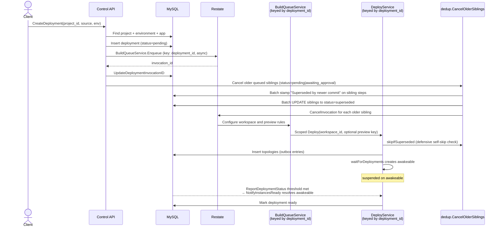
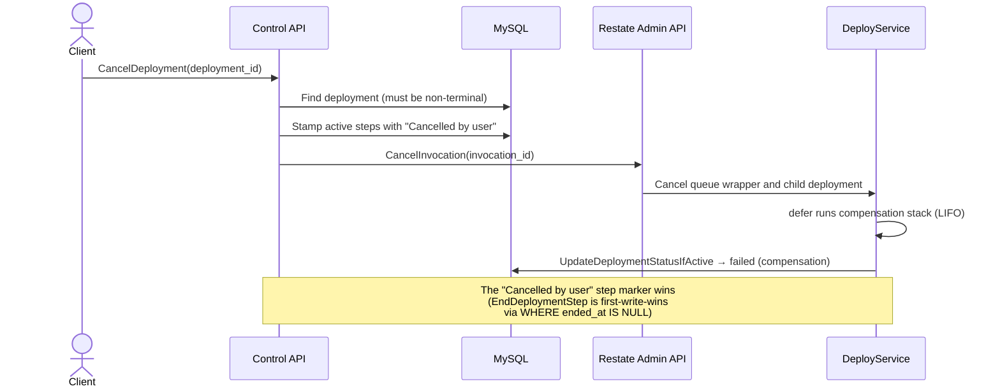
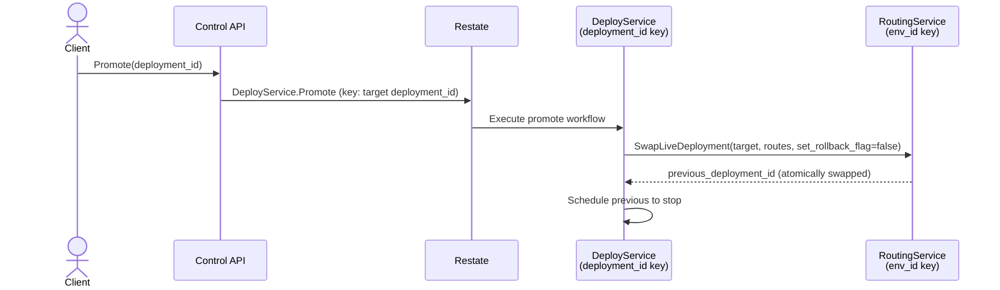
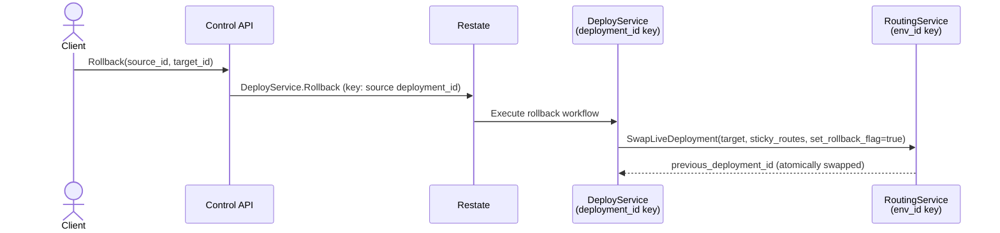

The control plane deployment service creates deployment records and delegates execution to Restate workflows.

## Virtual object keying

Each Restate VO uses the narrowest key that gives the serialization it needs:

- **`DeployService`** is keyed by `deployment_id`. Each deployment runs as its own isolated workflow, so multiple deployments in the same environment can build in parallel.
- **`RoutingService`** is keyed by `env_id`. All routing changes for an environment (frontline route assignment + the live-deployment swap) serialize here, so concurrent deploys/rollbacks/promotes for the same env can never race on `apps.current_deployment_id`.
- `BuildQueueService` is keyed by `deployment_id`. It starts the queue timeout, configures Restate concurrency rules, and invokes `DeployService` with the workspace scope.
- **`DeploymentService`** (delayed desired-state transitions) is keyed by `deployment_id`.

Rollback and Promote are themselves workflows but they don't need their own env-keyed gate — the actual mutation goes through `RoutingService.SwapLiveDeployment`, which is per-env serialized.

Key components:

- Control API deployment service — [`svc/ctrl/services/deployment`](https://github.com/unkeyed/unkey/blob/main/svc/ctrl/services/deployment)
- `DeployService` Restate workflow — [`svc/ctrl/worker/deploy`](https://github.com/unkeyed/unkey/blob/main/svc/ctrl/worker/deploy)
- `RoutingService` (route assignment + live swap) — [`svc/ctrl/worker/routing`](https://github.com/unkeyed/unkey/blob/main/svc/ctrl/worker/routing)
- `DeploymentService` VO for delayed desired-state transitions — [`svc/ctrl/worker/deployment`](https://github.com/unkeyed/unkey/blob/main/svc/ctrl/worker/deployment)
- `BuildQueueService` VO for per-workspace build concurrency: [`svc/ctrl/worker/buildqueue`](https://github.com/unkeyed/unkey/blob/main/svc/ctrl/worker/buildqueue)
- Dedup helper for cancelling superseded queued siblings — [`svc/ctrl/dedup`](https://github.com/unkeyed/unkey/blob/main/svc/ctrl/dedup)

## Flow: create deployment

```mermaid
sequenceDiagram
  actor Client
  participant CtrlAPI as Control API
  participant DB as MySQL
  participant Restate as Restate
  participant BuildQueue as BuildQueueService<br/>(keyed by deployment_id)
  participant Worker as DeployService<br/>(keyed by deployment_id)
  participant Dedup as dedup.CancelOlderSiblings

  Client->>CtrlAPI: CreateDeployment(project_id, source, env)
  CtrlAPI->>DB: Find project + environment + app
  CtrlAPI->>DB: Insert deployment (status=pending)
  CtrlAPI->>Restate: BuildQueueService.Enqueue (key: deployment_id, async)
  Restate-->>CtrlAPI: invocation_id
  CtrlAPI->>DB: UpdateDeploymentInvocationID
  CtrlAPI->>Dedup: Cancel older queued siblings (status=pending|awaiting_approval)
  Dedup->>DB: Batch stamp "Superseded by newer commit" on sibling steps
  Dedup->>DB: Batch UPDATE siblings to status=superseded
  Dedup->>Restate: CancelInvocation for each older sibling
  Restate->>BuildQueue: Configure workspace and preview rules
  BuildQueue->>Worker: Scoped Deploy(workspace_id, optional preview key)
  Worker->>Dedup: skipIfSuperseded (defensive self-skip check)
  Worker->>DB: Insert topologies (outbox entries)
  Worker->>Worker: waitForDeployments creates awakeable
  Note over Worker: suspended on awakeable
  DB-->>Worker: ReportDeploymentStatus threshold met<br/>→ NotifyInstancesReady resolves awakeable
  Worker->>DB: Mark deployment ready
```

## Flow: cancel deployment

```mermaid
sequenceDiagram
  actor Client
  participant CtrlAPI as Control API
  participant DB as MySQL
  participant RestateAdmin as Restate Admin API
  participant Worker as DeployService

  Client->>CtrlAPI: CancelDeployment(deployment_id)
  CtrlAPI->>DB: Find deployment (must be non-terminal)
  CtrlAPI->>DB: Stamp active steps with "Cancelled by user"
  CtrlAPI->>RestateAdmin: CancelInvocation(invocation_id)
  RestateAdmin->>Worker: Cancel queue wrapper and child deployment
  Worker->>Worker: defer runs compensation stack (LIFO)
  Worker->>DB: UpdateDeploymentStatusIfActive → failed (compensation)
  Note over CtrlAPI,Worker: The "Cancelled by user" step marker wins<br/>(EndDeploymentStep is first-write-wins<br/>via WHERE ended_at IS NULL)
```

## Flow: promote

```mermaid
sequenceDiagram
  actor Client
  participant CtrlAPI as Control API
  participant Restate as Restate
  participant Worker as DeployService<br/>(deployment_id key)
  participant Routing as RoutingService<br/>(env_id key)

  Client->>CtrlAPI: Promote(deployment_id)
  CtrlAPI->>Restate: DeployService.Promote (key: target deployment_id)
  Restate->>Worker: Execute promote workflow
  Worker->>Routing: SwapLiveDeployment(target, routes, set_rollback_flag=false)
  Routing-->>Worker: previous_deployment_id (atomically swapped)
  Worker->>Worker: Schedule previous to stop
```

## Flow: rollback

```mermaid
sequenceDiagram
  actor Client
  participant CtrlAPI as Control API
  participant Restate as Restate
  participant Worker as DeployService<br/>(deployment_id key)
  participant Routing as RoutingService<br/>(env_id key)

  Client->>CtrlAPI: Rollback(source_id, target_id)
  CtrlAPI->>Restate: DeployService.Rollback (key: source deployment_id)
  Restate->>Worker: Execute rollback workflow
  Worker->>Routing: SwapLiveDeployment(target, sticky_routes, set_rollback_flag=true)
  Routing-->>Worker: previous_deployment_id (atomically swapped)
```

## Workspace build concurrency

`BuildQueueService` is an unscoped VO keyed by `deployment_id`. It asks the workspace-keyed `BuildRuleService` to read `limits.builds_concurrent_max`, default missing limits to one, and upsert Restate rules for the workspace scope and its `preview` L1 limit key. It then starts a scoped `DeployService.Deploy` child and races admission against a 6-hour timeout.

The workspace rule limits all active builds to N. For N greater than one, the preview rule limits previews to N-1 and reserves one permit for production. At N=1, preview remains one. Restate's fair scheduling prevents starvation, but doesn't preserve strict production-first ordering.

The worker installs a wildcard concurrency limit of one before it accepts deployments. This limit prevents an unseen workspace from running without a cap while its exact rule propagates. `BuildRuleService`, keyed by workspace, serializes exact rule updates and reads the latest database value before each update.

### Roll out the vqueue migration

Restate 1.7.3 can migrate retained invocations, but enabling vqueues is a one-way operation. Use this sequence for an existing cluster:

1. Stop new deployment admission.
2. Upgrade every Restate server to 1.7.3 with vqueues disabled.
3. Drain or cancel every unscoped `DeployService` invocation and its `BuildSlotService` waiter. Reconcile any remaining nonterminal deployment rows before removing the old worker.
4. Enable protocol v7, vqueues, and scoped virtual objects on every Restate node, then restart the cluster.
5. Wait for `[VQueues Migration Completed]` on every partition. Confirm that `partition_state.enabled_features` contains `vqueues`.
6. Deploy the worker and API that route new work through `BuildQueueService`.
7. Resume deployment admission.

Don't send readiness notifications to a scoped deployment until the old unscoped deployment invocations have drained. A scoped virtual object and an unscoped virtual object with the same key are different Restate identities.

## Commit deduplication

When a new deployment is created, `dedup.CancelOlderSiblings` looks for older deployments on the same `(app, environment, branch)` that are still in the build queue (`pending` or `awaiting_approval`) and cancels them.

Once a deployment transitions to `starting`, it is committed. Newer commits don't supersede it. This prevents rapid pushes from cancelling every active build.

Cancellation happens in three steps, all batched:

1. **One SELECT** — list older queued sibling deployments with their invocation IDs.
2. **One batch UPDATE** — stamp every sibling's in-flight steps with `"Superseded by newer commit"` (first-write-wins via `WHERE ended_at IS NULL`).
3. **One batch UPDATE** — transition every sibling to `status=superseded`.
4. **N HTTP calls** — `restateAdmin.CancelInvocation` for each sibling that has an invocation ID.

Only git-sourced deployments with a branch are deduplicated; Docker-image redeploys bypass this path.

## Instance readiness (awakeable-based)

After `createTopologies`, the Deploy handler enters `waitForDeployments`, which parks on a Restate awakeable until krane reports pod readiness. Krane installs the per-deployment Cilium network policy itself when it applies each deployment, so the handler does not create one.

`waitForDeployments` flow:

1. Load per-region min replicas via `FindDeploymentTopologyMinReplicas`.
2. Count running instances per region.
3. Require `numRegions - 1` healthy regions (minimum 1, tolerating one regional outage).
4. Repeat the DB check until the threshold is met or `regionReadyTimeout` elapses.

The awakeable is resolved by `DeployService.NotifyInstancesReady`, a `SHARED` handler that runs concurrently with the suspended Deploy.

Caller: `cluster.Service.ReportDeploymentStatus` (the RPC krane calls to report instance state) runs a thundering-herd gate after the upsert transaction:

1. Deployment must be in an active status (`starting | building | deploying | network | finalizing`).
2. Look up per-region min replicas via `FindDeploymentTopologyMinReplicas`.
3. Count running instances per region; require `numRegions - 1` healthy regions (minimum 1 — tolerates one regional outage).
4. Dedup the notification via an in-process `sync.Map` so we don't re-fire on every subsequent status report once the threshold is met.
5. If the threshold is met, send `DeployService.NotifyInstancesReady(deployment_id)` with the deployment's workspace scope and deployment ID key.

## Self-skip (belt-and-suspenders dedup)

In addition to the proactive cancel above, the Deploy handler checks `HasNewerActiveDeployment` at the top of its workflow. If a newer sibling on the same `(app, env, branch)` is already `pending`, `starting`, `building`, `deploying`, `network`, `finalizing`, `ready`, or `awaiting_approval`, the current deployment self-skips. This catches races where the proactive cancel didn't land (e.g. the newer deployment hadn't persisted its invocation ID yet).

## State serialization (desired state)

Scheduled state changes are serialized via a Restate virtual object keyed by deployment ID in [`svc/ctrl/worker/deployment`](https://github.com/unkeyed/unkey/blob/main/svc/ctrl/worker/deployment). The object stores a nonce for the most recent transition so older delayed requests no-op.

## Retry policy

The `DeployService` is registered with an exponential-backoff retry policy: `30s → 1m → 2m → 4m → 5m` (capped), 10 attempts total (~30 minutes). If a deploy can't make progress after 10 retries (persistent MySQL connection errors, Depot outage), Restate kills the invocation, the compensation stack runs, and the deployment is marked failed. This replaces an older 150-attempt policy that could leave a deploy stuck retrying for ~24 hours.

## Compensation stack

The Deploy handler maintains a LIFO compensation stack registered via `Compensation.Add` and `Compensation.AddCtx`. The stack fires on any error or cancellation:

- Mark the deployment as `failed` (only if still in an active status — the conditional `UpdateDeploymentStatusIfActive` query prevents overwriting `superseded` or `ready`)
- Undo topology inserts, route assignments, etc.
