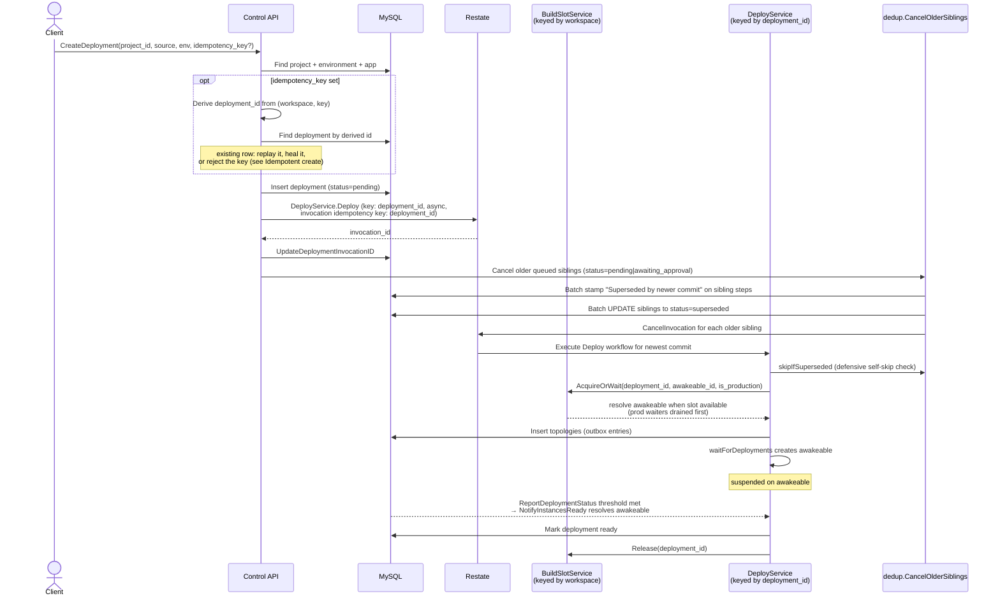
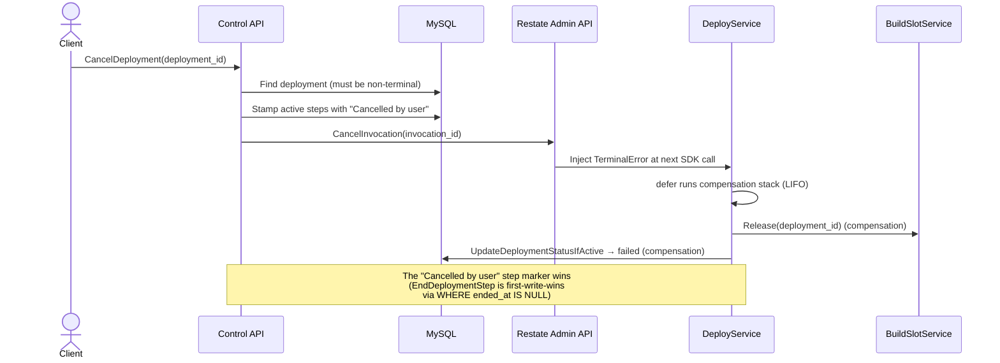
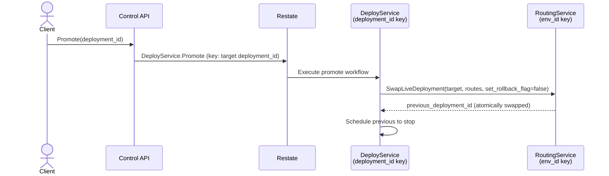
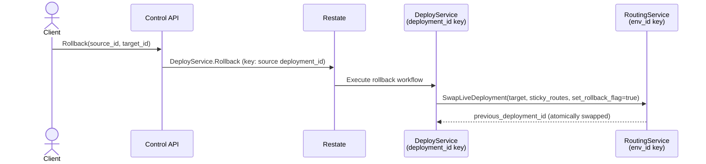

The control plane deployment service creates deployment records and delegates execution to Restate workflows.

## Virtual object keying

Each Restate VO uses the narrowest key that gives the serialization it needs:

- **`DeployService`** is keyed by `deployment_id`. Each deployment runs as its own isolated workflow, so multiple deployments in the same environment can build in parallel.
- **`RoutingService`** is keyed by `env_id`. All routing changes for an environment (frontline route assignment + the live-deployment swap) serialize here, so concurrent deploys/rollbacks/promotes for the same env can never race on `apps.current_deployment_id`.
- **`BuildSlotService`** is keyed by `workspace_id`. Caps how many deployments build at once across the workspace and prioritises production over preview waiters.
- **`DeploymentService`** (delayed desired-state transitions) is keyed by `deployment_id`.

Rollback and Promote are themselves workflows but they don't need their own env-keyed gate — the actual mutation goes through `RoutingService.SwapLiveDeployment`, which is per-env serialized.

Key components:

- Control API deployment service — [`svc/ctrl/services/deployment`](https://github.com/unkeyed/unkey/blob/main/svc/ctrl/services/deployment)
- `DeployService` Restate workflow — [`svc/ctrl/worker/deploy`](https://github.com/unkeyed/unkey/blob/main/svc/ctrl/worker/deploy)
- `RoutingService` (route assignment + live swap) — [`svc/ctrl/worker/routing`](https://github.com/unkeyed/unkey/blob/main/svc/ctrl/worker/routing)
- `DeploymentService` VO for delayed desired-state transitions — [`svc/ctrl/worker/deployment`](https://github.com/unkeyed/unkey/blob/main/svc/ctrl/worker/deployment)
- `BuildSlotService` VO for per-workspace build concurrency — [`svc/ctrl/worker/buildslot`](https://github.com/unkeyed/unkey/blob/main/svc/ctrl/worker/buildslot)
- Dedup helper for cancelling superseded queued siblings — [`svc/ctrl/dedup`](https://github.com/unkeyed/unkey/blob/main/svc/ctrl/dedup)

## Flow: create deployment

```mermaid
sequenceDiagram
  actor Client
  participant CtrlAPI as Control API
  participant DB as MySQL
  participant Restate as Restate
  participant BuildSlot as BuildSlotService<br/>(keyed by workspace)
  participant Worker as DeployService<br/>(keyed by deployment_id)
  participant Dedup as dedup.CancelOlderSiblings

  Client->>CtrlAPI: CreateDeployment(project_id, source, env, idempotency_key?)
  CtrlAPI->>DB: Find project + environment + app
  opt idempotency_key set
    CtrlAPI->>CtrlAPI: Derive deployment_id from (workspace, key)
    CtrlAPI->>DB: Find deployment by derived id
    Note over CtrlAPI: existing row: replay it, heal it,<br/>or reject the key (see Idempotent create)
  end
  CtrlAPI->>DB: Insert deployment (status=pending)
  CtrlAPI->>Restate: DeployService.Deploy (key: deployment_id, async,<br/>invocation idempotency key: deployment_id)
  Restate-->>CtrlAPI: invocation_id
  CtrlAPI->>DB: UpdateDeploymentInvocationID
  CtrlAPI->>Dedup: Cancel older queued siblings (status=pending|awaiting_approval)
  Dedup->>DB: Batch stamp "Superseded by newer commit" on sibling steps
  Dedup->>DB: Batch UPDATE siblings to status=superseded
  Dedup->>Restate: CancelInvocation for each older sibling
  Restate->>Worker: Execute Deploy workflow for newest commit
  Worker->>Dedup: skipIfSuperseded (defensive self-skip check)
  Worker->>BuildSlot: AcquireOrWait(deployment_id, awakeable_id, is_production)
  BuildSlot-->>Worker: resolve awakeable when slot available<br/>(prod waiters drained first)
  Worker->>DB: Insert topologies (outbox entries)
  Worker->>Worker: waitForDeployments creates awakeable
  Note over Worker: suspended on awakeable
  DB-->>Worker: ReportDeploymentStatus threshold met<br/>→ NotifyInstancesReady resolves awakeable
  Worker->>DB: Mark deployment ready
  Worker->>BuildSlot: Release(deployment_id)
```

## Idempotent create

`CreateDeployment` accepts an optional caller-supplied idempotency key (the v2 API forwards the `Idempotency-Key` header). There is no key table: the deployment id itself is the dedup gate. A keyed create derives its id as `uid.Derived("d", workspace_id, key)` (sha256, base62, 22 characters, disjoint from random ids), so a retry re-derives the same id and the primary key rejects the duplicate insert. The workspace id in the hash keeps tenants isolated: the same key in two workspaces derives two ids.

Because the row is the only record a key exists, a key stays bound only while its row survives. Purging a row frees its derived id, so a reused key creates a new deployment instead of replaying. This already happens: `Delete` in the environment worker hard-deletes the environment's deployment rows, and project and app deletes cascade into it. Callers cannot observe the release today, because a deleted target has no deployment left to replay.

A keyed retry that finds an existing row is dispatched by `dedupKeyedCreate` and classified by `resolveKeyedRetry` ([`svc/ctrl/services/deployment/create_deployment.go`](https://github.com/unkeyed/unkey/blob/main/svc/ctrl/services/deployment/create_deployment.go)):

| Existing row                                            | Answer                                                                                                                     |
| ------------------------------------------------------- | -------------------------------------------------------------------------------------------------------------------------- |
| Different app or environment                            | Reject: `AlreadyExists` with reason `key-scope-mismatch`. Answering would silently ignore the requested target.            |
| `pending`, no invocation id                             | Heal (below). The create died between insert and send, so no workflow will ever run it.                                    |
| Dead status (terminal except `ready`), no invocation id | Reject: `AlreadyExists` with reason `key-spent`. Nothing bound to this key will ever progress; the caller needs a new key. |
| Anything else                                           | Replay: return the original deployment id, no insert, no workflow, no audit.                                               |

The same classification runs twice: once as a pre-check before gates and source resolution (so replays cost one read), and again when the insert hits a duplicate-key error because a concurrent request won the race.

**Heal** (`healDeployment`) revives a stuck row: skip the insert, send the workflow, and write the invocation id onto the row. The build is pinned to what the row records, not the retry body, because the row defines what the deployment id means and the branch or body may have changed since the original attempt. A recorded image pins a docker build, which is why docker-source creates record their image at insert. A recorded commit without an image pins a git build, so the retry body cannot repoint it at an image. Command always comes from the row.

A repo connection deleted since the crash refuses the heal instead of silently falling back to the current deployment's image, and that refusal marks the row failed, spending the key: the build it pins can never run, so leaving it pending would loop the caller on the same key forever. The spend records a `queued` step ended with the reason, in the same transaction as the status change, so the dashboard shows why the deployment died instead of an empty timeline. Transient resolution errors (a GitHub outage) leave the row pending and healable.

Heal is safe to repeat. Sibling dedup runs with the stuck row's own creation time, so a heal never supersedes deployments newer than the row it revives, and a send failure never marks a healed row failed, so the next retry can heal again.

**Send failure on a fresh create.** Only unkeyed creates mark the row failed when the Restate send errors. A keyed create leaves the row pending, because a send error is ambiguous (Restate may have accepted it): the caller retries the same key, the heal re-sends, and the invocation-idempotent send attaches instead of building twice. Marking it failed would spend the key and force a duplicate deployment under a new one.

**Restate send idempotency.** The `DeployService` VO key only serializes invocations; it does not deduplicate them. Every `Deploy` send therefore carries an invocation-level idempotency key equal to the deployment id, so a heal whose original send actually succeeded (only the invocation id write was lost) attaches to the running invocation instead of building twice, and gets the same invocation id back. This deduplication only holds inside Restate's idempotency retention window (one day by default): a heal that re-sends after retention starts a second invocation for the same deployment id.

**Audit.** The `deployment.create` audit log commits in the same MySQL transaction as the deployment insert, so a deployment row exists if and only if its create audit exists: a crash cannot lose the audit, and a failed audit write rolls back the insert and fails the request. Replays and heals answer with a row whose insert already audited; they write nothing and report `replayed=true`, which also surfaces to API callers as the `Idempotent-Replayed: true` response header.

**Error contract.** Both rejections are `connect.CodeAlreadyExists` with a reason in the error metadata under the key defined in [`pkg/deploy/idempotency`](https://github.com/unkeyed/unkey/blob/main/pkg/deploy/idempotency). The v2 API maps recognized reasons to a 400 and lets any other `AlreadyExists` fall through to the generic error path.

## Flow: cancel deployment

```mermaid
sequenceDiagram
  actor Client
  participant CtrlAPI as Control API
  participant DB as MySQL
  participant RestateAdmin as Restate Admin API
  participant Worker as DeployService
  participant BuildSlot as BuildSlotService

  Client->>CtrlAPI: CancelDeployment(deployment_id)
  CtrlAPI->>DB: Find deployment (must be non-terminal)
  CtrlAPI->>DB: Stamp active steps with "Cancelled by user"
  CtrlAPI->>RestateAdmin: CancelInvocation(invocation_id)
  RestateAdmin->>Worker: Inject TerminalError at next SDK call
  Worker->>Worker: defer runs compensation stack (LIFO)
  Worker->>BuildSlot: Release(deployment_id) (compensation)
  Worker->>DB: UpdateDeploymentStatusIfActive → failed (compensation)
  Note over CtrlAPI,Worker: The "Cancelled by user" step marker wins<br/>(EndDeploymentStep is first-write-wins<br/>via WHERE ended_at IS NULL)
```

## Flow: promote

```mermaid
sequenceDiagram
  actor Client
  participant CtrlAPI as Control API
  participant Restate as Restate
  participant Worker as DeployService<br/>(deployment_id key)
  participant Routing as RoutingService<br/>(env_id key)

  Client->>CtrlAPI: Promote(deployment_id)
  CtrlAPI->>Restate: DeployService.Promote (key: target deployment_id)
  Restate->>Worker: Execute promote workflow
  Worker->>Routing: SwapLiveDeployment(target, routes, set_rollback_flag=false)
  Routing-->>Worker: previous_deployment_id (atomically swapped)
  Worker->>Worker: Schedule previous to stop
```

## Flow: rollback

```mermaid
sequenceDiagram
  actor Client
  participant CtrlAPI as Control API
  participant Restate as Restate
  participant Worker as DeployService<br/>(deployment_id key)
  participant Routing as RoutingService<br/>(env_id key)

  Client->>CtrlAPI: Rollback(source_id, target_id)
  CtrlAPI->>Restate: DeployService.Rollback (key: source deployment_id)
  Restate->>Worker: Execute rollback workflow
  Worker->>Routing: SwapLiveDeployment(target, sticky_routes, set_rollback_flag=true)
  Routing-->>Worker: previous_deployment_id (atomically swapped)
```

## BuildSlotService (workspace concurrency)

`BuildSlotService` caps concurrent builds per workspace. It is a Restate VO keyed by `workspace_id`, which makes `Acquire` and `Release` race-free across concurrent deploy handlers.

State held in the VO:

- `active_slots` — set of deployment IDs currently holding a slot
- `prod_wait_list` — FIFO of production waiters
- `preview_wait_list` — FIFO of non-production waiters

Acquire flow:

1. Deploy handler creates a Restate awakeable and calls `AcquireOrWait(deployment_id, awakeable_id, is_production)`.
2. The workspace's `builds_concurrent_max` limit is fetched. If `len(active_slots) < limit`, the deployment is added to `active_slots` and the awakeable is resolved immediately.
3. Otherwise the deployment is appended to `prod_wait_list` (if production) or `preview_wait_list` (if not). The Deploy handler stays suspended on `awakeable.Result()`.

Production deployments respect the same quota cap as preview — they don't bypass — but they get priority by going onto a separate wait list that Release drains first.

Release flow:

1. Deploy handler calls `Release(deployment_id)` — from the success path explicitly, or from the compensation stack on failure/cancel.
2. If the deployment was in `active_slots`, it is removed and a waiter is promoted: `prod_wait_list` first, then `preview_wait_list`. The promoted waiter's awakeable is resolved.
3. If the deployment was in either wait list (cancelled before it ever got a slot), it is removed.

This gives push-based slot hand-off with priority — no polling. The concurrency cap is `limits.builds_concurrent_max` per workspace.

## Commit deduplication

When a new deployment is created, `dedup.CancelOlderSiblings` looks for older deployments on the same `(app, environment, branch)` that are still in the build queue (`pending` or `awaiting_approval`) and cancels them.

Once a deployment acquires a build slot and transitions to `starting`, it is **committed** — newer commits will not supersede it. This avoids the pathological case where rapid pushes keep cancelling builds and nothing ever finishes.

Cancellation happens in three steps, all batched:

1. **One SELECT** — list older queued sibling deployments with their invocation IDs.
2. **One batch UPDATE** — stamp every sibling's in-flight steps with `"Superseded by newer commit"` (first-write-wins via `WHERE ended_at IS NULL`).
3. **One batch UPDATE** — transition every sibling to `status=superseded`.
4. **N HTTP calls** — `restateAdmin.CancelInvocation` for each sibling that has an invocation ID.

Only git-sourced deployments with a branch are deduplicated; Docker-image redeploys bypass this path.

## Instance readiness (awakeable-based)

After `createTopologies`, the Deploy handler enters `waitForDeployments`, which parks on a Restate awakeable until krane reports pod readiness. Krane installs the per-deployment Cilium network policy itself when it applies each deployment, so the handler does not create one.

`waitForDeployments` flow:

1. Load per-region min replicas via `FindDeploymentTopologyMinReplicas`.
2. Count running instances per region.
3. Require `numRegions - 1` healthy regions (minimum 1, tolerating one regional outage).
4. Repeat the DB check until the threshold is met or `regionReadyTimeout` elapses.

The awakeable is resolved by `DeployService.NotifyInstancesReady`, a `SHARED` handler that runs concurrently with the suspended Deploy.

Caller: `cluster.Service.ReportDeploymentStatus` (the RPC krane calls to report instance state) runs a thundering-herd gate after the upsert transaction:

1. Deployment must be in an active status (`starting | building | deploying | network | finalizing`).
2. Look up per-region min replicas via `FindDeploymentTopologyMinReplicas`.
3. Count running instances per region; require `numRegions - 1` healthy regions (minimum 1 — tolerates one regional outage).
4. Dedup the notification via an in-process `sync.Map` so we don't re-fire on every subsequent status report once the threshold is met.
5. If threshold met (and not yet notified), send `DeployService.NotifyInstancesReady(deployment_id)` via the ingress client, keyed by `deployment_id`.

## Self-skip (belt-and-suspenders dedup)

In addition to the proactive cancel above, the Deploy handler checks `HasNewerActiveDeployment` at the top of its workflow. If a newer sibling on the same `(app, env, branch)` is already `pending`, `starting`, `building`, `deploying`, `network`, `finalizing`, `ready`, or `awaiting_approval`, the current deployment self-skips. This catches races where the proactive cancel didn't land (e.g. the newer deployment hadn't persisted its invocation ID yet).

## State serialization (desired state)

Scheduled state changes are serialized via a Restate virtual object keyed by deployment ID in [`svc/ctrl/worker/deployment`](https://github.com/unkeyed/unkey/blob/main/svc/ctrl/worker/deployment). The object stores a nonce for the most recent transition so older delayed requests no-op.

## Retry policy

The `DeployService` is registered with an exponential-backoff retry policy: `30s → 1m → 2m → 4m → 5m` (capped), 10 attempts total (~30 minutes). If a deploy can't make progress after 10 retries (persistent MySQL connection errors, Depot outage), Restate kills the invocation, the compensation stack runs, and the deployment is marked failed. This replaces an older 150-attempt policy that could leave a deploy stuck retrying for ~24 hours.

## Compensation stack

The Deploy handler maintains a LIFO compensation stack registered via `Compensation.Add` (for side-effects wrapped in `restate.RunVoid`) and `Compensation.AddCtx` (for raw `ObjectContext` operations like `BuildSlotService.Release().Send`). The stack fires on any error or cancellation:

- Release the build slot
- Mark the deployment as `failed` (only if still in an active status — the conditional `UpdateDeploymentStatusIfActive` query prevents overwriting `superseded` or `ready`)
- Undo topology inserts, route assignments, etc.
