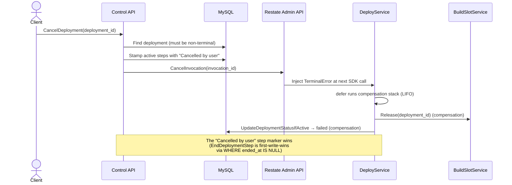
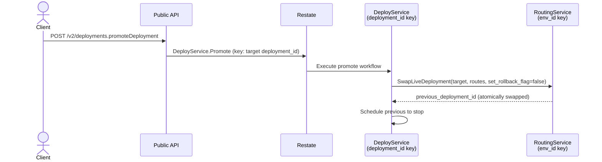
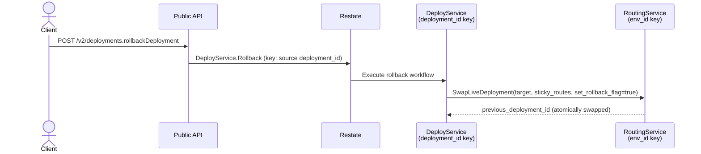

The control plane deployment service creates deployment records and delegates execution to Restate workflows.

## Virtual object keying

Each Restate VO uses the narrowest key that gives the serialization it needs:

- **`DeployService`** is keyed by `deployment_id`. Each deployment runs as its own isolated workflow, so multiple deployments in the same environment can build in parallel.
- **`RoutingService`** is keyed by `env_id`. All routing changes for an environment (frontline route assignment + the live-deployment swap) serialize here, so concurrent deploys/rollbacks/promotes for the same env can never race on `apps.current_deployment_id`.
- **`BuildSlotService`** is keyed by `workspace_id`. Caps how many deployments build at once across the workspace and prioritises production over preview waiters.
- **`DeploymentService`** (delayed desired-state transitions) is keyed by `deployment_id`.

Rollback and Promote are themselves workflows but they don't need their own env-keyed gate — the actual mutation goes through `RoutingService.SwapLiveDeployment`, which is per-env serialized.

Key components:

- Control API deployment service — [`svc/ctrl/services/deployment`](https://github.com/unkeyed/unkey/blob/main/svc/ctrl/services/deployment)
- `DeployService.Create`, the only writer of deployment rows: [`svc/ctrl/worker/deploy/create.go`](https://github.com/unkeyed/unkey/blob/main/svc/ctrl/worker/deploy/create.go)
- `DeployService` Restate workflow — [`svc/ctrl/worker/deploy`](https://github.com/unkeyed/unkey/blob/main/svc/ctrl/worker/deploy)
- `RoutingService` (route assignment + live swap) — [`svc/ctrl/worker/routing`](https://github.com/unkeyed/unkey/blob/main/svc/ctrl/worker/routing)
- `DeploymentService` VO for delayed desired-state transitions — [`svc/ctrl/worker/deployment`](https://github.com/unkeyed/unkey/blob/main/svc/ctrl/worker/deployment)
- `BuildSlotService` VO for per-workspace build concurrency — [`svc/ctrl/worker/buildslot`](https://github.com/unkeyed/unkey/blob/main/svc/ctrl/worker/buildslot)
- Dedup helper for cancelling superseded queued siblings — [`svc/ctrl/dedup`](https://github.com/unkeyed/unkey/blob/main/svc/ctrl/dedup)

## Flow: create deployment

```mermaid
sequenceDiagram
  actor Client
  participant CtrlAPI as Control API
  participant DB as MySQL
  participant Restate as Restate
  participant BuildSlot as BuildSlotService<br/>(keyed by workspace)
  participant Worker as DeployService<br/>(keyed by deployment_id)
  participant Dedup as dedup.CancelOlderSiblings
  participant Create as DeployService.Create<br/>(same deployment_id key)

  Client->>CtrlAPI: Create deployment (source, env, optional Idempotency-Key)
  CtrlAPI->>CtrlAPI: Mint deployment id<br/>(derived from the idempotency key when sent)
  CtrlAPI->>DB: Check permissions, target, source, plan
  CtrlAPI->>Restate: DeployService.Create (one-way, key: deployment_id,<br/>idempotency key when the header was sent)
  CtrlAPI-->>Client: deployment id, without waiting for the create
  Restate->>Create: Execute Create (a keyed retry replays instead)
  Create->>DB: Row already there? answer REPLAYED
  Create->>DB: Load target, run gates, resolve build source
  Create->>DB: Insert deployment (status=pending), queued step,<br/>and create audit in one transaction
  Create->>Restate: DeployService.Deploy (key: deployment_id, async)
  Create->>DB: UpdateDeploymentInvocationID
  Create->>Dedup: Cancel older queued siblings (status=pending|awaiting_approval)
  Dedup->>DB: Batch stamp "Superseded by newer commit" on sibling steps
  Dedup->>DB: Batch UPDATE siblings to status=superseded
  Dedup->>Restate: CancelInvocation for each older sibling
  Restate->>Worker: Execute Deploy workflow for newest commit
  Worker->>Dedup: skipIfSuperseded (defensive self-skip check)
  Worker->>BuildSlot: AcquireOrWait(deployment_id, awakeable_id, is_production)
  BuildSlot-->>Worker: resolve awakeable when slot available<br/>(prod waiters drained first)
  Worker->>DB: Insert topologies (outbox entries)
  Worker->>Worker: waitForDeployments creates awakeable
  Note over Worker: suspended on awakeable
  DB-->>Worker: ReportDeploymentStatus threshold met<br/>→ NotifyInstancesReady resolves awakeable
  Worker->>DB: Mark deployment ready
  Worker->>BuildSlot: Release(deployment_id)
```

## Idempotent create

`DeployService.Create` is the only writer of deployment rows. The public API, the GitHub webhook, and operator rebuilds all reach it, and the object key is always the deployment id.

**Deriving the id.** The caller mints the id before it calls, which is how the public API can answer with a deployment id without waiting for the create. Without an `Idempotency-Key` header the id is random, so a retry is simply a second deployment, which is what a caller that did not ask for idempotency gets. With the header the id is derived from `workspace_id`, `app_id`, `environment_id`, and the caller's key, so a retry computes the same id and lands on the same virtual object. The workspace is in the scope because it is the trust boundary: callers send human-readable keys or client-generated UUIDs, and without it two tenants sending one key would collide. The app and the environment are in the scope because they are the target: one key can deploy the same commit to production and to staging, and a reused key can never answer with another target's deployment.

**Two dedup layers.** The header also travels to Restate as the invocation idempotency key. Inside the retention window Restate replays the first invocation's journaled response and runs nothing. The service registers a 12 hour retention, which is the caller-facing lifetime of the key. There is no idempotency key table in MySQL; past that window the deployment row takes over, so `Create` looks the row up before doing anything else and answers `REPLAYED` when it finds one. A row belonging to another project or app is a terminal error rather than a replay.

**Durable execution.** Every step is journaled: the row lookup, the target load with its gates and build source resolution, the insert of the row plus its queued step plus its `deployment.create` audit in one MySQL transaction, then the `Deploy` send, the invocation id write, and the sibling dedup. A worker crash resumes from the journal, so an accepted create always completes and a row can never end up inserted but never sent.

**Decisions.** The caller says what should happen to the row. `DEPLOY` builds it, `SKIP` records that a commit was seen and deliberately not built, and `AWAIT_APPROVAL` parks a fork PR until a project member authorizes it. Every decision writes a row.

**Target reload.** The request carries ids only. `Create` loads the project, app, environment, and their settings itself, so the row records the settings and secrets current when the create runs and not when it was requested. A target deleted in between comes back as `TARGET_NOT_FOUND`.

**Refusals are responses.** A caller precondition no retry can fix, such as no Compute plan, a spend cap, a missing repository connection, or an unresolvable commit, returns outcome `BLOCKED` with a `CreateBlockedReason` instead of failing the invocation. The Restate ingress collapses a handler failure into unstructured text, which svc/api cannot turn back into a 412 with its own message, and a webhook on a repository that will never be eligible would keep producing failed invocations. The text behind the reason stays in the worker's logs, because it names repositories and deployments the caller may not be allowed to read.

**One-way submission.** The public API and the GitHub webhook `Send` the create and read no response. Everything a caller must be told synchronously is therefore checked before the send: permissions, a malformed image reference, an undeployable environment, and a workspace that may not deploy. `Create` re-checks the entitlement gates when it runs, so a workspace that loses its entitlement in between is still refused, just asynchronously. Operator rebuilds use `Request` and read the outcome.

## Flow: cancel deployment

```mermaid
sequenceDiagram
  actor Client
  participant CtrlAPI as Control API
  participant DB as MySQL
  participant RestateAdmin as Restate Admin API
  participant Worker as DeployService
  participant BuildSlot as BuildSlotService

  Client->>CtrlAPI: CancelDeployment(deployment_id)
  CtrlAPI->>DB: Find deployment (must be non-terminal)
  CtrlAPI->>DB: Stamp active steps with "Cancelled by user"
  CtrlAPI->>RestateAdmin: CancelInvocation(invocation_id)
  RestateAdmin->>Worker: Inject TerminalError at next SDK call
  Worker->>Worker: defer runs compensation stack (LIFO)
  Worker->>BuildSlot: Release(deployment_id) (compensation)
  Worker->>DB: UpdateDeploymentStatusIfActive → failed (compensation)
  Note over CtrlAPI,Worker: The "Cancelled by user" step marker wins<br/>(EndDeploymentStep is first-write-wins<br/>via WHERE ended_at IS NULL)
```

## Flow: promote

```mermaid
sequenceDiagram
  actor Client
  participant PublicAPI as Public API
  participant Restate as Restate
  participant Worker as DeployService<br/>(deployment_id key)
  participant Routing as RoutingService<br/>(env_id key)

  Client->>PublicAPI: POST /v2/deployments.promoteDeployment
  PublicAPI->>Restate: DeployService.Promote (key: target deployment_id)
  Restate->>Worker: Execute promote workflow
  Worker->>Routing: SwapLiveDeployment(target, routes, set_rollback_flag=false)
  Routing-->>Worker: previous_deployment_id (atomically swapped)
  Worker->>Worker: Schedule previous to stop
```

## Flow: rollback

```mermaid
sequenceDiagram
  actor Client
  participant PublicAPI as Public API
  participant Restate as Restate
  participant Worker as DeployService<br/>(deployment_id key)
  participant Routing as RoutingService<br/>(env_id key)

  Client->>PublicAPI: POST /v2/deployments.rollbackDeployment
  PublicAPI->>Restate: DeployService.Rollback (key: source deployment_id)
  Restate->>Worker: Execute rollback workflow
  Worker->>Routing: SwapLiveDeployment(target, sticky_routes, set_rollback_flag=true)
  Routing-->>Worker: previous_deployment_id (atomically swapped)
```

## BuildSlotService (workspace concurrency)

`BuildSlotService` caps concurrent builds per workspace. It is a Restate VO keyed by `workspace_id`, which makes `Acquire` and `Release` race-free across concurrent deploy handlers.

State held in the VO:

- `active_slots` — set of deployment IDs currently holding a slot
- `prod_wait_list` — FIFO of production waiters
- `preview_wait_list` — FIFO of non-production waiters

Acquire flow:

1. Deploy handler creates a Restate awakeable and calls `AcquireOrWait(deployment_id, awakeable_id, is_production)`.
2. The workspace's `builds_concurrent_max` limit is fetched. If `len(active_slots) < limit`, the deployment is added to `active_slots` and the awakeable is resolved immediately.
3. Otherwise the deployment is appended to `prod_wait_list` (if production) or `preview_wait_list` (if not). The Deploy handler stays suspended on `awakeable.Result()`.

Production deployments respect the same quota cap as preview — they don't bypass — but they get priority by going onto a separate wait list that Release drains first.

Release flow:

1. Deploy handler calls `Release(deployment_id)` — from the success path explicitly, or from the compensation stack on failure/cancel.
2. If the deployment was in `active_slots`, it is removed and a waiter is promoted: `prod_wait_list` first, then `preview_wait_list`. The promoted waiter's awakeable is resolved.
3. If the deployment was in either wait list (cancelled before it ever got a slot), it is removed.

This gives push-based slot hand-off with priority — no polling. The concurrency cap is `limits.builds_concurrent_max` per workspace.

## Commit deduplication

When a new deployment is created, `dedup.CancelOlderSiblings` looks for older deployments on the same `(app, environment, branch)` that are still in the build queue (`pending` or `awaiting_approval`) and cancels them.

Once a deployment acquires a build slot and transitions to `starting`, it is **committed** — newer commits will not supersede it. This avoids the pathological case where rapid pushes keep cancelling builds and nothing ever finishes.

Cancellation happens in three steps, all batched:

1. **One SELECT** — list older queued sibling deployments with their invocation IDs.
2. **One batch UPDATE** — stamp every sibling's in-flight steps with `"Superseded by newer commit"` (first-write-wins via `WHERE ended_at IS NULL`).
3. **One batch UPDATE** — transition every sibling to `status=superseded`.
4. **N HTTP calls** — `restateAdmin.CancelInvocation` for each sibling that has an invocation ID.

Only git-sourced deployments with a branch are deduplicated; Docker-image redeploys bypass this path.

## Instance readiness (awakeable-based)

After `createTopologies`, the Deploy handler enters `waitForDeployments`, which parks on a Restate awakeable until krane reports pod readiness. Krane installs the per-deployment Cilium network policy itself when it applies each deployment, so the handler does not create one.

`waitForDeployments` flow:

1. Load per-region min replicas via `FindDeploymentTopologyMinReplicas`.
2. Count running instances per region.
3. Require `numRegions - 1` healthy regions (minimum 1, tolerating one regional outage).
4. Repeat the DB check until the threshold is met or `regionReadyTimeout` elapses.

The awakeable is resolved by `DeployService.NotifyInstancesReady`, a `SHARED` handler that runs concurrently with the suspended Deploy.

Caller: `cluster.Service.ReportDeploymentStatus` (the RPC krane calls to report instance state) runs a thundering-herd gate after the upsert transaction:

1. Deployment must be in an active status (`starting | building | deploying | network | finalizing`).
2. Look up per-region min replicas via `FindDeploymentTopologyMinReplicas`.
3. Count running instances per region; require `numRegions - 1` healthy regions (minimum 1 — tolerates one regional outage).
4. Dedup the notification via an in-process `sync.Map` so we don't re-fire on every subsequent status report once the threshold is met.
5. If threshold met (and not yet notified), send `DeployService.NotifyInstancesReady(deployment_id)` via the ingress client, keyed by `deployment_id`.

## Self-skip (belt-and-suspenders dedup)

In addition to the proactive cancel above, the Deploy handler checks `HasNewerActiveDeployment` at the top of its workflow. If a newer sibling on the same `(app, env, branch)` is already `pending`, `starting`, `building`, `deploying`, `network`, `finalizing`, `ready`, or `awaiting_approval`, the current deployment self-skips. This catches races where the proactive cancel didn't land (e.g. the newer deployment hadn't persisted its invocation ID yet).

## State serialization (desired state)

Scheduled state changes are serialized via a Restate virtual object keyed by deployment ID in [`svc/ctrl/worker/deployment`](https://github.com/unkeyed/unkey/blob/main/svc/ctrl/worker/deployment). The object stores a nonce for the most recent transition so older delayed requests no-op.

## Retry policy

The `DeployService` is registered with an exponential-backoff retry policy: `30s → 1m → 2m → 4m → 5m` (capped), 10 attempts total (~30 minutes). If a deploy can't make progress after 10 retries (persistent MySQL connection errors, Depot outage), Restate kills the invocation, the compensation stack runs, and the deployment is marked failed. This replaces an older 150-attempt policy that could leave a deploy stuck retrying for ~24 hours.

## Compensation stack

The Deploy handler maintains a LIFO compensation stack registered via `Compensation.Add` (for side-effects wrapped in `restate.RunVoid`) and `Compensation.AddCtx` (for raw `ObjectContext` operations like `BuildSlotService.Release().Send`). The stack fires on any error or cancellation:

- Release the build slot
- Mark the deployment as `failed` (only if still in an active status — the conditional `UpdateDeploymentStatusIfActive` query prevents overwriting `superseded` or `ready`)
- Undo topology inserts, route assignments, etc.
