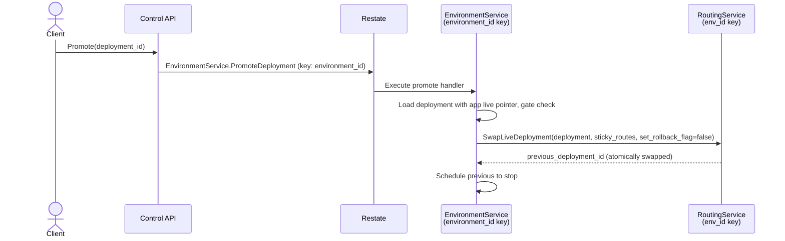
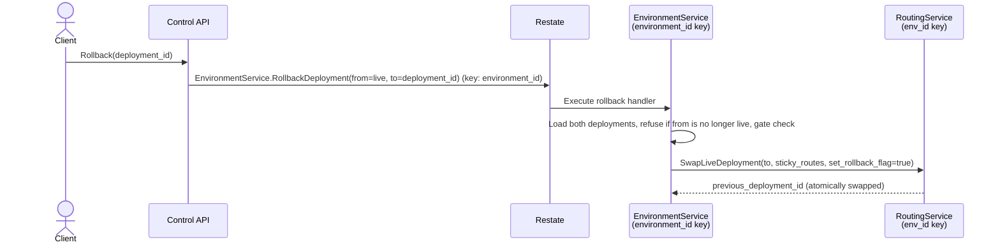

The control plane deployment service creates deployment records and delegates execution to Restate workflows.

## Virtual object keying

Each Restate VO uses the narrowest key that gives the serialization it needs:

- **`DeployWorkflow`** is keyed by `deployment_id`. Each deployment is one workflow run, so multiple deployments in the same environment can build in parallel. It is a workflow rather than a virtual object because Deploy has no operations to serialise.
- **`EnvironmentService`** is keyed by `environment_id`. Promote and rollback run here. Both change which deployment is live in one environment, and both check the live pointer before they swap it. One key holds the check and the swap under one lock. With separate keys, two operations on the same environment can pass their checks against the same live pointer and then swap one after the other.
- **`RoutingService`** is keyed by `env_id`. Frontline route assignment and the live-deployment swap serialize here. It is the write primitive that `DeployWorkflow` and `EnvironmentService` call.
- **`DeploymentService`** (desired-state transitions, scheduled and immediate) is keyed by `deployment_id`.

Build concurrency has no virtual object. `DeployWorkflow.Build` is a shared handler that Deploy calls on the same workflow key in the Restate scope `builds` with the workspace id as the limit key, and Restate's rule book caps how many run at once per workspace. See [Build concurrency](#build-concurrency-restate-flow-control).

Key components:

- Control API deployment service — [`svc/ctrl/services/deployment`](https://github.com/unkeyed/unkey/blob/main/svc/ctrl/services/deployment)
- `DeployWorkflow` Restate workflow — [`svc/ctrl/worker/deploy`](https://github.com/unkeyed/unkey/blob/main/svc/ctrl/worker/deploy)
- `EnvironmentService` (promote, rollback, environment deletion): [`svc/ctrl/worker/environment`](https://github.com/unkeyed/unkey/blob/main/svc/ctrl/worker/environment)
- `RoutingService` (route assignment + live swap) — [`svc/ctrl/worker/routing`](https://github.com/unkeyed/unkey/blob/main/svc/ctrl/worker/routing)
- `DeploymentService` VO for scheduled and immediate desired-state transitions — [`svc/ctrl/worker/deployment`](https://github.com/unkeyed/unkey/blob/main/svc/ctrl/worker/deployment)
- `RunBuildLimitSync` cron that writes the rule book: [`svc/ctrl/worker/cron/buildlimitsync`](https://github.com/unkeyed/unkey/blob/main/svc/ctrl/worker/cron/buildlimitsync)
- Superseded sibling cancellation — [`svc/ctrl/worker/deploy/supersede.go`](https://github.com/unkeyed/unkey/blob/main/svc/ctrl/worker/deploy/supersede.go)

## Flow: create deployment

```mermaid
sequenceDiagram
  actor Client
  participant CtrlAPI as Control API
  participant DB as MySQL
  participant Restate as Restate
  participant Worker as DeployWorkflow<br/>(keyed by deployment_id)
  participant Build as DeployWorkflow.Build<br/>(same key, scope builds)
  participant Dedup as Workflow.cancelOlderSiblings

  Client->>CtrlAPI: CreateDeployment(project_id, source, env)
  CtrlAPI->>Restate: DeployWorkflow.Create (key: deployment_id)
  Restate->>Worker: Create
  Worker->>DB: Find project + environment + app
  Worker->>DB: Insert deployment (status=pending)
  Worker->>Restate: DeployWorkflow.Deploy (in-context; the ingress refuses it)
  Worker->>DB: UpdateDeploymentInvocationID
  Worker->>Dedup: Cancel older queued siblings (status=pending|awaiting_approval)
  Dedup->>DB: Batch stamp "Superseded by newer commit" on sibling steps
  Dedup->>DB: Batch UPDATE siblings to status=superseded
  Dedup->>Restate: CancelInvocation for each older sibling
  Restate->>Worker: Execute Deploy workflow for newest commit
  Worker->>Dedup: skipIfSuperseded (defensive self-skip check)
  Worker->>Restate: Build (scope builds, limit key workspace_id)
  Note over Restate: queued until the workspace<br/>is under its rule book cap
  Restate->>Build: Build
  Build->>DB: End queued step, run starting and building steps
  Build-->>Worker: BuildResponse
  Worker->>DB: Insert topologies (outbox entries)
  Worker->>Worker: waitForDeployments awaits promise instances_ready
  Note over Worker: suspended on promise
  DB-->>Worker: ReportDeploymentStatus threshold met<br/>→ NotifyInstancesReady resolves promise
  Worker->>DB: Mark deployment ready
```

## Flow: cancel deployment

```mermaid
sequenceDiagram
  actor Client
  participant CtrlAPI as Control API
  participant DB as MySQL
  participant RestateAdmin as Restate Admin API
  participant Worker as DeployWorkflow

  Client->>CtrlAPI: CancelDeployment(deployment_id)
  CtrlAPI->>DB: Find deployment (must be non-terminal)
  CtrlAPI->>DB: Stamp active steps with "Cancelled by user"
  CtrlAPI->>RestateAdmin: CancelInvocation(invocation_id)
  Note over RestateAdmin: Also cancels the Build that Deploy is waiting on;<br/>a queued Build is removed without running
  RestateAdmin->>Worker: Inject TerminalError at next SDK call
  Worker->>Worker: defer runs compensation stack (LIFO)
  Worker->>DB: UpdateDeploymentStatusIfActive → failed (compensation)
  Note over CtrlAPI,Worker: The "Cancelled by user" step marker wins<br/>(EndDeploymentStep is first-write-wins<br/>via WHERE ended_at IS NULL)
```

## Flow: promote


```mermaid
sequenceDiagram
  actor Client
  participant CtrlAPI as Control API
  participant Restate as Restate
  participant Worker as EnvironmentService<br/>(environment_id key)
  participant Routing as RoutingService<br/>(env_id key)

  Client->>CtrlAPI: Promote(deployment_id)
  CtrlAPI->>Restate: EnvironmentService.PromoteDeployment (key: environment_id)
  Restate->>Worker: Execute promote handler
  Worker->>Worker: Load deployment with app live pointer, gate check
  Worker->>Routing: SwapLiveDeployment(deployment, sticky_routes, set_rollback_flag=false)
  Routing-->>Worker: previous_deployment_id (atomically swapped)
  Worker->>Worker: Schedule previous to stop
```

## Flow: rollback


```mermaid
sequenceDiagram
  actor Client
  participant CtrlAPI as Control API
  participant Restate as Restate
  participant Worker as EnvironmentService<br/>(environment_id key)
  participant Routing as RoutingService<br/>(env_id key)

  Client->>CtrlAPI: Rollback(deployment_id)
  CtrlAPI->>Restate: EnvironmentService.RollbackDeployment(from=live, to=deployment_id) (key: environment_id)
  Restate->>Worker: Execute rollback handler
  Worker->>Worker: Load both deployments, refuse if from is no longer live, gate check
  Worker->>Routing: SwapLiveDeployment(to, sticky_routes, set_rollback_flag=true)
  Routing-->>Worker: previous_deployment_id (atomically swapped)
```

## Build concurrency (Restate flow control)

Build concurrency is Restate flow control; the worker holds no queue state of its own. Three Restate terms, defined the same way in the `DeployWorkflow` proto comment:

- A **scope** is a name Restate groups invocations under. Deploy calls `Build` in the scope `builds`.
- A **limit key** is the value Restate counts running invocations by within a scope. Deploy passes the workspace id.
- The **rule book** says how many invocations may run at once for a `<scope>/<limit key>` pattern. It is written through the admin API and read from the `sys_rules` table. An exact pattern beats a wildcard. No matching rule means unlimited.

| Rule pattern | Concurrency | Description | Written by |
| --- | --- | --- | --- |
| `builds/*` | 1 | `default per-workspace build concurrency` | `CronService.RunBuildLimitSync`, every 15 minutes |
| `builds/<workspace_id>` | `limits.builds_concurrent_max` when above 1 | `per-workspace build concurrency from limits` | the same cron, deleted once the row is back at 1 or below |

The database is the source of truth. The cron rewrites both kinds of rule on every tick and deletes any `builds/<workspace_id>` rule the `limits` table does not call for, so a rule set by hand lasts at most 15 minutes.

Deploy uses `Request`, never `Send`. Restate treats the Build as part of the Deploy invocation, so cancelling Deploy also cancels a queued or running Build; a `Send` would detach it and it would keep running:

```go
hydrav1.NewDeployWorkflowClient(ctx, deployment.ID, restate.WithScope(restateadmin.BuildConcurrencyScope)).
    Build().
    Request(req, restate.WithLimitKey(deployment.WorkspaceID))
```

What this gives:

- One queue per workspace, shared by production and preview, ordered by the time each Build became ready. There is no production preference and no queue timeout: a queued deployment stays `pending` until a running Build in its workspace completes or is cancelled, or until someone cancels it.
- `Build` refuses to run when the request did not arrive in scope `builds` or with the workspace id as limit key. A wrong scope matches no rule and builds without a cap; a wrong limit key charges the build to another workspace.
- A Build that exhausts its retry budget is killed, not paused. Kill returns a terminal error to Deploy, which closes the open step and fails the deployment through its compensation stack.
- Scoped invocations take their partition from the scope, so every Build in the fleet shares one Restate partition, whatever its workspace. Queues stay per workspace inside that partition. A leader change of that partition replays every in-flight build.

### Runbook (Restate Cloud)

Canary and production run on Restate Cloud. Both clusters are in us-east-1; canary's Restate Cloud environment is hosted in the EU region, production's in the US region. The worker's token is the operator's registration token. These commands have been run against dev Restate, not yet against Cloud.

```bash
export CTX=<canary or production us-east-1 context>
export ENV_ID=201kfwtpdc67n1p4d6vdpf017sh   # canary; production is 201kf0h15frcbabqajch9nz2ztt
export ADMIN="https://${ENV_ID}.env.eu.restate.cloud:9070"   # canary is .env.eu., production is .env.us.
export TOKEN="$(kubectl --context "$CTX" -n restate-system get secret restate-cloud-credentials -o jsonpath='{.data.token}' | base64 -d)"
```

Read the rule book. There is no `GET /limits/rules`; the book is read through the SQL endpoint, and the `Accept` header is required or the response is binary Arrow:

```bash
curl -sS "$ADMIN/query" -H "Authorization: Bearer $TOKEN" \
  -H 'Content-Type: application/json' -H 'Accept: application/json' \
  -d '{"query":"SELECT pattern, concurrency, description, disabled, version FROM sys_rules"}'
```

What the result means:

- `builds/*` missing: every workspace builds without a cap. The next cron tick within 15 minutes rewrites it. To fix it now, run the CronJob by hand: `kubectl --context "$CTX" -n restate-system create job --from=cronjob/restate-build-limit-sync build-limit-sync-manual`.
- Any rule edited by hand: the cron rewrites it on the next tick, so the edit lasts at most 15 minutes.
- One workspace needs a higher cap during an incident: raise `builds_concurrent_max` on its `limits` row. The cron writes the matching `builds/<workspace_id>` rule within 15 minutes, and queued builds for that workspace start as soon as the rule lands.

Queue depth and age:

```bash
curl -sS "$ADMIN/query" -H "Authorization: Bearer $TOKEN" \
  -H 'Content-Type: application/json' -H 'Accept: application/json' \
  -d '{"query":"SELECT id, target, created_at, status FROM sys_invocation WHERE target_service_name = '"'"'hydra.v1.DeployWorkflow'"'"' AND target_handler_name = '"'"'Build'"'"' AND status <> '"'"'completed'"'"'"}'
```

Other introspection tables: `sys_user_limits` (per limit key usage) and `sys_vqueue_entry_status` (queued entries). Registration of a new worker revision follows [runbook 0001](https://github.com/unkeyed/infra/blob/main/docs/runbooks/restate/0001-control-worker-registration.md).

## Commit deduplication

When a new deployment is created, `Workflow.cancelOlderSiblings` looks for older deployments on the same `(app, environment, branch)` that are still in the build queue (`pending` or `awaiting_approval`) and cancels them.

Once Restate lets a deployment's Build run and it transitions to `starting`, it is **committed**: newer commits will not supersede it. This avoids the pathological case where rapid pushes keep cancelling builds and nothing ever finishes.

Cancellation happens in three steps, all batched:

1. **One SELECT** — list older queued sibling deployments with their invocation IDs.
2. **One batch UPDATE** — stamp every sibling's in-flight steps with `"Superseded by newer commit"` (first-write-wins via `WHERE ended_at IS NULL`).
3. **One batch UPDATE** — transition every sibling to `status=superseded`.
4. **N HTTP calls** — `restateAdmin.CancelInvocation` for each sibling that has an invocation ID.

Only git-sourced deployments with a branch are deduplicated; Docker-image redeploys bypass this path.

## Instance readiness (promise-based)

After `createTopologies`, the Deploy run enters `waitForDeployments`, which awaits a durable promise named `instances_ready` until krane reports pod readiness. Krane installs the per-deployment Cilium network policy itself when it applies each deployment, so the run does not create one.

`waitForDeployments` flow:

1. Build per-region min replicas from the topologies just inserted.
2. Require `numRegions - 1` healthy regions (minimum 1, tolerating one regional outage).
3. Check the database once for instances that are already healthy.
4. Otherwise await the promise, racing it against `regionReadyTimeout`.

The promise is resolved by `DeployWorkflow.NotifyInstancesReady`, a `SHARED` handler that runs concurrently with the suspended run. A report that arrives before the run awaits is kept by the promise, so there is no awakeable to stash and no state to clear.

Caller: `cluster.Service.ReportDeploymentStatus` (the RPC krane calls to report instance state) runs a thundering-herd gate after the upsert transaction:

1. Deployment must be in an active status (`starting | building | deploying | network | finalizing`).
2. Look up per-region min replicas via `FindDeploymentTopologyMinReplicas`.
3. Count running instances per region; require `numRegions - 1` healthy regions (minimum 1 — tolerates one regional outage).
4. Dedup the notification via an in-process `sync.Map` so we don't re-fire on every subsequent status report once the threshold is met.
5. Skip if the deployment's Deploy invocation is no longer live in Restate. Wake also reports with status `deploying`, and a notify for a finished run would leave a promise Restate never cleans up.
6. If threshold met (and not yet notified), send `NotifyInstancesReady(deployment_id)` to `DeployWorkflow`.

## Self-skip (belt-and-suspenders dedup)

In addition to the proactive cancel above, the Deploy handler checks `HasNewerActiveDeployment` at the top of its workflow. If a newer sibling on the same `(app, env, branch)` is already `pending`, `starting`, `building`, `deploying`, `network`, `finalizing`, `ready`, or `awaiting_approval`, the current deployment self-skips. This catches races where the proactive cancel didn't land (e.g. the newer deployment hadn't persisted its invocation ID yet).

## State serialization (desired state)

Scheduled state changes are serialized via a Restate virtual object keyed by deployment ID in [`svc/ctrl/worker/deployment`](https://github.com/unkeyed/unkey/blob/main/svc/ctrl/worker/deployment). The object stores a nonce for the most recent transition so older delayed requests no-op.

## Retry policy

`DeployWorkflow` is registered with an exponential-backoff retry policy: `2s → 4s → 8s → 16s → 30s` (capped), 15 attempts total (about 5 minutes). Short intervals keep cancel latency low, since a cancel lands at the next attempt boundary. On exhaustion the invocation pauses rather than being killed, so the compensation stack can still run when a `restate.Run` returns a terminal error. This replaces an older 150-attempt policy that could leave a deploy stuck retrying for about 24 hours.

## Compensation stack

The Deploy handler maintains a LIFO compensation stack registered via `Compensation.Add`, each step wrapped in `restate.RunVoid`. The stack fires on any error or cancellation:

- Mark the deployment as `failed` (only if still in an active status — the conditional `UpdateDeploymentStatusIfActive` query prevents overwriting `superseded` or `ready`)
- Undo topology inserts, route assignments, etc.
