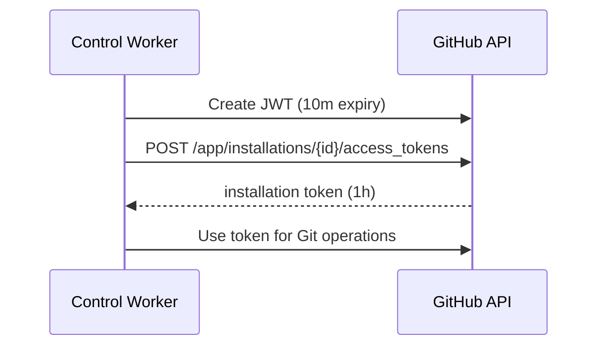

The control worker uses a GitHub App to access repositories for git-based builds. Authentication uses JWTs signed by the app private key, then exchanges for installation tokens scoped to the repo.

Key components:

- GitHub App client (<a href="https://github.com/unkeyed/unkey/blob/main/svc/ctrl/worker/github" target="_blank">`svc/ctrl/worker/github`</a>).
- App credentials in `UNKEY_GITHUB_APP_ID` and `UNKEY_GITHUB_PRIVATE_KEY_PEM`.
- Webhook signature verification using `UNKEY_GITHUB_APP_WEBHOOK_SECRET`.

## Flow: authorize a git build

## Token caching

Installation tokens are cached for 55 minutes and stale for 5 minutes to reduce GitHub API calls.

## Failure modes

- Invalid App ID or private key fails JWT signing.
- Incorrect webhook secret fails signature validation.
- GitHub API errors return non-201 responses during token exchange.
- Installation ID missing or invalid causes validation errors.

TODO: Document webhook event types that trigger deployments.
