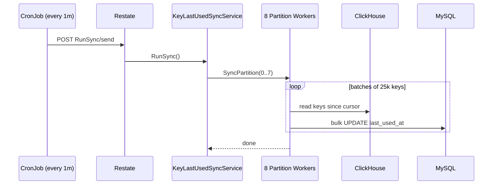

## Why this exists

When a key is verified, Sentinel and the API service write the verification event to ClickHouse.
That gives us the source of truth for when a key was last used, but the API and dashboard read key metadata from MySQL, so rather than querying ClickHouse for this after we read from the db, we periodically sync the latest `lastUsedAt` timestamp back into MySQL.

We don't update `lastUsedAt` during verification because at our volume, multiple services would be writing to the same key rows concurrently, leading to lock contention and deadlocks in MySQL. Even moving the write off the hot path asynchronously doesn't help — the fundamental problem is concurrent writes to the same rows. Batching the sync into a single writer that runs every minute avoids this entirely, and minute-level accuracy is more than enough for this field.

## Why ClickHouse has the truth

Raw verification events land in `key_verifications_raw_v2`.
A materialized view (`key_last_used_mv_v1`) continuously aggregates these into `key_last_used_v1` which is an `AggregatingMergeTree` that keeps exactly one row per key with the `max(time)`
ClickHouse merges rows with the same primary key in the background, so the table stays compact regardless of verification volume.

## How it works

A cronjob runs every minute and calls `KeyLastUsedSyncService.RunSync` via the Restate ingress.
Each invocation uses a minute-scoped idempotency key so Restate deduplicates overlapping runs.

The orchestrator fans out to 8 partition workers that run concurrently.
Each worker owns a slice of the keyspace via `cityHash64(key_id) % 8`, so there's no overlap or contention between them.
Workers are Restate virtual objects, they persist their own cursor in Restate state and pick up where they left off on the next run, making the sync incremental.



## Why it's safe to re-run

The MySQL update only writes forward:

```sql
UPDATE keys SET last_used_at = ? WHERE id IN (...) AND last_used_at < ?
```

An older timestamp can never overwrite a newer one. Duplicate deliveries, retries, and overlapping CronJob invocations are all harmless.

## Design choices

- **Minute-truncated timestamps** — keys verified in the same minute get the same `last_used_at` value. This lets us group hundreds of keys into a single `UPDATE ... WHERE id IN (...)` instead of issuing per-key writes.

- **Composite cursor** — pagination uses `(time, key_id)` rather than just `time`, so keys sharing the same millisecond timestamp aren't skipped between batches.

- **Restate journaling** — each batch of 25k keys is wrapped in `restate.Run`. If a worker crashes mid-sync, only the last incomplete batch is retried. Previously completed batches aren't re-executed.

- **Partition count changes** — if the number of partitions changes between runs, all cursors reset to zero and a full re-sync happens. This is safe because the update is idempotent.
