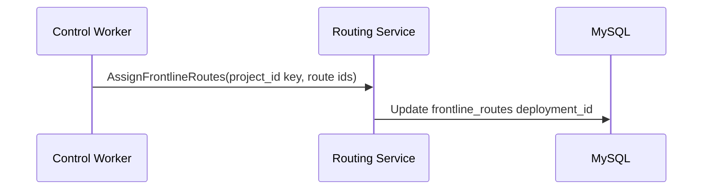

Routing updates are handled by the routing Restate service. It updates frontline route records to point to the desired deployment.

Key components:

- Routing service (<a href="https://github.com/unkeyed/unkey/blob/main/svc/ctrl/worker/routing" target="_blank">`svc/ctrl/worker/routing`</a>).
- Frontline route records in the database.

## Flow: assign routes

## Notes

`AssignFrontlineRoutes` updates each route sequentially with `ReassignFrontlineRoute` and sets `updated_at` for each row.
