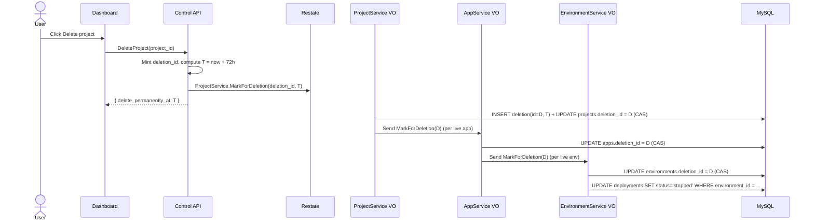
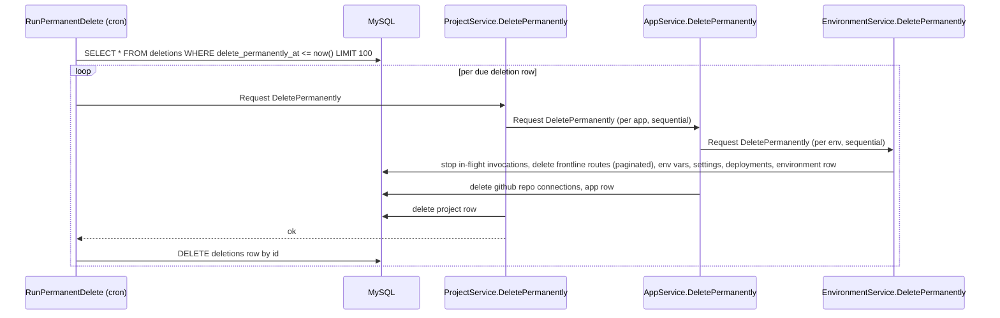

Project, app, and environment deletions go through a two-phase soft delete: the resource is hidden from the API immediately and a deletions row is written; a cron sweep performs the actual destruction after a 72 hour grace window. The user can restore within the window from the dashboard.

## Why two phases

A single immediate-destroy delete is unforgiving: an accidental click takes out everything tied to a project (deployments, environments, custom domains, variables, frontline routes, analytics). Engineering and support workload around accidental deletes is real, and undoing them required restoring from backups. The two-phase model gives users a grace window to recover and gives ops a single source of truth (the deletions table) for what is currently scheduled.

Splitting also localises the risky destruction step. The cron sweep is the only thing that ever runs the hard-delete cascade. Everything else only sets flags.

## Source

- [`web/internal/db/src/schema`](https://github.com/unkeyed/unkey/blob/main/web/internal/db/src/schema): `deletions` table and `deletion_id` columns on `projects`, `apps`, `environments`
- [`svc/ctrl/worker/{project,app,environment}`](https://github.com/unkeyed/unkey/blob/main/svc/ctrl/worker): VO handlers
- [`svc/ctrl/worker/cron/permanentdelete`](https://github.com/unkeyed/unkey/blob/main/svc/ctrl/worker/cron/permanentdelete): cron sweep
- [`svc/ctrl/services/project`](https://github.com/unkeyed/unkey/blob/main/svc/ctrl/services/project): public ctrl service
- [`web/apps/dashboard/app/(app)/[workspaceSlug]/settings/scheduled-deletions`](https://github.com/unkeyed/unkey/blob/main/web/apps/dashboard/app): dashboard recovery page

## Data model

The `deletions` table is the source of truth for the soft-delete state. One row exists per cascade root.

| Column                  | Notes                                                                                                          |
| ----------------------- | -------------------------------------------------------------------------------------------------------------- |
| `id`                    | Primary key. `uid.DeletionPrefix` (`del_...`).                                                                 |
| `workspace_id`          | Denormalised so the dashboard list is a single query, not a UNION across resource tables.                      |
| `resource_type`         | `project`, `app`, or `environment`. Matches the strings the cron dispatcher routes on.                         |
| `resource_id`           | The root resource id. Unique with `resource_type`.                                                             |
| `delete_permanently_at` | Epoch-ms when the cron sweep will run the hard-delete cascade.                                                 |

Every soft-deletable resource table has a nullable `deletion_id varchar(64)` column with an index. Read paths filter `WHERE deletion_id IS NULL`, which hides the row from the API the moment the column is set.

Crucially, all rows that belong to one cascade carry the **same** `deletion_id` value. The root mints a single id; child handlers point their own `deletion_id` column at that root row without inserting a new deletions row. Independently-deleted descendants have a different `deletion_id` and are unaffected by the cascade. That equality check is what makes restore correct without storing parent pointers.

## Virtual object methods

`ProjectService`, `AppService`, and `EnvironmentService` each expose three methods, keyed by the resource id:

- `MarkForDeletion(deletion_id, delete_permanently_at?)` enters the grace window. The project handler inserts the deletions row and points the project at it (single transaction with a CAS guard on `deletion_id`). The app and environment handlers only set their own `deletion_id`; they do not insert a new deletions row. Each layer fans out via `.Send()` (fire-and-forget) to live children.
- `Restore` reverses MarkForDeletion. The root handler reads its own `deletion_id`, cascades that id to children via `.Send()`, then clears its column and deletes the deletions row (one transaction, CAS-guarded). Children compare `own.deletion_id` against the request id and skip on mismatch.
- `DeletePermanently` is the hard-delete cascade. Invoked by the cron sweep (or directly when no grace is desired). Calls children via `.Request()` (synchronous) so it knows when the cascade is complete; only then does control return to the cron caller, which removes the deletions row.

## Flow: soft delete



The environment handler is the only place deployments are stopped during soft delete. Krane already reconciles `status='stopped'` as "no pods desired", so this is what frees the workload during the grace window. `desired_state` is not changed; the user's intent is preserved for after restore.

## Flow: restore

```mermaid
sequenceDiagram
  actor User
  participant Dashboard as Dashboard
  participant CtrlAPI as Control API
  participant Restate as Restate
  participant Project as ProjectService VO
  participant App as AppService VO
  participant Env as EnvironmentService VO
  participant DB as MySQL

  User->>Dashboard: Click Restore
  Dashboard->>CtrlAPI: RestoreProject(project_id)
  CtrlAPI->>Restate: ProjectService.Restore
  Project->>DB: SELECT projects.deletion_id (= D)
  Project->>App: Send Restore(D) (per app, regardless of state)
  App->>DB: SELECT apps.deletion_id; skip if != D
  App->>Env: Send Restore(D)
  Env->>DB: SELECT environments.deletion_id; skip if != D
  Env->>DB: UPDATE environments SET deletion_id = NULL WHERE id = ... AND deletion_id = D (CAS)
  App->>DB: UPDATE apps SET deletion_id = NULL WHERE id = ... AND deletion_id = D (CAS)
  Project->>DB: UPDATE projects SET deletion_id = NULL (CAS) + DELETE deletions row
```

Deployment status is not reversed. The user triggers a fresh deployment after restore. This is intentional: restoring config is what matters; the suspended workload was already snapshotted by the user's own deploy history.

## Flow: cron sweep (permanent delete)



The cron handler dispatches with `.Request()` (synchronous) so it knows the entire cascade has completed before removing the deletions row. This is what makes the design work for non-project roots too: an app-only soft delete (when that surface exists) lands the deletions row at the app level, the cron dispatches `AppService.DeletePermanently`, and the same cleanup loop removes the row. The handler doesn't need a special case per resource type beyond the dispatch switch.

Failures are aggregated. A single bad row's cascade error doesn't poison the batch; its deletions row stays intact for the next tick to retry. The handler is keyed `permanent-delete` so a wedged invocation can't block other cron handlers.

## Idempotency and CAS

Every `deletion_id` write uses the `UpdateXDeletionId` query with an `expected_deletion_id` argument. The SQL applies a NULL-safe equality (`<=>`) so set-when-null and clear-when-equal both go through the same form. A zero-affected response means another writer changed the column since the caller read it; the caller surfaces that as either a retry (MarkForDeletion) or a logged no-op (Restore).

`InsertDeletion` is `ON DUPLICATE KEY UPDATE resource_id = resource_id`, a no-op preservation of the existing row. A cascade that races against an independent delete at the same id (essentially impossible because ids are minted with nanoid) would preserve the original timestamp; in practice the conflict path is unreachable.

## Frontline routes

Frontline routes are deleted at the environment hard-delete step, scoped by `environment_id`. The DELETE is paginated (`LIMIT 1000`) and the handler loops until a partial page comes back. This bounds transaction size for environments that accumulated many routes (production environments can accrue thousands of `deployment`-sticky routes over time). Branch-sticky and live-sticky URLs are covered by the same `environment_id` predicate because every row carries `environment_id NOT NULL` regardless of stickyness.

## Dashboard surface

The list query reads from the `deletions` table joined with the resource tables for names. Adding a new soft-deletable resource type means: extend the `resourceType` enum, add a `findMany` for the new table, and add a case to the restore dispatch. The `deletions` query never changes.

## Adding a new soft-deletable resource

1. Add a nullable `deletion_id varchar(64)` column to the resource table and an index on it.
2. Add the read filter `WHERE deletion_id IS NULL` to every find/list query that surfaces the resource to the API.
3. Add an `UpdateXDeletionId` sqlc query with the CAS pattern.
4. Add `MarkForDeletion`/`Restore`/`DeletePermanently` handlers on the resource's VO. The MarkForDeletion handler should accept a `deletion_id` from the parent (if any) and inherit it; only the cascade root mints a new id and inserts the deletions row.
5. Add the resource_type string to the cron `dispatch` switch in `permanentdelete.Handler`.
6. Extend the dashboard `listScheduledDeletions` to query the new table, and `restoreResource` to dispatch to the new resource.
