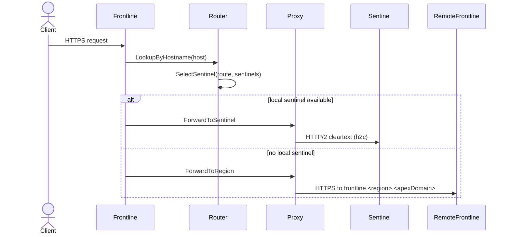

Frontline is the shared ingress tier for Unkey. It is the first Unkey-owned hop
for inbound traffic, and it sits in front of all per-environment sentinel
services. Its job is to convert a public hostname into a concrete environment
route and move the request to the correct regional sentinel with minimal
latency.

## Role in the stack

Frontline runs as a regional, multi-tenant edge service. It terminates TLS for
custom domains, looks up the target environment in the control plane database,
and forwards traffic to the sentinel that owns that environment. When the local
region does not have a healthy sentinel, it forwards to another region's
frontline to keep routing consistent and to preserve TLS termination.

Sentinel is single-tenant per environment. Frontline is the layer that keeps
those sentinels hidden behind a single, stable ingress and makes cross-region
failover transparent.

## Responsibilities

- Terminate TLS using SNI and custom domain certificates.
- Resolve hostnames to deployments and sentinel instances.
- Forward requests to a local sentinel or a remote region.
- Enforce hop limits to prevent routing loops.
- Render HTML error pages when clients prefer HTML.
- Serve ACME HTTP-01 challenges for certificate issuance.

## Traffic flow

## Routing model

Frontline reads routing data from MySQL and caches it with stale-while-revalidate
semantics. The cache stores hostname to route mappings and environment to
sentinel lists. When gossip is enabled, invalidation events are broadcast so all
frontline nodes converge on the same view of routing and certificate data.

Sentinel selection is based on health and region proximity. If a healthy
sentinel is available in the current region, frontline forwards to it directly.
Otherwise frontline chooses the nearest region that has a healthy sentinel. If
no healthy sentinel exists, frontline returns a service unavailable error.

## Proxying model

Frontline uses a shared HTTP transport for cross-region forwarding and a
dedicated HTTP/2 cleartext transport for local sentinel connections. Requests
carry routing and trace headers that sentinel uses to pick the deployment and to
track the forwarding chain.

Key headers:

- `X-Unkey-Frontline-Id`, `X-Unkey-Region`, `X-Unkey-Request-Id`
- `X-Deployment-Id`
- `X-Unkey-Parent-Frontline-Id`, `X-Unkey-Parent-Request-Id`
- `X-Unkey-Frontline-Hops`
- `X-Forwarded-Proto`
- `X-Unkey-Timing`

Frontline increments `X-Unkey-Frontline-Hops` on every cross-region forward and
rejects requests that exceed the configured hop limit.

## TLS and certificate selection

Frontline supports three TLS modes:

- Dynamic certificates from Vault via the certificate manager.
- Static certificates from files for development.
- TLS disabled explicitly in configuration.

The certificate manager looks up certificates by exact hostname and then by the
immediate wildcard (for example `*.example.com`). Certificates are stored in
MySQL with encrypted private keys that are decrypted using Vault and cached for
reuse.

## ACME HTTP-01 challenges

Frontline runs a separate HTTP server on the challenge port for
`/.well-known/acme-challenge/*` requests. It validates the hostname, forwards
the token to the control plane ACME service, and returns the authorization
response to the ACME client.

## Observability and error handling

Every request is wrapped in a middleware that emits tracing spans, Prometheus
metrics, and structured logs. Frontline also captures errors from proxying and
maps them to typed error codes. When a client prefers HTML, frontline renders a
styled error page; otherwise it returns JSON error payloads.

Sentinel errors are treated as upstream responses. Frontline rewrites 4xx JSON
errors into HTML when the client accepts HTML, and maps sentinel 5xx responses
to frontline gateway errors for consistent observability.
