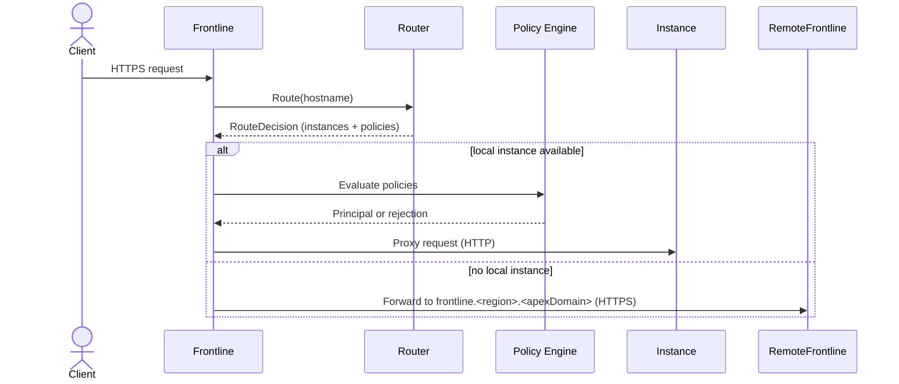

Frontline is the shared ingress tier for Unkey. It is the first Unkey-owned hop
for inbound traffic. Its job is to convert a public hostname into a concrete
deployment, evaluate that deployment's policies, and proxy the request to a
running instance with minimal latency.

## Role in the stack

Frontline runs as a regional, multi-tenant edge service. A single fleet per
region serves every workspace and environment. It terminates TLS for custom
domains, looks up the target deployment in the control plane database, runs the
deployment's policies inline, and proxies directly to a running instance in the
same region. When the local region has no healthy instance, it forwards to
another region's Frontline, which redoes the full hostname to instance chain
while preserving TLS termination and routing consistency.

There is no separate per-environment proxy. Frontline owns the request path end
to end.

## Responsibilities

- Terminate TLS using SNI and custom domain certificates.
- Resolve hostnames to deployments and their running instances.
- Evaluate the deployment's policies (KeyAuth, RateLimit, Firewall, OpenAPI) before proxying.
- Proxy to a local instance, or forward to a peer region when none is healthy locally.
- Enforce hop limits to prevent routing loops.
- Render HTML error pages when clients prefer HTML.
- Serve ACME HTTP-01 challenges for certificate issuance.

## Traffic flow

```mermaid
sequenceDiagram
  actor Client
  participant Frontline
  participant Router
  participant Engine as Policy Engine
  participant Instance
  participant RemoteFrontline

  Client->>Frontline: HTTPS request
  Frontline->>Router: Route(hostname)
  Router-->>Frontline: RouteDecision (instances + policies)
  alt local instance available
    Frontline->>Engine: Evaluate policies
    Engine-->>Frontline: Principal or rejection
    Frontline->>Instance: Proxy request (HTTP)
  else no local instance
    Frontline->>RemoteFrontline: Forward to frontline.<region>.<apexDomain> (HTTPS)
  end
```

## Routing model

Frontline reads routing data from MySQL and caches it with stale-while-revalidate
semantics. The cache stores hostname to route mappings, the deployment's parsed
policies, and the deployment's running instances. Each node maintains its own
local cache; entries refresh on their fresh/stale schedule.

Instance selection is based on health and region proximity. If the deployment
has a running instance in the current region, Frontline proxies to it directly,
trying candidates in shuffled order and advancing on dial failures. Otherwise
Frontline forwards to the nearest region that has a running instance. If no
region has one, Frontline returns a service unavailable error.

## Proxying model

Frontline proxies directly to the deployment instance for local routes and uses
a shared HTTP transport for cross-region forwarding to a peer Frontline. Requests
carry routing and trace headers that the receiving instance or peer Frontline
uses to identify the deployment and to track the forwarding chain.

Key headers:

- `X-Unkey-Frontline-Id`, `X-Unkey-Region`, `X-Unkey-Request-Id`
- `X-Deployment-Id`
- `X-Unkey-Parent-Frontline-Id`, `X-Unkey-Parent-Request-Id`
- `X-Unkey-Frontline-Hops`
- `X-Forwarded-Proto`
- `X-Unkey-Timing`

Frontline increments `X-Unkey-Frontline-Hops` on every cross-region forward and
rejects requests that exceed the configured hop limit.

## TLS and certificate selection

Frontline supports three TLS modes:

- Dynamic certificates from Vault via the certificate manager.
- Static certificates from files for development.
- TLS disabled explicitly in configuration.

The certificate manager looks up certificates by exact hostname and then by the
immediate wildcard (for example `*.example.com`). Certificates are stored in
MySQL with encrypted private keys that are decrypted using Vault and cached for
reuse.

## ACME HTTP-01 challenges

Frontline runs a separate HTTP server on the challenge port for
`/.well-known/acme-challenge/*` requests. It validates the hostname, forwards
the token to the control plane ACME service, and returns the authorization
response to the ACME client.

## Observability and error handling

Every request is wrapped in a middleware that emits tracing spans, Prometheus
metrics, and structured logs. Frontline also captures errors from policy
evaluation and proxying and maps them to typed error codes. When a client
prefers HTML, Frontline renders a styled error page; otherwise it returns JSON
error payloads. Errors from the upstream instance are categorized and mapped to
Frontline gateway errors for consistent observability.
