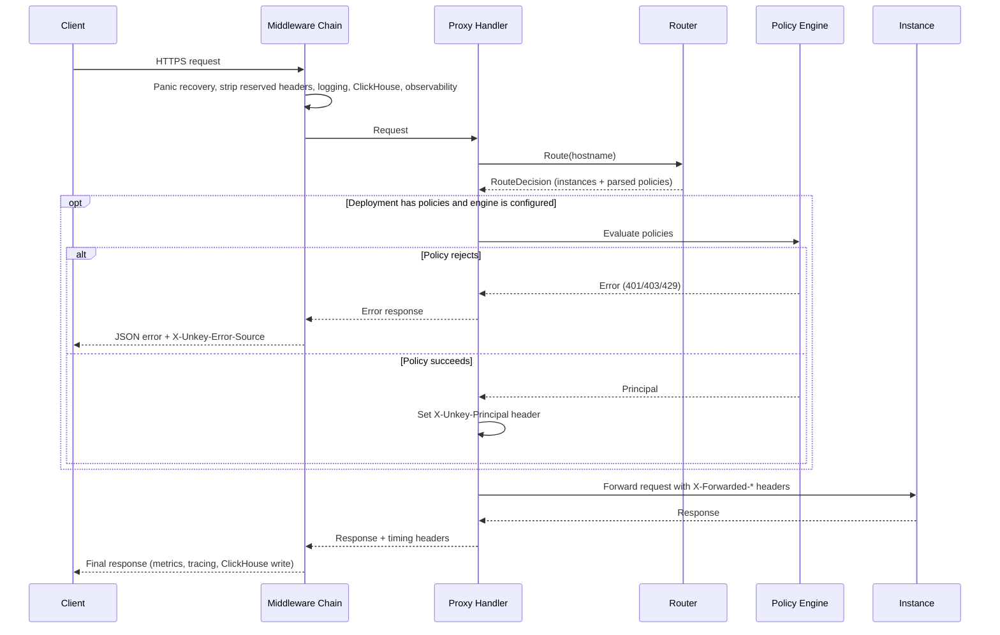

This page traces a request from the moment Frontline accepts the TLS connection to the response being streamed back to the client. Frontline owns the full path: it resolves the hostname, evaluates the deployment's policies inline, and proxies directly to a running instance.

## Middleware chain

Every request passes through a middleware chain before reaching the proxy handler. The chain executes top-to-bottom on the request path and bottom-to-top on the response path. The order is set in [`svc/frontline/routes/register.go`](https://github.com/unkeyed/unkey/blob/main/svc/frontline/routes/register.go):

1. **PanicRecovery.** Catches panics in downstream handlers so a single request cannot crash the process.
2. **Reserved header strip.** Removes client-supplied reserved headers, including `X-Unkey-Principal`, so a client cannot forge an identity. Frontline sets the verified principal itself after authentication.
3. **Logging.** Structured request logging. Skips internal paths (`/_unkey/internal/`).
4. **ClickHouseLogging.** Creates a tracking context with a start timestamp and, on completion, writes the full request and response to ClickHouse. It wraps observability so it reads the final status code after observability has written the response.
5. **Observability.** Starts an OpenTelemetry span (`frontline.proxy`), records Prometheus metrics (`unkey_frontline_requests_total`), maps fault codes to HTTP status codes, and renders an HTML error page when the client prefers HTML.
6. **Timeout.** Enforces the configured request timeout.

## Proxy handler

After the middleware chain, the proxy handler runs. Its inputs are the router service, the proxy service, and the policy engine.

### 1. Route the hostname

The handler calls `Route(hostname)` on the router. The router resolves the hostname to a `frontline_route` (deployment ID, `sentinel_config`, upstream protocol), parses the `sentinel_config` bytes into a policy list, and selects a destination. For a local destination the decision carries the running instances in shuffled order plus the parsed policies. If the hostname has no configured route, or the deployment has no running instance in any reachable region, the router returns a `Frontline.Routing` error (for example `NoRunningInstances`, surfaced as 503).

### 2. Evaluate policies

When the deployment has policies and the engine is configured, the engine evaluates each policy in order against the request. A policy that rejects the request (invalid key, rate limited, insufficient permissions) produces an error response before any byte is proxied. On success, the first authentication policy yields a `Principal`, which the handler serializes to the `X-Unkey-Principal` header. When the deployment has no policies, the request is forwarded without policy evaluation.

### 3. Forward to the instance

The handler proxies to a running instance of the deployment in the same region, attempting the shuffled candidates in order and advancing on dial failures. When every local instance fails and a peer region has a healthy instance, the request falls through to a peer Frontline. The following headers are set on the proxied request:

| Header              | Value                                         |
| ------------------- | --------------------------------------------- |
| `X-Forwarded-For`   | Client IP                                     |
| `X-Forwarded-Host`  | Original request host                         |
| `X-Forwarded-Proto` | `http` (TLS is terminated at Frontline)       |
| `X-Unkey-Principal` | JSON-serialized principal (if auth succeeded) |

### 4. Stream and record the response

The handler streams the instance response back to the client. The ClickHouse logging middleware records the request and response (status, headers, and a size-capped body) and the timing breakdown for analytics.

## Headers reference

### Set by a peer Frontline on cross-region forwards

| Header                   | Purpose                                           |
| ------------------------ | ------------------------------------------------- |
| `X-Deployment-Id`        | Identifies which deployment owns this request     |
| `X-Unkey-Frontline-Id`   | Identifies the forwarding Frontline instance      |
| `X-Unkey-Region`         | Region of the forwarding Frontline instance       |
| `X-Unkey-Frontline-Hops` | Cross-region hop counter (prevents routing loops) |

### Forwarded to the instance

| Header              | Purpose                                          |
| ------------------- | ------------------------------------------------ |
| `X-Forwarded-For`   | Client IP address                                |
| `X-Forwarded-Host`  | Original request hostname                         |
| `X-Forwarded-Proto` | Always `http` (TLS terminated at Frontline)      |
| `X-Unkey-Principal` | JSON principal from a successful auth policy      |

### Returned to the client

| Header                  | Purpose                                       |
| ----------------------- | --------------------------------------------- |
| `X-Unkey-Latency`       | Latency breakdown (Frontline and instance)    |
| `X-Unkey-Error-Source`  | Identifies Frontline as the source on errors  |
| `X-RateLimit-Limit`     | Rate limit ceiling from policies              |
| `X-RateLimit-Remaining` | Remaining requests in window                  |
| `X-RateLimit-Reset`     | Unix timestamp when the window resets         |
| `Retry-After`           | Seconds until retry (only on 429 responses)   |
