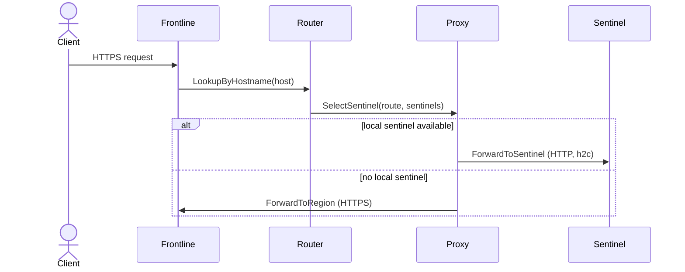

Frontline routes requests to the correct environment by looking up the hostname, selecting a healthy sentinel, and forwarding the request locally or to another region.

Key components:

- Router service (<a href="https://github.com/unkeyed/unkey/blob/main/svc/frontline/services/router" target="_blank">`svc/frontline/services/router`</a>).
- Proxy service (<a href="https://github.com/unkeyed/unkey/blob/main/svc/frontline/services/proxy" target="_blank">`svc/frontline/services/proxy`</a>).

## Flow: route request



## Routing decisions

- Frontline looks up the route by FQDN in the database.
- If there is a healthy sentinel in the current region, it forwards locally.
- If not, it selects the nearest region using the region proximity list.

## Cross-region forwarding

When forwarding to another region, frontline targets:

```
https://frontline.<region>.<apexDomain>
```

The original hostname is preserved so the remote frontline can perform TLS termination and routing.

## Hop limits

Frontline enforces a maximum hop count to prevent routing loops. When the `X-Unkey-Frontline-Hops` header reaches `max_hops`, the request is rejected.

Hop header: `X-Unkey-Frontline-Hops`.

## TLS certificate selection

Frontline selects TLS certificates per SNI. It attempts exact hostname match first, then falls back to the immediate wildcard (for example `*.example.com`). If no certificate is found, the TLS handshake falls back to a default certificate.
