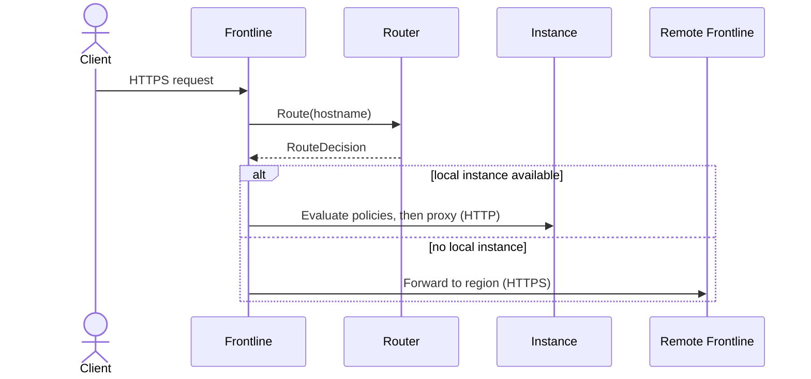

Frontline routes a request by looking up its hostname, selecting a healthy instance of the target deployment, and proxying locally or forwarding to another region.

Key components:

- Router ([`svc/frontline/internal/router`](https://github.com/unkeyed/unkey/blob/main/svc/frontline/internal/router)).
- Proxy handler ([`svc/frontline/routes/proxy`](https://github.com/unkeyed/unkey/blob/main/svc/frontline/routes/proxy)).

## Flow: route request


```mermaid
sequenceDiagram
  actor Client
  participant Frontline as Frontline
  participant Router as Router
  participant Instance as Instance
  participant Remote as Remote Frontline

  Client->>Frontline: HTTPS request
  Frontline->>Router: Route(hostname)
  Router-->>Frontline: RouteDecision
  alt local instance available
    Frontline->>Instance: Evaluate policies, then proxy (HTTP)
  else no local instance
    Frontline->>Remote: Forward to region (HTTPS)
  end
```

## Routing decisions

- Frontline looks up the route by FQDN in the database and parses the deployment's policies.
- If the deployment has a running instance in the current region, it proxies locally, trying instances in shuffled order.
- If not, it selects the nearest region with a running instance using the region proximity list.

## Cross-region forwarding

When forwarding to another region, Frontline targets:

```
https://frontline.<region>.<apexDomain>
```

The original hostname is preserved so the remote Frontline can perform TLS termination, policy evaluation, and instance selection.

## Hop limits

Frontline enforces a maximum hop count to prevent routing loops. When the `X-Unkey-Frontline-Hops` header reaches `max_hops`, the request is rejected.

Hop header: `X-Unkey-Frontline-Hops`.

## TLS certificate selection

Frontline selects TLS certificates per SNI. It attempts an exact hostname match first, then falls back to the immediate wildcard (for example `*.example.com`). If no certificate is found, the TLS handshake falls back to a default certificate.
