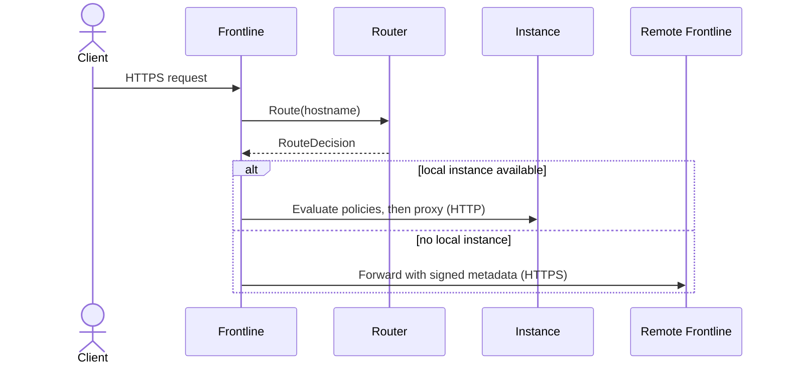
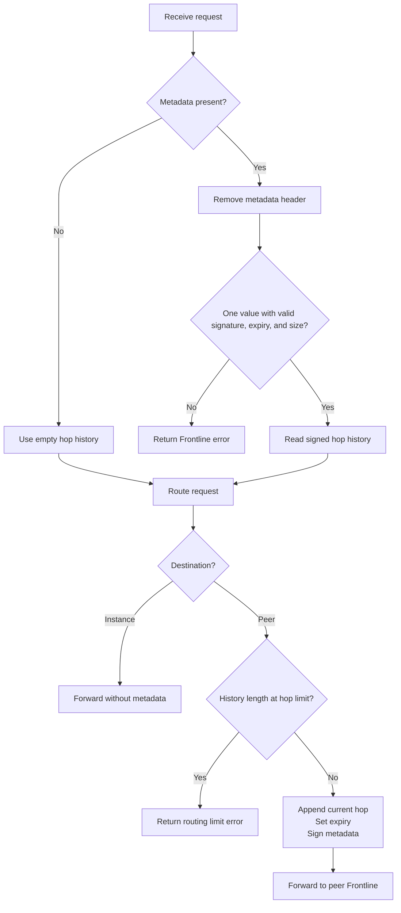

Frontline routes a request by looking up its hostname, selecting a healthy instance of the target deployment, and proxying locally or forwarding to another region.

Key components:

- Router ([`svc/frontline/internal/router`](https://github.com/unkeyed/unkey/blob/main/svc/frontline/internal/router)).
- Proxy handler ([`svc/frontline/routes/proxy`](https://github.com/unkeyed/unkey/blob/main/svc/frontline/routes/proxy)).

## Flow: route request


```mermaid
sequenceDiagram
  actor Client
  participant Frontline as Frontline
  participant Router as Router
  participant Instance as Instance
  participant Remote as Remote Frontline

  Client->>Frontline: HTTPS request
  Frontline->>Router: Route(hostname)
  Router-->>Frontline: RouteDecision
  alt local instance available
    Frontline->>Instance: Evaluate policies, then proxy (HTTP)
  else no local instance
    Frontline->>Remote: Forward with signed metadata (HTTPS)
  end
```

## Routing decisions

Frontline uses deployment state and regional proximity to select a destination.

- Frontline looks up the route by FQDN in the database and parses the deployment's policies.
- If the deployment has a running instance in the current region, it proxies locally, trying instances in shuffled order.
- If not, it selects the nearest region with a running instance using the region proximity list.

## Cross-region forwarding

When forwarding to another region, Frontline targets:

```plaintext
https://frontline.<region>.<apexDomain>
```

The original hostname is preserved so the remote Frontline can perform TLS termination, policy evaluation, and instance selection.

Frontline sends `X-Unkey-Frontline-Meta` to the peer. The header contains an
HS256 JWT with an expiry time and an ordered hop history. Each hop contains the
region, request ID, Frontline ID, and forward time as Unix milliseconds. The
complete header value cannot exceed 4,096 bytes.

The following flow shows how Frontline handles the metadata.


```mermaid
flowchart TD
  request["Receive request"] --> header{"Metadata present?"}
  header -- No --> zero["Use empty hop history"]
  header -- Yes --> remove["Remove metadata header"]
  remove --> verify{"One value with valid signature, expiry, and size?"}
  verify -- No --> invalid["Return Frontline error"]
  verify -- Yes --> read["Read signed hop history"]
  zero --> route["Route request"]
  read --> route
  route --> destination{"Destination?"}
  destination -- Instance --> strip["Forward without metadata"]
  destination -- Peer --> limit{"History length at hop limit?"}
  limit -- Yes --> reject["Return routing limit error"]
  limit -- No --> sign["Append current hop<br/>Set expiry<br/>Sign metadata"]
  sign --> peer["Forward to peer Frontline"]
```

## Hop limits

Frontline enforces a maximum hop count to prevent routing loops. The signed
`X-Unkey-Frontline-Meta` header carries the hop history. The history length is
the hop count. Frontline rejects a cross-region forward when the length reaches
`max_hops`. It preserves duplicate regions because they show routing loops.
Frontline appends the current hop, replaces the token, and sets the expiry to 1
minute in the future on each forward.

## TLS certificate selection

Frontline selects TLS certificates per SNI. It attempts an exact hostname match first, then falls back to the immediate wildcard (for example `*.example.com`). If no certificate is found, the TLS handshake falls back to a default certificate.
