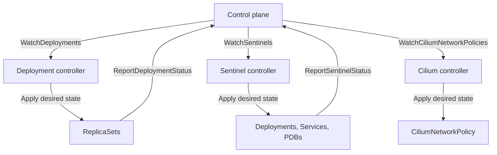

Krane is Unkey's in-cluster Kubernetes control agent. It reconciles control plane intent into Kubernetes resources, reports actual cluster state upstream, and brokers secrets decryption when Vault is configured.

Krane does not serve user traffic or make product decisions. It keeps Kubernetes state aligned with upstream intent.

## Place in the stack

Krane runs in each Kubernetes cluster. It is the only service in this stack with direct Kubernetes API credentials, which keeps cluster access isolated to Krane.

## Service boundaries

Krane only talks to three systems.

- Upstream: control plane streams desired state and receives status updates
- Downstream: Kubernetes API server for creating, updating, and watching resources
- Sidecar dependency: Vault for secrets decryption when enabled

Krane does not perform scheduling decisions, tenancy policy, or routing logic. Those live in the control plane and sentinel services. Krane only reconciles Kubernetes resources and reports state.

## Core responsibilities

Krane is built around these core responsibilities.

- Reconcile user workloads as Kubernetes ReplicaSets
- Reconcile sentinel infrastructure as Deployments, Services, PDBs, and gossip resources
- Reconcile Cilium network policies from control plane definitions
- Report actual state for workloads and sentinels upstream
- Decrypt workload secrets using Vault when enabled

## Control plane interface

Krane connects upstream with a Connect RPC client that keeps long-running streams open. It injects `Authorization: Bearer <token>` and `X-Krane-Region` headers on every request, and supports h2c for non-TLS URLs.

## Reconciliation model

## Control loops

Each controller maintains its own version cursor and reconnect logic for its stream. Streams reconnect with jittered backoff between one and five seconds. A version cursor advances only after a state is applied successfully, which makes stream replay safe.

### Deployment controller

The deployment controller manages user workloads as Kubernetes ReplicaSets. It runs three loops.

- Desired state apply loop streams `WatchDeployments` and applies or deletes ReplicaSets
- Actual state report loop watches ReplicaSet events and reports status to the control plane
- Resync loop runs every minute and corrects drift by re-reading desired state

### Sentinel controller

The sentinel controller manages the shared routing layer that fronts workloads. It also runs three loops.

- Desired state apply loop streams `WatchSentinels` and applies or deletes resources
- Actual state report loop watches sentinel Deployments and reports health
- Resync loop runs every minute and corrects drift by re-reading desired state

### Cilium controller

The Cilium controller manages Cilium network policies. It runs two loops.

- Desired state apply loop streams `WatchCiliumNetworkPolicies` and applies or deletes policies
- Resync loop runs every minute and corrects drift by re-reading desired state

## Kubernetes resource model

Krane uses server-side apply for all Kubernetes resources and labels everything it manages. Labels include `app.kubernetes.io/managed-by=krane` and a component label for selection.

### Deployments

User workloads are represented as ReplicaSets with the following characteristics.

- Namespaces are created on demand
- Pods run with `RuntimeClassName: gvisor` for isolation
- Pods tolerate the `karpenter.sh/nodepool=untrusted` taint
- Topology spread keeps replicas balanced across zones
- Pod affinity prefers zones that already run sentinel pods for the environment
- Env vars include `UNKEY_WORKSPACE_ID`, `UNKEY_PROJECT_ID`, `UNKEY_ENVIRONMENT_ID`, and `UNKEY_DEPLOYMENT_ID`
- `UNKEY_ENCRYPTED_ENV` contains a base64-encoded secrets blob when present
- Healthchecks map to HTTP probes, and POST uses an exec probe with `wget`
- Optional preStop hook sends non-SIGTERM shutdown signals

### Sentinels

Sentinels are infrastructure proxies deployed into the `sentinel` namespace. Each sentinel reconciliation applies the following resources.

- Deployment for the sentinel pods
- ClusterIP Service owned by the Deployment for stable addressing
- PodDisruptionBudget to keep at least one pod available
- Headless gossip service for peer discovery across the environment
- CiliumNetworkPolicy for gossip traffic between sentinel pods

### Cilium network policies

CiliumNetworkPolicy resources are applied with the dynamic client. Policies are provided by the control plane as JSON, and Krane sets names, namespaces, and Krane labels before applying them.

## Consistency guarantees

Krane uses streaming desired state, Kubernetes watches, and a periodic resync to ensure eventual consistency. The resync loop lists all Krane-managed resources, queries the control plane for desired state, and applies or deletes resources when drift is detected.
