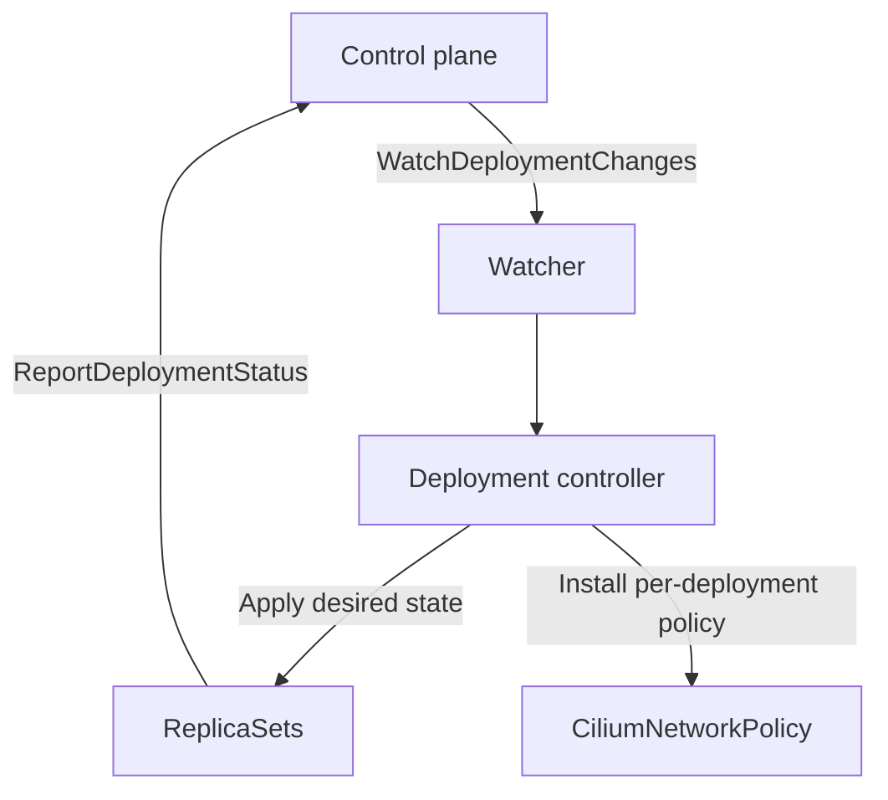

Krane is Unkey's in-cluster Kubernetes control agent. It reconciles control plane intent into Kubernetes resources, reports actual cluster state upstream, and brokers secrets decryption when Vault is configured.

Krane does not serve user traffic or make product decisions. It keeps Kubernetes state aligned with upstream intent.

## Place in the stack

Krane runs in each Kubernetes cluster. It is the only service in this stack with direct Kubernetes API credentials, which keeps cluster access isolated to Krane.

## Service boundaries

Krane only talks to three systems.

- Upstream: control plane streams desired state and receives status updates
- Downstream: Kubernetes API server for creating, updating, and watching resources
- Sidecar dependency: Vault for secrets decryption when enabled

Krane does not perform scheduling decisions, tenancy policy, or routing logic. Those live in the control plane and Frontline. Krane only reconciles Kubernetes resources and reports state.

## Core responsibilities

Krane is built around these core responsibilities.

- Reconcile user workloads as Kubernetes ReplicaSets
- Install a per-deployment Cilium network policy that admits Frontline ingress
- Report actual state for workloads upstream
- Decrypt workload secrets using Vault when enabled

## Control plane interface

Krane connects upstream with a Connect RPC client that keeps long-running streams open. It injects the `Authorization: Bearer <token>` header on every request and stamps a `RegionKey` (platform, name) on every request proto message. h2c is supported for non-TLS URLs.

## Reconciliation model

```mermaid
flowchart TD
  Ctrl[Control plane] -->|WatchDeploymentChanges| Watcher[Watcher]
  Watcher --> DeployCtrl[Deployment controller]

  DeployCtrl -->|Apply desired state| K8SDeploy[ReplicaSets]
  DeployCtrl -->|Install per-deployment policy| K8SCilium[CiliumNetworkPolicy]

  K8SDeploy -->|ReportDeploymentStatus| Ctrl
```

## Control loops

Krane consumes a single `WatchDeploymentChanges` stream from the control plane and dispatches each event to the deployment controller. The stream reconnects with jittered backoff between one and five seconds. A version cursor advances only after a state is applied successfully, which makes stream replay safe.

### Deployment controller

The deployment controller manages user workloads as Kubernetes ReplicaSets. It runs three loops.

- Desired state apply loop consumes deployment events from `WatchDeploymentChanges` and applies or deletes ReplicaSets
- Actual state report loop watches ReplicaSet events and reports status to the control plane
- Resync loop runs every minute and corrects drift by re-reading desired state

Applying a deployment also installs its [Cilium network policy](#cilium-network-policies) in the same step, so the policy is created and garbage-collected alongside the ReplicaSet.

## Kubernetes resource model

Krane uses server-side apply for all Kubernetes resources and labels everything it manages. Labels include `app.kubernetes.io/managed-by=krane` and a component label for selection.

### Deployments

User workloads are represented as ReplicaSets with the following characteristics.

- Namespaces are created on demand
- Pods run with `RuntimeClassName: gvisor` for isolation
- Pods select and tolerate `node-class=untrusted` nodes
- Topology spread keeps replicas balanced across zones
- Pod affinity prefers zones already running pods with the environment's sentinel component label (`ComponentSentinel`). This is a soft preference inherited from the sentinel proxy layer; since that layer merged into Frontline and no pods carry the label, the affinity currently matches nothing
- Env vars include `PORT`, `UNKEY_DEPLOYMENT_ID`, `UNKEY_ENVIRONMENT_SLUG`, `UNKEY_REGION`, `UNKEY_INSTANCE_ID`, and the `UNKEY_GIT_*` set (commit SHA, branch, repo, commit message)
- A `command` override from the deployment spec replaces the image entrypoint when set; otherwise the image's `ENTRYPOINT`/`CMD` runs
- Decrypted environment variables are mounted from a per-deployment K8s Secret via `envFrom.secretRef`
- Healthchecks map to HTTP probes, and POST uses an exec probe with `wget`
- Optional preStop hook sends non-SIGTERM shutdown signals

### Cilium network policies

When the deployment controller applies a deployment, it also installs a `<deployment>-frontline-ingress` CiliumNetworkPolicy in the deployment's namespace. Cilium default-deny applies to any endpoint a policy selects, so this policy is what admits ingress: it permits Frontline pods to reach the deployment's pods on the container port, and nothing else. Krane builds the policy from the deployment spec and applies it with the dynamic client using server-side apply. The policy is owned by the ReplicaSet, so Kubernetes garbage-collects it when the deployment is deleted.

## Consistency guarantees

Krane uses streaming desired state, Kubernetes watches, and a periodic resync to ensure eventual consistency. The resync loop lists all Krane-managed resources, queries the control plane for desired state, and applies or deletes resources when drift is detected.
