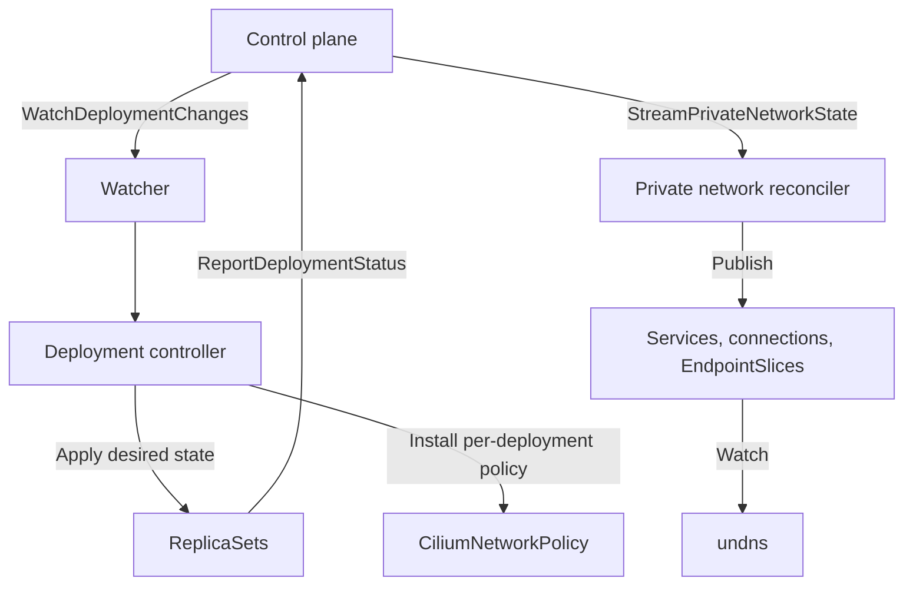

Krane is Unkey's in-cluster Kubernetes control agent. It reconciles control plane intent into Kubernetes resources, reports actual cluster state upstream, and brokers secrets decryption when Vault is configured.

Krane does not serve user traffic or make product decisions. It keeps Kubernetes state aligned with upstream intent.

## Place in the stack

Krane runs in each Kubernetes cluster and owns the customer workload resources there. It isn't the only Kubernetes client. Other services use their own credentials, and when private networking is enabled, the regional `undns` resolver watches Pods, ConfigMaps, Services, and EndpointSlices with read-only access. See the `svc/undns` package documentation for the resolver contract.

## Service boundaries

Krane talks to three systems.

- Upstream: the control plane streams deployment changes, serves private network snapshots, and receives status updates
- Downstream: the Kubernetes API server for creating, updating, and watching resources
- Sidecar dependency: Vault for secrets decryption when enabled

Krane does not perform scheduling decisions, tenancy policy, or routing logic. Those live in the control plane and Frontline. Krane only reconciles Kubernetes resources and reports state.

## Core responsibilities

Krane is built around these core responsibilities.

- Reconcile user workloads as Kubernetes ReplicaSets
- Install a per-deployment Cilium network policy that admits Frontline ingress
- Install directed Cilium grants for app connections and automatic replica connections when private networking is enabled
- Publish private network discovery objects when private networking is enabled
- Report actual state for workloads upstream
- Decrypt workload secrets using Vault when enabled

## Control plane interface

Krane connects upstream with a Connect RPC client. It keeps the deployment change stream open and reads the private network snapshot as a server stream every poll. It injects the `Authorization: Bearer <token>` header on every request and stamps a `ClusterKey` (cell ID, platform, and region) on every request proto message. h2c is supported for non-TLS URLs.

## Reconciliation model


```mermaid
flowchart TD
  Ctrl[Control plane] -->|WatchDeploymentChanges| Watcher[Watcher]
  Watcher --> DeployCtrl[Deployment controller]

  DeployCtrl -->|Apply desired state| K8SDeploy[ReplicaSets]
  DeployCtrl -->|Install per-deployment policy| K8SCilium[CiliumNetworkPolicy]

  K8SDeploy -->|ReportDeploymentStatus| Ctrl

  Ctrl -->|StreamPrivateNetworkState| PrivateNet[Private network reconciler]
  PrivateNet -->|Publish| K8SDiscovery[Services, connections, EndpointSlices]
  K8SDiscovery -->|Watch| Undns[undns]
```

## Control loops

Krane consumes the `WatchDeploymentChanges` stream from the control plane and dispatches each event to the deployment controller. The stream reconnects with jittered backoff between one and five seconds. A version cursor advances only after a state is applied successfully, which makes stream replay safe.

### Deployment controller

The deployment controller manages user workloads as Kubernetes ReplicaSets. It runs three loops.

- Desired state apply loop consumes deployment events from `WatchDeploymentChanges` and applies or deletes ReplicaSets
- Actual state report loop watches ReplicaSet events and reports status to the control plane
- Resync loop runs every minute and corrects drift by re-reading desired state

Applying a deployment also installs its [Cilium network policy](#cilium-network-policies) in the same step, so the policy is created and garbage-collected alongside the ReplicaSet.

### Private network reconciler

When `private_network.enabled` is set, one Krane instance per cluster holds a Lease and runs the private network reconciler. Every 5 seconds it reads a complete snapshot from `StreamPrivateNetworkState`. Ctrl reads every page inside one database transaction without a fixed row cap, then streams the snapshot in chunks ending with a complete chunk. Both Ctrl and Krane hold the full snapshot in memory. A stream without the complete chunk is partial and is not reconciled. The snapshot has one entry per app connection and running caller deployment on the cluster's platform, with the target deployment that Ctrl selected for it. Only caller deployments created with private networking appear. Ctrl decides that once when it creates a deployment and stores it on the deployment row: the workspace needs an app connection to another app, and the `private-networking` feature flag must be on for its WorkOS organization. Later flag or connection changes don't change the decision for running deployments. See [Feature flags](/contributing/tooling/feature-flags#ctrl).

For each entry, the reconciler maintains a global headless Service per target deployment, one connection ConfigMap per connection and caller deployment, and one CiliumNetworkPolicy per connection and caller deployment. It also writes EndpointSlices for local ready Pods, and Cilium ClusterMesh imports the slices of other regions. A connection moves to a replacement deployment only after that deployment has a ready endpoint visible in this region. Each region switches on its own schedule.

A connection policy lets the caller deployment reach the target deployment on every TCP and UDP port, in one direction, in any cluster. The reverse direction needs a separate connection from the target app. Ctrl also creates a discovery entry for the own replicas of each deployment created with private networking, named after its app slug, for example `api.unkey.internal`. Users don't add a connection for this: Krane injects the name as `UNKEY_DEPLOYMENT_HOST`. Connection names can't reuse the caller app's slug or start with `unkey`. ICMP, SCTP, broadcast, and multicast are not granted. The Service port is the target deployment's declared port and is metadata only; DNS answers carry Pod IPs, not ports.

A connection missing from a complete snapshot loses its published objects during cleanup, and its Services retire 30 minutes after they become unreferenced. A failed or partial snapshot skips the pass. An invalid entry or a connection that fails to reconcile keeps its published objects, and every other connection reconciles and cleans up in the same pass. Cleanup itself is not atomic: a failed deletion does not undo earlier deletions. If the reconciler loses its Lease, Krane exits with an error.

The `unkey_krane_private_network_*` metrics report leadership, loop completion, failures by step, and entry states. See <a href="https://github.com/unkeyed/infra/blob/main/docs/runbooks/eks/0020-private-networking.md" target="_blank">Troubleshoot private networking in the infra repository</a> for queries and fixes.

#### Upgrade from app bindings to connections

Existing pre-release installations need a coordinated maintenance window. This is not a rolling-compatible rename: the table, tRPC namespace, Kubernetes connection labels, and metric names change. Fresh installations use `app_connections` directly.

1. Stop the dashboard, Ctrl API, Ctrl worker, and Krane writers before changing the schema. Pause deployment and connection changes for the window.
2. Record the row count and IDs in `app_bindings`, then run this data-preserving rename:

```sql
ALTER TABLE app_bindings
  RENAME TO app_connections,
  RENAME INDEX app_bindings_id_unique TO app_connections_id_unique,
  RENAME INDEX app_bindings_app_name_idx TO app_connections_app_name_idx,
  RENAME INDEX app_bindings_app_resource_idx TO app_connections_app_resource_idx,
  RENAME INDEX app_bindings_project_idx TO app_connections_project_idx,
  RENAME INDEX app_bindings_resource_idx TO app_connections_resource_idx,
  RENAME INDEX app_bindings_workspace_idx TO app_connections_workspace_idx,
  RENAME INDEX app_bindings_target_deployment_idx TO app_connections_target_deployment_idx;
```

3. Verify the row count and IDs are unchanged. Start the updated dashboard, Ctrl API, and Ctrl worker.
4. Replace Krane and `undns` in every region within the window. Krane publishes `unkey-pn-connection-*` ConfigMaps with `unkey.com/connection.id`, then removes obsolete owned objects through normal cleanup. Old and new resolvers must not serve together during this transition. Private DNS can fail until publication and watches converge.
5. Verify hostname resolution, permitted traffic, and denied traffic in every region before resuming deployment and connection changes. Update monitoring from `unkey_dns_bindings` to `unkey_dns_connections`, and from the `binding` kind to `connection`.

Policy annotations change from `bindings.unkey.com/targets` to `connections.unkey.com/targets`. Recreated policies use the current snapshot, not the old policy's overlap history. Finish target rollouts before this upgrade, or expect existing traffic to previous targets to stop during the window.

The migration does not rewrite resource IDs, DNS aliases, host environment variables, deployment capabilities, or protobuf field numbers. Headless Service identities and retirement annotations stay unchanged. Existing dashboard and documentation URLs redirect to Connections. Rollback requires stopping writers, reversing the schema rename, and restoring all old binaries together; it is not a mixed-version rollback.

## Kubernetes resource model

Krane labels everything it manages with `app.kubernetes.io/managed-by=krane` and a component label for selection. The deployment controller uses server-side apply. The private network reconciler uses create and update with resource version checks.

### Deployments

User workloads are represented as ReplicaSets with the following characteristics.

- Namespaces are created on demand
- Pods run with `RuntimeClassName: gvisor` for isolation, unless krane is configured with `disable_gvisor`, as local development is
- Pods select and tolerate `node-class=untrusted` nodes
- Topology spread keeps replicas balanced across zones
- Env vars include `PORT`, `UNKEY_DEPLOYMENT_ID`, `UNKEY_ENVIRONMENT_SLUG`, `UNKEY_REGION`, `UNKEY_INSTANCE_ID`, and the `UNKEY_GIT_*` set (commit SHA, branch, repo, commit message)
- A `command` override from the deployment spec replaces the image entrypoint when set; otherwise the image's `ENTRYPOINT`/`CMD` runs
- Decrypted environment variables are mounted from a per-deployment K8s Secret via `envFrom.secretRef`
- Healthchecks map to HTTP probes, and POST uses an exec probe with `wget`
- Optional preStop hook sends non-SIGTERM shutdown signals
- Pods carry an environment kind label
- With private networking enabled in the region and the deployment created with private networking, Pods use the regional `undns` Service as their only nameserver, with `ndots:1` and no search domains. Pods of other deployments keep cluster DNS

### Cilium network policies

When the deployment controller applies a deployment, it installs a `<deployment>-frontline-ingress` CiliumNetworkPolicy in the deployment's namespace, once before and once after the ReplicaSet. The policy admits Frontline ingress on the container port. The ReplicaSet owns the policy, so Kubernetes garbage-collects it with the deployment. Traffic between deployments is denied unless an app connection policy from the [private network reconciler](#private-network-reconciler) allows it. Environment kind grants no network access.

When a replacement canary is ready, Ctrl schedules older running deployments in the same app, environment, branch, and fork to stop after 30 minutes. The app's live deployment is excluded. For deployments pinned by an app connection, the scheduled stop retries until the pin is removed, waiting from 1 minute up to 15 minutes between checks. This timer is independent of Krane's discovery retirement timer.

## Consistency guarantees

Krane uses streaming desired state, Kubernetes watches, and a periodic resync to ensure eventual consistency. The resync loop lists all Krane-managed resources, queries the control plane for desired state, and applies or deletes resources when drift is detected. Private network discovery converges separately from complete snapshots, and regions converge independently.
