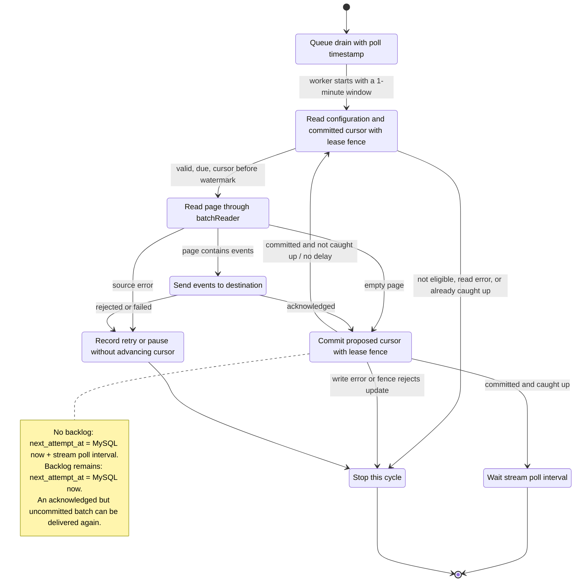
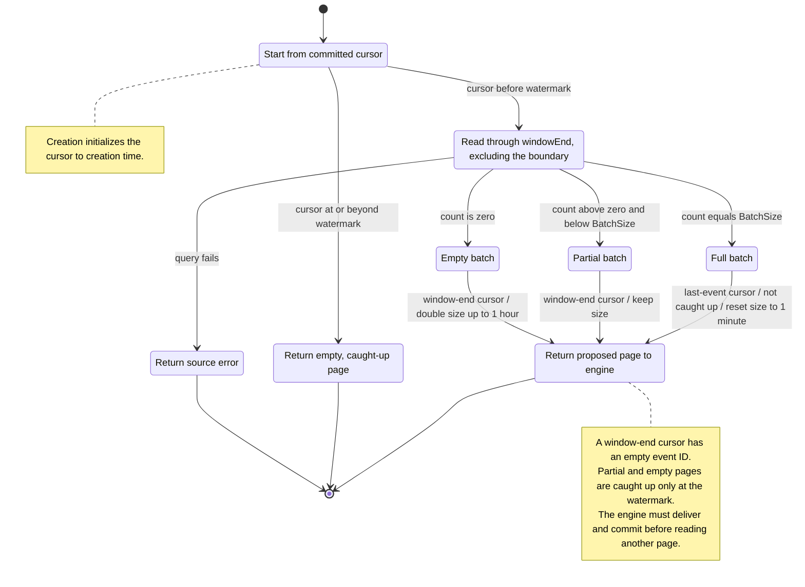

The logdrain service (`svc/logdrain`) streams audit logs, key verifications, gateway HTTP requests, and runtime logs from ClickHouse to
customer-owned destinations: generic HTTP endpoints and Axiom.
Under one valid lease, it sends events in cursor order. It provides
at-least-once delivery. MySQL stores configuration and delivery progress. The
service does not use an external queue or workflow engine.

## How the service works

Each process runs a lease service and a delivery engine. The lease service
assigns drains to the process and keeps those assignments valid. The delivery
engine polls for assigned drains that are due, then gives them to a worker
pool.

A worker first confirms its assignment in MySQL. It then reads the drain's
configuration and cursor, queries the next stream batch from ClickHouse,
and sends that batch to the customer destination. After the destination
acknowledges the batch, the worker advances the cursor in MySQL. A failed
delivery leaves the cursor unchanged.

MySQL stores the destination configuration as a serialized
`logdrain.v1.Config` protobuf. Its provider `oneof` keeps HTTP and Axiom fields
separate. Secret fields contain Vault ciphertext, so MySQL does not store
plaintext credentials. The Vault ciphertext includes the key ID that the
service needs for decryption. HTTP header names stay in plaintext. Each HTTP
header value has separate Vault ciphertext.

The `stream` oneof identifies the stream and contains its typed configuration,
independently of the destination. `audit_logs` selects `AuditLogStreamConfig`.
Its `event_types` list selects exact audit event names. An empty list means all
audit events, including event types added later. Existing protobuf configs with
no stream retain the legacy audit-log behavior without filters.

`runtime_logs` selects `RuntimeLogStreamConfig`. Its `severities`, `project_ids`,
`app_ids`, and `environment_ids` lists match exact collected values. Lists combine
with AND, values within a list with OR, and empty lists are unrestricted.
The payload contains `log_id`, `severity`, `message`, nested `attributes`, customer
resource IDs, and `region`. Vector parses application output before insertion.
The drain preserves that output and omits Kubernetes pod names and platform metadata.

The dashboard uses the same source tree for gateway requests and runtime logs.
Whole-project and whole-app selections keep their IDs, so they include future
environments. Mixed selections use environment IDs and do not include future
environments automatically. Selecting every current environment removes the
source restriction. Clearing every source blocks submission.

The protobuf stream selects the source. The MySQL `stream` column remains for
drain counts and listing, but does not control source selection.

ClickHouse applies the filter before ordering and limiting each batch. Windows
with no matching events still advance the cursor. Editing the filter expires
the lease and resumes from the committed cursor with a new fencing token. It
does not replay events skipped by the previous filter. A request already in
flight can still reach the destination, but its old fence cannot commit.

The worker does not hold a MySQL transaction while it calls the customer
destination. A fencing token protects each state read and write instead.

```plaintext
svc/logdrain process
├── lease service
│   └── acquires and refreshes leases in MySQL
└── delivery engine
    ├── polls due leases from MySQL
    └── workers
        ├── read config and cursor from MySQL
        ├── read the configured stream from ClickHouse
        ├── send batches to the customer destination
        └── write delivery state to MySQL and telemetry to ClickHouse
```

## Delivery cycle

On each poll, the delivery engine finds running drains assigned to its
lease ID that have reached `next_attempt_at`. It passes the drain ID and
fencing token to a worker. The worker reads the drain only if that token still
identifies a valid lease. If the lease expired or another process acquired it,
the worker stops.

The engine owns leases, delivery, and durable progress. A `batchReader` owns
source queries and adaptive windows. It returns a page containing events, a
proposed next cursor, and a `caughtUp` flag. Reading a page does not commit its
cursor. The engine commits only after the destination acknowledges all events
in that page. Empty pages need no destination request.

After each commit, the engine immediately reads another page unless
`caughtUp` is true. A partial or empty page can exhaust one window without
reaching the watermark. It does not cause a poll delay while a backlog remains.



Cancellation stops the cycle. It does not mark a source cancellation as a
retryable failure. If the failure-state write fails or loses its fence, the
worker also stops. These exits never authorize a cursor advance.

### Adaptive read windows

Each cycle starts with a 1-minute window and one fixed watermark. The reader
sets `windowEnd = min(cursor.Time + windowSize, watermark)`. Its query reads
after the composite cursor and strictly before `windowEnd`, with at most
`BatchSize` events.



Empty windows grow through 1, 2, 4, 8, 16, 32, and 60 minutes. Further empty
windows stay at 60 minutes. A full batch resets the next query to 1 minute
from the last event's cursor, including its event ID. A partial batch keeps
the window size. Every query is capped at the fixed watermark, even when the
chosen window is larger than the remaining interval.

Window size lives only in the reader for that cycle. It is not stored in
MySQL. A restart, retry, or later poll starts at 1 minute again, using the
committed cursor. A larger window can still be expensive when an empty period
is followed by a burst. Adaptation limits the time range, not query duration
or rows scanned.

## Cursor and watermark

Each drain subscribes to one stream. `audit_logs` reads `audit_logs_raw_v1`
with cursor `(inserted_at, event_id)`. `key_verifications` reads
`key_verifications_raw_v2` with cursor `(inserted_at, request_id)`.
The existing request ID identifies the verification and is the export event ID.
`runtime_logs` reads `runtime_logs_raw_v1` with `(inserted_at, log_id)`, reusing
Vector's stable ID and ClickHouse's insertion timestamp. Its time-first projection
orders `(workspace_id, inserted_at, log_id)` and stores `_part_offset`.
Runtime retention remains `expires_at + INTERVAL 7 DAY`, with the existing
90-day insertion-time default for `expires_at` and whole-part deletion.
MySQL stores each cursor as
`committed_offset_inserted_at` and `committed_offset_event_id`.

ClickHouse stamps verification `inserted_at` when it inserts the row. Writers
omit that column. The event's `time` stays unchanged, so buffered or retried
events with older occurrence times remain eligible for later insertion windows.
The service retains the existing 90-day event-time TTL for verifications.
Events older than that retention period are not guaranteed to remain available.

All streams have a lightweight `proj_logdrain` projection. The verification
projection orders `(workspace_id, inserted_at, request_id)` and stores
`_part_offset` rather than duplicating payload columns. The query uses expanded
cursor OR predicates so ClickHouse can prune the insertion range. Reduced
payload reads depend on base-table granularity: matching rows scattered across
every granule can still require a full payload read. Outcome and keyspace filters run
before `LIMIT`, but are not part of the projection ordering.

Creation sets the cursor to the drain's creation time with an empty event ID.
Historical backfill before creation is not supported. Pauses, failures, and
outages resume from the committed cursor and still catch up normally.

A zero cursor follows the same adaptive window path from the Unix epoch.
It eventually catches up without a separate history lookup, but can require
many empty-window queries.

MySQL and ClickHouse must order `event_id` values the same way. ClickHouse
compares `String` values byte by byte, so the MySQL
`committed_offset_event_id` column uses the binary `utf8mb4_0900_bin`
collation. If the two databases used different ordering, they could disagree
about which event follows the committed cursor and skip or repeat events.

The event ID is necessary because multiple events can have the same
`inserted_at` value. For example, assume a batch size of two and these events:

| `inserted_at` | `event_id` |
| --- | --- |
| 1,000 | `evt_a` |
| 1,000 | `evt_b` |
| 1,000 | `evt_c` |
| 1,001 | `evt_d` |

The first query returns `evt_a` and `evt_b`, then commits the cursor
`(1000, evt_b)`. The next query starts after that pair, so it returns `evt_c`
before `evt_d`. A cursor that stored only `1000` would start the next query
after that millisecond and skip `evt_c`.

A full batch advances the cursor to its last event. A short or empty batch
advances the cursor to that window's exclusive end with an empty event ID.
The empty event ID keeps events at that exact boundary eligible for the next
read, which can happen in the same cycle.

The watermark is the poll's enqueue timestamp minus the configured stream lag.
The worker selects that lag from the protobuf stream before it chooses the
watermark. A missing stream keeps the legacy audit policy. The watermark stays
fixed while the worker catches up, including time spent waiting in the queue.
This settling period gives late ClickHouse inserts time to become query-visible
before the cursor passes their insertion timestamp.

### Stream timing

Audit logs default to a 5-minute watermark lag and a 60-second poll interval.
Key verifications, gateway HTTP requests, and runtime logs use a fixed
15-second lag and a 5-second interval. Future non-audit sources use the same
non-audit timing policy when their source dispatch is added.

The existing `poll_interval` and `watermark_lag` settings control audits only.
Non-audit timing is defined by engine constants and has no operator settings.
The audit defaults are:

```toml
poll_interval = "60s"
watermark_lag = "5m"
```

The audit poll interval must be at least 1ms. Its watermark lag must not be negative.
The engine scans MySQL at the shorter poll interval. A caught-up drain remains
ineligible until database commit time plus its stream's poll interval. Thus,
5-second discovery does not repeatedly read caught-up audits from ClickHouse.
Query window sizes are not sleep intervals. Backlog pages continue immediately
on the same worker.

For a healthy, caught-up non-audit drain, roughly 15–25 seconds after insertion
is an expectation, not a guaranteed end-to-end SLO. The target is delivery
within a minute of occurrence. Queue delay, backlog, destination failures, and
collection buffering can exceed it. API and frontline buffers flush every
5 seconds; the local Vector ClickHouse sink batches for up to 3 seconds.
Production collector settings require a separate check.

The shorter lag accepts more risk of missing rows that become query-visible
after the cursor passes their insertion timestamp. It does not drop failed
batches or change retries, fencing, or audit timing. The committed-batch log
reports insertion-cursor age as `lag_ms` and the oldest delivered occurrence's
age at commit as `oldest_event_age_ms`. Event timestamps and service clock skew
affect the latter. Delivery-duration metrics measure destination request time,
not end-to-end event age.

## Leasing and fencing

Leases divide drains between service processes. Each process creates one
startup-unique `lease_id`. The lease service acquires expired leases for that
ID and refreshes them before they expire. Database time controls acquisition,
refresh, and expiry.

Each acquisition also creates a new `fencing_token`. The token identifies one
specific ownership period, even if the same process loses and later reacquires
the drain. The poller includes this token with each work item. Every delivery
state read and write requires the same token and a lease that is still valid.
As a result, stale workers cannot change the cursor, retry time, or failure
state.

Fencing protects durable state. It cannot cancel a customer request that
started before the lease expired.

## Disablement, retries, and pauses

The `logdrains.status` field is `running`, `paused_by_user`, or
`paused_by_failure`. The engine processes a drain only when it is running.

A destination rejection, such as HTTP 400 or HTTP 500, leaves the cursor
unchanged. An unexpected delivery error, such as a timeout or DNS failure,
also leaves the cursor unchanged. The engine retries both cases.

The engine calculates an exponential delay from `consecutive_failures`. The
first retry waits 1 minute. Each later failure doubles the delay through 128
minutes. Later retries wait 4 hours. With the default failure threshold of 50,
the 49 retry waits span 7 days and 15 minutes.

A destination can request a longer delay. The HTTP sink reads the standard
`Retry-After` response header. The Axiom sink reads `Retry-After` first. If that
header is not valid, it reads `X-RateLimit-Reset` as a UTC Unix timestamp in
seconds. The engine uses the longer of the local delay and the destination
delay. It limits a destination delay to 24 hours.

The failure update query increments `consecutive_failures` and writes an
absolute retry time to `next_attempt_at`. It calculates that timestamp from
MySQL time, not process time. The due-drain queries return the drain only after
`next_attempt_at` has passed. A successful cursor update resets the failure
count. A page remains due immediately while a backlog remains. Only a page
that reaches the watermark schedules the next attempt after its stream's
poll interval.

The engine pauses the drain only after it reaches the configured failure
threshold. Re-enabling a drain or changing its destination makes it running. The
change resets its failure count and retry time. It preserves the cursor.
Delivery resumes from that cursor, subject to the 90-day ClickHouse retention
period for audit logs.

## Delivery guarantees

The cursor, lease, and fencing token define the delivery semantics:

- Deliver-then-commit gives at-least-once delivery. If the process crashes
  after the destination acknowledges a batch but before the cursor update,
  the next cycle sends that batch again.
- A failure never advances the cursor. The drain retries the same events until
  the destination accepts them or the drain pauses.
- Fencing prevents stale workers from changing durable state after lease
  expiry, configuration changes, deletion, or reacquisition. It cannot cancel
  an external request after a worker completes its fenced read.

Customers must handle duplicate events. They can use the audit log event `id`
or the verification or gateway `request_id` as a deduplication key within its stream.

## Verification payload

Each HTTP record contains `event` (the verification payload),
`stream: "key_verifications"`, and `timestamp`
(occurrence time in UTC RFC3339 with millisecond precision). Batch metadata
stays in request headers. Axiom contains `event`, `stream: "key_verifications"`,
and `_time` with the same occurrence time. HTTP JSON sends an array; NDJSON
sends one record per line. `inserted_at` is only an internal cursor field.

The verification payload contains these fields from the raw verification row:

| Fields | Meaning |
| --- | --- |
| `request_id` | Request correlation and deduplication ID. |
| `key_space_id`, `key_id` | Verified key and key space. |
| `identity` | Object with `id` and `externalId`. Omitted when both identifiers are absent. |
| `region` | Verification region. |
| `source` | Object with `type`: `api` or `gateway`. Gateway sources also include `appId`; API sources omit it. |
| `outcome` | Verification outcome, not an audit event type. |
| `tags` | String array of verification tags. |
| `spent_credits` | Credits spent on this verification. |
