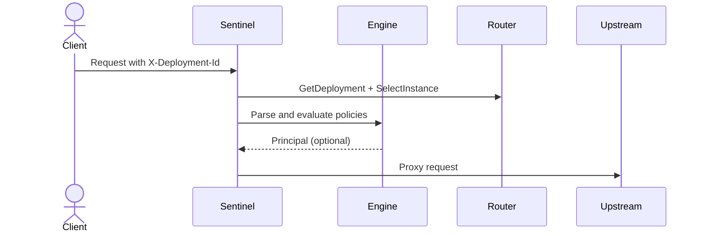

Sentinel evaluates middleware policies before proxying traffic to deployment instances. Policies live in the deployment's `sentinel_config` payload and are parsed from JSON into the `sentinel.v1.Config` proto.

## Flow

## Evaluation model

Policies are evaluated in order. Disabled policies are skipped, and match expressions must all pass for a policy to run. If a policy rejects a request, evaluation stops and sentinel returns a structured error response.

The engine currently executes only the KeyAuth policy. Other policy types exist in the schema for forward compatibility, but the engine skips unknown policy types. The first authentication policy that succeeds sets the principal for the request, and subsequent auth policies are ignored.

## Shared types

- [Policy schema](/architecture/services/sentinel/policies/policy)
- [Match expressions](/architecture/services/sentinel/policies/match-expressions)
- [Principal](/architecture/services/sentinel/policies/principal)

## Policy types

- [KeyAuth](/architecture/services/sentinel/policies/keyauth)
- [JWTAuth](/architecture/services/sentinel/policies/jwtauth)
- [BasicAuth](/architecture/services/sentinel/policies/basicauth)
- [RateLimit](/architecture/services/sentinel/policies/ratelimit)
- [IP rules](/architecture/services/sentinel/policies/ip-rules)
- [OpenAPI request validation](/architecture/services/sentinel/policies/openapi)

## Pass-through mode

If the middleware engine is disabled, sentinel skips policy evaluation and proxies requests directly. This happens when Redis is not configured or the engine fails to initialize.
