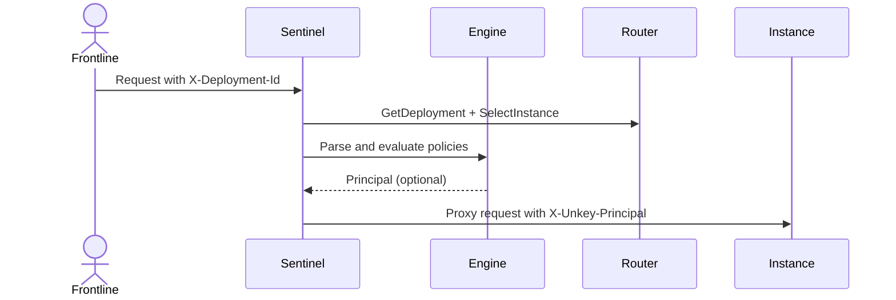

Sentinel evaluates middleware policies before proxying traffic to deployment instances. Policies are stored in the deployment's `sentinel_config` column as a JSON-serialized `sentinel.v1.Config` protobuf.

## Evaluation flow


```mermaid
sequenceDiagram
  actor Frontline
  participant Sentinel
  participant Engine
  participant Router
  participant Instance

  Frontline->>Sentinel: Request with X-Deployment-Id
  Sentinel->>Router: GetDeployment + SelectInstance
  Sentinel->>Engine: Parse and evaluate policies
  Engine-->>Sentinel: Principal (optional)
  Sentinel->>Instance: Proxy request with X-Unkey-Principal
```

## Evaluation model

Policies are evaluated in declaration order. For each policy:

1. Skip if `enabled` is false.
2. Evaluate all match expressions. All expressions must match (AND semantics). If any expression does not match, the policy is skipped.
3. Execute the policy. If it rejects the request (invalid key, rate limited, insufficient permissions), evaluation stops and sentinel returns a structured error response.
4. If the policy is an auth policy and succeeds, it sets the `Principal` for the request. Subsequent auth policies are skipped.

Unknown policy types are silently skipped for forward compatibility. This means a sentinel running an older version can load a config that references a new policy type without breaking.

## Composability

Policies are composable building blocks. The policy list is not a set of independent checks but an ordered pipeline where earlier policies can establish context that later policies consume.

### Auth sets context for downstream policies

Auth policies produce a [Principal](/architecture/services/sentinel/policies/principal) containing a subject and a method-specific `source` object. Today only KeyAuth is implemented; JWTAuth is defined in the protobuf schema but not yet executed by the engine (see [implementation status](#implementation-status)). Downstream policies reference this principal. For example, a RateLimit policy can use the authenticated subject as its bucket key, giving each user their own rate limit window instead of a shared one.

```
Policy 1: KeyAuth        → authenticates the request, sets Principal
Policy 2: RateLimit      → rate limits per Principal.subject  (not yet implemented)
```

<Note>The examples in this section illustrate the composability model. Only KeyAuth executes today; other policy types are shown to demonstrate the design.</Note>

### Same policy type, different match expressions

The same policy type can appear multiple times with different [match expressions](/architecture/services/sentinel/policies/match-expressions). This enables path-specific or method-specific rules without requiring a single policy to handle every case.

For example, applying different rate limits to different paths:

```
Policy 1: RateLimit  match: /v1/expensive/* → 10 req/min
Policy 2: RateLimit  match: /v1/*           → 1000 req/min
```

Policies are evaluated in order and all matching policies execute until one rejects. A request to `/v1/expensive/foo` matches both policies, so both rate limits apply independently. If the stricter limit rejects, evaluation stops and the broader policy never runs. Place more specific match expressions before broader ones so a rejection skips unnecessary work.

### Layering multiple concerns

A typical production configuration layers firewall, auth, rate limiting, and validation:

```
Policy 1: Firewall   match: path prefix /admin → DENY admin routes from public traffic
Policy 2: KeyAuth    match: all                → authenticate, set Principal
Policy 3: RateLimit  match: /v1/*              → 1000 req/min per subject
Policy 4: RateLimit  match: /v1/expensive/*    → 10 req/min per subject
Policy 5: OpenAPI    match: all                → validate request shape
```

Each policy can reject the request independently. A blocked path never reaches auth. An invalid key never reaches rate limiting. A rate-limited request never reaches schema validation. Order matters.

## Full config example

The `sentinel_config` column on a deployment stores a JSON-serialized `sentinel.v1.Config` protobuf. Here is a complete example that blocks `/admin`, authenticates with KeyAuth, and applies two rate limit tiers:

```json
{
  "policies": [
    {
      "id": "block-admin",
      "name": "Block /admin",
      "enabled": true,
      "match": [
        { "path": { "path": { "prefix": "/admin" } } }
      ],
      "firewall": { "action": "ACTION_DENY" }
    },
    {
      "id": "api-auth",
      "name": "Authenticate API keys",
      "enabled": true,
      "match": [],
      "keyauth": {
        "key_space_ids": ["ks_abc123"],
        "locations": [
          { "bearer": {} }
        ],
        "permission_query": "api.read"
      }
    },
    {
      "id": "search-ratelimit",
      "name": "Strict limit on search",
      "enabled": true,
      "match": [
        { "path": { "path": { "prefix": "/v1/search" } } },
        { "method": { "methods": ["GET"] } }
      ],
      "ratelimit": {
        "limit": 10,
        "window_ms": 60000,
        "key": { "authenticated_subject": {} }
      }
    },
    {
      "id": "global-ratelimit",
      "name": "Default rate limit",
      "enabled": true,
      "match": [
        { "path": { "path": { "prefix": "/v1/" } } }
      ],
      "ratelimit": {
        "limit": 1000,
        "window_ms": 60000,
        "key": { "authenticated_subject": {} }
      }
    }
  ]
}
```

What happens for `GET /v1/search?q=test` with a valid API key:

1. `block-admin` match does not apply (path is `/v1/search`, not `/admin`), so the policy is skipped.
2. `api-auth` runs. Extracts the Bearer token, verifies it against keyspace `ks_abc123`, checks the `api.read` permission, and sets the Principal.
3. `search-ratelimit` runs. Both match expressions pass (path starts with `/v1/search` AND method is GET). Rate limits the request at 10/min using the authenticated subject as the bucket key.
4. `global-ratelimit` match also passes (path starts with `/v1/`), but the request was already rate-limited by policy 3. Both policies evaluate independently.

What happens for `POST /v1/keys` with an invalid key:

1. `block-admin` is skipped (path does not match).
2. `api-auth` rejects the request with 401. Evaluation stops. Policies 3 and 4 never run.

## Implementation status

The engine executes only KeyAuth. Other policy types are defined in the protobuf schema and can be configured, but the engine skips them at evaluation time.

| Policy                                                                 | Implemented |
| ---------------------------------------------------------------------- | ----------- |
| [KeyAuth](/architecture/services/sentinel/policies/keyauth)            | Yes         |
| [Firewall](/architecture/services/sentinel/policies/firewall)          | Yes         |
| [JWTAuth](/architecture/services/sentinel/policies/jwtauth)            | Schema only |
| [RateLimit](/architecture/services/sentinel/policies/ratelimit)        | Schema only |
| [OpenAPI validation](/architecture/services/sentinel/policies/openapi) | Schema only |

## Shared types

- [Policy schema](/architecture/services/sentinel/policies/policy) for the `sentinel.v1.Policy` message structure
- [Match expressions](/architecture/services/sentinel/policies/match-expressions) for request matching rules
- [Principal](/architecture/services/sentinel/policies/principal) for the authenticated identity shape

## Config parsing

The engine handles these edge cases when parsing `sentinel_config`:

| Input                    | Behavior                                                 |
| ------------------------ | -------------------------------------------------------- |
| `nil` or empty bytes     | Pass-through (no policies)                               |
| `{}` (empty JSON object) | Pass-through (legacy compatibility)                      |
| Valid JSON with policies | Parse and evaluate                                       |
| Invalid JSON             | Error with code `Sentinel.Internal.InvalidConfiguration` |

## Adding a new policy type

1. Define the policy proto in `svc/sentinel/proto/policies/v1/`.
2. Add the new type to the `config` oneof in `policy.proto`.
3. Add a case in the evaluation switch in `svc/sentinel/engine/engine.go`.
4. Implement the executor (follow `keyauth.go` as a reference).
5. Run `make generate` to regenerate protobuf code.

Old sentinel versions that do not recognize the new policy type skip it silently, so rollouts are safe.
