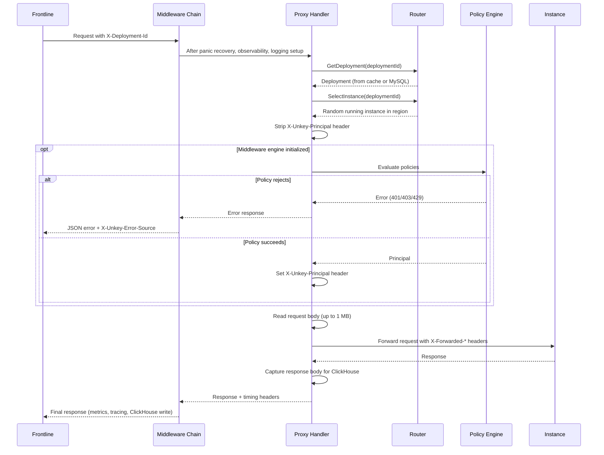

This page traces a request from the moment sentinel receives it to the response being sent back to Frontline.

## Middleware chain

Every request passes through a middleware chain before reaching the proxy handler. The chain executes top-to-bottom on the request path and bottom-to-top on the response path:

1. **PanicRecovery.** Catches panics in downstream handlers. Prevents a single request from crashing the process.
2. **Observability.** Starts an OpenTelemetry span (`sentinel.proxy`), increments the active request gauge, and records Prometheus metrics on completion. Maps fault codes to HTTP status codes and writes JSON error responses.
3. **SentinelLogging.** Creates a tracking context with a start timestamp. On completion, writes the full request and response to ClickHouse.
4. **ProxyErrorHandling.** Categorizes network errors from the reverse proxy (connection refused, timeout, DNS failure) into fault codes and status codes.
5. **Logging.** Structured request logging. Skips internal paths (`/_unkey/internal/`).

## Proxy handler

After the middleware chain, the proxy handler runs:

### 1. Extract deployment ID

The handler reads the `X-Deployment-Id` header, set by Frontline. If the header is missing, sentinel returns 400 with code `User.BadRequest.MissingRequiredHeader`.

### 2. Look up deployment

The router service fetches the deployment from the deployment cache (or MySQL on cache miss). Sentinel validates that the deployment belongs to its own environment. If the deployment does not exist or belongs to a different environment, sentinel returns 404 with code `Sentinel.Routing.DeploymentNotFound`.

### 3. Select an instance

The router fetches instances for the deployment from the instance cache, filters to instances in the same region with status `RUNNING`, and selects one at random. If no running instances exist, sentinel returns 503 with code `Sentinel.Routing.NoRunningInstances`.

### 4. Evaluate middleware policies

If the middleware engine is initialized, sentinel parses the deployment's `sentinel_config` (a protobuf-serialized policy list) and evaluates each policy in order. Policies that reject the request (invalid key, rate limited, insufficient permissions) cause sentinel to return an error response before proxying. On success, the first auth policy sets the `Principal`.

If the middleware engine is nil (Redis unavailable), this step is skipped and requests pass through without policy evaluation. This is a known bug tracked in [#5365](https://github.com/unkeyed/unkey/issues/5365).

### 5. Read request body

The request body is read into memory (up to 1 MB) for ClickHouse logging. A copy is set on the proxy request for forwarding.

### 6. Forward to instance

The following headers are set on the proxied request to the instance:

| Header              | Value                                         |
| ------------------- | --------------------------------------------- |
| `X-Forwarded-For`   | Client IP                                     |
| `X-Forwarded-Host`  | Original request host                         |
| `X-Forwarded-Proto` | `http`                                        |
| `X-Unkey-Principal` | JSON-serialized principal (if auth succeeded) |

### 7. Capture response

Sentinel captures the response status, headers, and body (up to 1 MB) for ClickHouse logging. It also records the instance end timestamp for latency calculation.

### 8. Write timing headers

Sentinel adds `X-Unkey-Latency` headers to the response:

- `sentinel` duration: time spent in sentinel (total minus instance)
- `instance` duration: time between forwarding the request and receiving the response

## Headers reference

### Headers set by Frontline (consumed by sentinel)

| Header                   | Purpose                                           |
| ------------------------ | ------------------------------------------------- |
| `X-Deployment-Id`        | Identifies which deployment owns this request     |
| `X-Unkey-Frontline-Id`   | Identifies the Frontline instance                 |
| `X-Unkey-Region`         | Region of the Frontline instance                  |
| `X-Unkey-Frontline-Hops` | Cross-region hop counter (prevents routing loops) |

### Headers set by sentinel (forwarded to instance)

| Header              | Purpose                                     |
| ------------------- | ------------------------------------------- |
| `X-Forwarded-For`   | Client IP address                           |
| `X-Forwarded-Host`  | Original request hostname                   |
| `X-Forwarded-Proto` | Always `http` (TLS terminated at Frontline) |
| `X-Unkey-Principal` | JSON principal from successful auth policy  |

### Headers set by sentinel (returned to frontline)

| Header                  | Purpose                                             |
| ----------------------- | --------------------------------------------------- |
| `X-Unkey-Latency`       | Latency breakdown (sentinel and instance durations) |
| `X-Unkey-Error-Source`  | Set to `sentinel` on error responses                |
| `X-RateLimit-Limit`     | Rate limit ceiling from policies                    |
| `X-RateLimit-Remaining` | Remaining requests in window                        |
| `X-RateLimit-Reset`     | Unix timestamp when the window resets               |
| `Retry-After`           | Seconds until retry (only on 429 responses)         |
