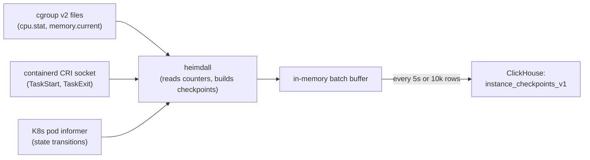
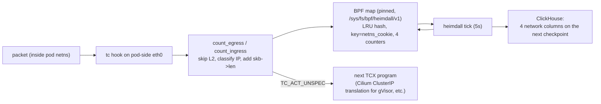
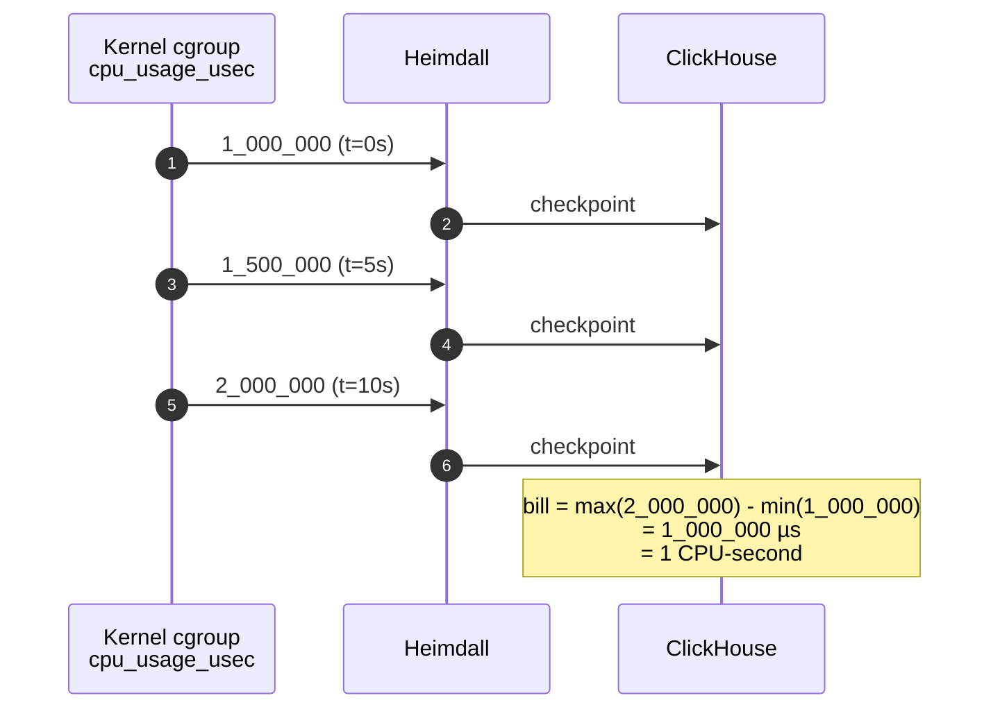

## What this is

Heimdall is the agent that reads kernel counters off every node hosting customer pods and writes them to ClickHouse. It runs as a DaemonSet on the `untrusted` nodepool and writes one row per container per tick (plus extras when containers start or stop). Anything that bills from this data (future work) computes at query time; heimdall itself only emits raw counter snapshots.

Two things to keep in mind for the rest of this doc:

> **Collection must never inflate a reading. Undercount is acceptable.**

Every design choice flows from that rule — if a reading is lost or skipped, the downstream aggregate is smaller than the truth, never larger.

> **Heimdall stores snapshots of monotone counters, not rates or events.**

This is the part most people get wrong. The rest of the doc explains why.

## Why snapshots and not rates

The short version: snapshots of cumulative kernel counters are idempotent under duplicate writes; rate or delta rows aren't. For the full walkthrough of the pipeline (counter vs gauge, the five stages from kernel to chart, why duplicates are invariant) see [metrics-architecture](./metrics-architecture). For the citation-heavy defence against "just write deltas" proposals specifically, see [why-counters-not-deltas](./why-counters-not-deltas).

The rest of this doc covers what's specific to heimdall as an agent: how a tick works, the network metering, the ClickHouse layout, and the local-dev TopoLVM setup.

## How a tick works



Three signals feed heimdall and they feed it in parallel.

The **5 second tick** is the workhorse. Every 5 seconds heimdall walks the list of billable pods on the node and reads three files per pod under `/sys/fs/cgroup`:

| File | What it gives us |
|------|------------------|
| `cpu.stat:usage_usec` | Cumulative CPU microseconds (the monotone counter) |
| `memory.current` | Total memory bytes |
| `memory.stat:inactive_file` | Reclaimable page cache (subtracted from `memory.current` so we bill the working set, not file cache the kernel can drop) |

Working-set memory matches what kubelet's OOM killer uses and what `container_memory_working_set_bytes` reports. If we billed `memory.current` raw we would be charging for cached files that the customer cannot shed, which violates the invariant.

The **CRI event stream** gives us millisecond precision on container start and stop. Heimdall opens a gRPC subscription on `/run/containerd/containerd.sock` and reads from `/tasks/start` and `/tasks/exit`. When an event arrives heimdall reads the cgroup immediately and emits a checkpoint with `event_kind=start` or `event_kind=stop`. Without this we would lose up to one tick of CPU at the start and end of every container.

The **pod informer** is a backup. Containerd is known to drop CRI events under load ([containerd#3177](https://github.com/containerd/containerd/issues/3177)). The informer watches the K8s API for pod status transitions and fires the same checkpoint path. If both fire we get two checkpoints, which is fine, the math is invariant to extras.

The **5 second cadence** was chosen so that every 15 second dashboard bucket gets at least 2 samples (so `max - min` produces a real CPU delta) without burning excess syscalls. At 50 pods per node times 3 syscalls per tick, that's 30 syscalls per second on a busy node. Negligible.

## Network: tc-eBPF on the pod-side eth0

### Networking background (skip if you know this)

A few terms show up repeatedly below. Quick definitions so the rest reads cleanly.

- **Network namespace (netns).** A Linux kernel feature that gives a process its own isolated view of networking: its own interfaces, its own routing table, its own firewall rules. Every Kubernetes pod runs in its own netns, so from the pod's perspective it has its own `eth0`, its own IP, its own everything. The host sits in its own separate netns.
- **veth pair.** Literally a virtual ethernet cable with two ends. You plug one end into the pod's netns (shows up as `eth0` inside the pod), and the other end into the host's netns (typically `lxc<hash>` under Cilium). Packets written to one end normally come out the other.
- **CNI (Container Network Interface).** The plugin model Kubernetes uses for networking. Our CNI is Cilium in BPF host-routing mode. When a pod starts, Cilium creates the veth pair, puts one end in the pod, and keeps the other end on the host.
- **`bpf_redirect_peer`.** A Cilium fastpath helper. In BPF host-routing mode, packets arriving on the node's physical NIC are punted directly into the target pod's netns via this helper, **bypassing the host-side veth entirely**. The host end never sees those skbs, which is why the first version of heimdall (attached to `lxc<hash>`) read ~zero while pods were doing MB/s.
- **`ifindex`.** Every network interface has a small integer ID unique within its namespace. Pod-side eth0 happens to be ifindex 3 in every CNI netns, which means we cannot use ifindex as our BPF map key (every pod would collide on the same slot).
- **Netns cookie.** A 64-bit kernel-maintained identifier that is unique per netns and stable over that netns's lifetime. Readable from BPF via `bpf_get_netns_cookie(skb)` and from userspace via `getsockopt(SOL_SOCKET, SO_NETNS_COOKIE)` on a socket created inside the netns. We use this as the map key so one pinned map serves every pod on the node with no collisions.
- **`tc` (traffic control).** A kernel subsystem with hook points where you can attach programs that run on every packet passing through a specific network interface. Two directions: `tc-ingress` (packets arriving at the interface) and `tc-egress` (packets leaving). You can attach an eBPF program to either, and the kernel runs it for every packet.
- **TCX.** The newer (Linux 6.6+) attachment mechanism for tc eBPF programs. Supports multiple programs on the same hook in a chain, with clean ordering. We use it so we can coexist with whatever Cilium eventually installs on the pod-side device without terminating its chain.
- **`cgroup_skb`.** An older kernel hook type that runs a BPF program when a packet is sent or received by a process inside a specific cgroup. Works fine for normal containers, but is useless for gVisor pods (customer syscalls never reach the host kernel, so the hook sees nothing).

That's enough to follow the rest of this section.

### Why the obvious approaches don't work

CPU, memory, and disk all come from sysfs files. Network is different because there is no per-pod byte counter exposed by the kernel via files, and on this cluster every obvious alternative is blocked:

- **`cgroup_skb` at the pod cgroup** (the first thing we built) is useless under gVisor. `runsc` is a userspace kernel. Customer syscalls are trapped inside it and never reach the host's socket layer, so the cgroup hook sees only whatever runsc does on its own sockets, not per-packet customer traffic. Verified in local dev: every BPF map entry showed zero for every public counter even with pods doing real downloads. This is why we never shipped it.
- **Reading Cilium's per-endpoint counters** looks attractive since Cilium already tags traffic by pod. But Cilium has declined per-endpoint byte counters four separate times ([cilium#13173](https://github.com/cilium/cilium/issues/13173), [cilium#29586](https://github.com/cilium/cilium/issues/29586), [cilium#32193](https://github.com/cilium/cilium/issues/32193), [cilium#21252](https://github.com/cilium/cilium/issues/21252)); `cilium_forward_bytes_total` is node-aggregated only. Not a supported per-pod surface.
- **tc-eBPF on the host-side veth** (the second thing we built, and what we shipped first to prod) is silently broken on EKS with Cilium in BPF host-routing mode. Cilium's `bpf_redirect_peer` (see [bpf/lib/local_delivery.h](https://github.com/cilium/cilium/blob/main/bpf/lib/local_delivery.h) and [bpf_lxc.c](https://github.com/cilium/cilium/blob/main/bpf/bpf_lxc.c)) punts packets from `cil_from_netdev` on the host NIC straight into the target pod's netns, so the per-pod host-side veth (`lxc<hash>` / `eni<hash>`) sees ~zero data packets. Production incident: host-side veth RX/TX counters sat at a few hundred bytes while the pod was actively moving MBs. Sentinel nodes worked because sentinels run kube-proxy without host-routing; untrusted workload nodes did not. Unusable at scale.

What does work is to attach at the packet layer on the **pod-side eth0** inside each pod's netns. Pod-side eth0 is the one interface every packet must cross, independent of CNI routing choices and of whether the workload is runc or gVisor (runsc writes to eth0 via AF_PACKET). tc-eBPF (TCX) there sees the real L3 packet with the real remote IP.

### The eBPF program

Two `SEC("tc")` programs, one per direction, share one pinned `BPF_MAP_TYPE_LRU_HASH` keyed by the pod's **netns cookie** (u64). Value is four u64 counters. The map is declared with `LIBBPF_PIN_BY_NAME` and pinned at `/sys/fs/bpf/heimdall/v1/pod_counters` so per-pod byte totals survive heimdall restarts: without pinning, a restart would hand out a fresh zero-filled map and dashboards would silently undercount whatever traffic crossed the gap. The pin path is versioned (`/v1`) because libbpf refuses to reuse a pinned map whose spec has drifted — bump to `/v2` the day `max_entries`, the `counters` struct, or the key type changes.

- `count_egress` attaches to **tc-egress of pod-side eth0**. Packets leaving this hook originate from the pod (the pod's egress direction). Classify by `iph->daddr`.
- `count_ingress` attaches to **tc-ingress of pod-side eth0**. Packets arriving here are about to be delivered to the pod (the pod's ingress direction). Classify by `iph->saddr`.

Note this is the mirror image of the old host-side-veth layout: on the pod side, pod-egress = tc-egress (not tc-ingress of some host interface).

Map keying uses `bpf_get_netns_cookie(skb)`, not `skb->ifindex`. Pod-side eth0 is ifindex 3 in every CNI netns, so an ifindex key would collide across pods. The netns cookie is scoped to the skb's netns (falling through from `skb->sk` when sk is non-null, else the skb's own netns), which inside a pod-side eth0 hook is exactly the pod's netns. Userspace reads the same cookie via `SO_NETNS_COOKIE` after `setns`'ing into the pod netns, so the keys align on both sides.

The program skips the 14-byte Ethernet header (tc on veth sees L2-framed skbs), branches on `skb->protocol`, reads the remote IP (`iph->daddr` on pod-egress, `iph->saddr` on pod-ingress), and classifies it via one of two helpers:

- **IPv4** — `is_v4_private` matches RFC1918 (`10/8`, `172.16/12`, `192.168/16`), CGNAT (`100.64/10`), link-local (`169.254/16`), and loopback (`127/8`).
- **IPv6** — `is_v6_private` matches ULA (`fc00::/7`, which is Cilium's default for dual-stack pod IPs), link-local (`fe80::/10`), multicast (`ff00::/8`), and loopback (`::1`).

Anything outside those ranges is billed as public. `__sync_fetch_and_add`s `skb->len` into the matching counter slot.

**Caveat on v6:** if a future deployment uses globally-routable IPv6 (non-ULA) for pod-to-pod traffic, intra-cluster traffic would bill as public egress. That's a pod-CIDR-awareness problem, not a bug in the classifier — the fix would be to read the CNI's pod CIDR at attach time and compare against that instead of the well-known private ranges.

The same idempotent counter math used for CPU works here: `max(network_egress_public_bytes) - min(...)` over any window is replay-safe and unaffected by extra readings. Two heimdall pods overlapping during a rolling update both see the same monotone counter value, write distinct rows, and the aggregated reading stays correct.

### The TCX return-code trap

Both programs return **`TC_ACT_UNSPEC`**, not `TC_ACT_OK`. This distinction is the single most important thing to understand in this file.

In a TCX multi-program chain these two look equivalent at first glance ("don't drop the packet"), but they're actually opposite:

- `TC_ACT_UNSPEC` (-1) is `TCX_NEXT`. Non-terminating; hand off to the next program in the chain.
- `TC_ACT_OK` (0) is `TCX_PASS`. Accept the packet AND terminate the chain.

Our program must be non-terminating because Cilium (or anything else) may install TCX programs on the same pod-side eth0 hook that need to run after us. In particular, `bpf_redirect_peer`'s delivery path can chain additional programs on the pod side, and any ClusterIP → pod-IP translation for gVisor pods happens in those hooks (gVisor bypasses the kernel's BPF cgroup socket hooks because its userspace connect/bind calls never cross the host socket layer, so tc-BPF is the only place service IPs like coredns's `10.96.0.10` get rewritten to an actual pod IP). Returning `TC_ACT_OK` from a head-anchored program terminates the chain before Cilium's translator runs, and DNS silently breaks for every gVisor pod on the node.

Retina's `packetparser` plugin uses the exact same `TC_ACT_UNSPEC`-observer-at-head pattern for the same reason ([retina packetparser.c](https://github.com/microsoft/retina/blob/main/pkg/plugin/packetparser/_cprog/packetparser.c)). If you are editing `bpf/network.bpf.c`, do not change this return code.

We attach with `Anchor: link.Head()` so we run upstream of any program that might later return `TC_ACT_REDIRECT` and terminate the chain; a tail-anchored observer would never see those packets.

### Safety invariants

The metering datapath sits on every customer packet, so it is designed to be incapable of breaking the pod it's measuring. The properties that make this true:

1. **Read-only.** The BPF program reads `skb->len` and the IP header. It never calls a helper that mutates the skb (no `bpf_skb_store_bytes`, no checksum helpers, no redirect helpers). The packet is byte-identical before and after our program runs.
2. **Unconditionally non-terminating.** Every code path (truncated packet, non-IP protocol, classifier failure, map-full) exits through a single `return TC_ACT_UNSPEC` at the bottom of each program. There is no path that returns `TC_ACT_SHOT` or `TC_ACT_OK`. The verifier will not accept a program that drops the invariant, so this is enforced at load time.
3. **Stateless packet processing.** No conntrack, no flow tables, no packet buffering. An atomic increment failing (wouldn't happen; `__sync_fetch_and_add` on a per-cgroup map entry can't fail) would only undercount, never drop.
4. **Userspace failures never touch the datapath.** A `link.AttachTCX` error, a containerd gRPC timeout, a netns lookup failure: all surface as `Attach` returning an error to heimdall. The pod simply ends up not attached. Uncounted, but running normally.
5. **Detach is never forced.** When the pod netns goes away (pod teardown), pod-side eth0 is destroyed with it and the kernel auto-detaches the TCX links. Heimdall's `Detach` path is best-effort cleanup.

Concretely: a bug in this package can cause undercount of network bytes, or crash heimdall itself (which is isolated on the node). It cannot drop, corrupt, or reorder customer packets, and it cannot break customer pod networking.

### What counts, what doesn't

The counter increments by `skb->len` per packet that classifies as IPv4 or IPv6. A few specifics worth knowing:

- **TCP retransmits count each transmission.** `skb->len` increments for every re-sent packet, so a flow that retransmits 3× shows 3× the bytes. This is "wire bytes," which is the industry-standard thing to bill for (AWS, Cloudflare, GCP all do the same). Customers don't get a refund for their own packet loss.
- **GSO/TSO packets count pre-segmentation bytes.** On egress, a large skb (up to 64 KiB) represents a single transport-layer write before the NIC splits it into MTU-sized wire packets. `skb->len` is the pre-split size, so we miss the few per-segment L2+IP+TCP header bytes that get replicated on the real wire. Effectively a ~1–2 % undercount on TCP-heavy workloads. Safe direction per the never-inflate invariant.
- **IP fragments count each fragment.** Each fragment is its own skb with its own length, and they share the same saddr/daddr, so the classifier bills each fragment to the right pair of counters. Total bytes are correct.
- **ARP, LLDP, and other non-IP L2 traffic is not counted.** `skb->protocol` matches only `ETH_P_IP` and `ETH_P_IPV6`; everything else returns early. Control-plane L2 chatter doesn't count against a customer's egress number.
- **VLAN-tagged traffic is silently skipped.** `skb->protocol` is `ETH_P_8021Q` (0x8100) for tagged frames and neither IPv4 nor IPv6 matches. Pod-side eth0 under Cilium's native pod networking doesn't see VLAN tags (tags, if any, are stripped before the packet reaches the pod netns) so this doesn't fire today — but if the network config ever changes (e.g. a multi-tenant overlay with VLAN separation), we'd undercount. Worth catching via sample-density alerts if it ever happens.

### Resolving the pod netns

We need to enter the pod's netns to attach on pod-side eth0 and to read its cookie. Finding the netns under gVisor is non-obvious because:

- PIDs in the pod's cgroup live in gVisor's **sandbox** netns, not the CNI netns where eth0 lives. The usual trick of `/proc/<pid>/ns/net` lands you in runsc's internal netstack, not the Cilium netns.
- The CNI netns has no IP assigned to `eth0` under gVisor (the IP lives in runsc's userspace stack), so you can't match by pod IP either.

The only reliable reference is the containerd sandbox container's OCI spec. On every attach, heimdall queries containerd for the container whose labels are `io.kubernetes.pod.uid=<uid>` and `io.cri-containerd.kind=sandbox`, loads its OCI spec, and reads `linux.namespaces[type=network].path`. That's the `/var/run/netns/cni-<uuid>` path the CNI plugin created.

From there, on a single `runtime.LockOSThread`'d worker goroutine: open both the host netns and the pod netns, `setns(CLONE_NEWNET)` into the pod netns, enumerate interfaces via `netlink.LinkList` and pick the first veth with `ParentIndex > 0` (CNI convention names it `eth0`; the "first veth with a peer" is unambiguous because CNI only puts one veth pair in each pod netns), read the netns cookie via `getsockopt(SOL_SOCKET, SO_NETNS_COOKIE)` on a throwaway socket created in-netns, attach both TCX programs to that ifindex, `setns` back to the host netns. If the `setns`-back fails the thread is deliberately leaked (never returned to the Go runtime, so it can't be handed to another goroutine that expects to be in the host netns).

```mermaid
flowchart LR
    kubelet["K8s informer<br/>pod uid"] --> heimdall
    heimdall["heimdall Attach(uid)"] -->|containerd gRPC| cd["sandbox container<br/>OCI spec"]
    cd -->|"linux.namespaces[network].path"| path["/var/run/netns/cni-&lt;uuid&gt;"]
    path -->|"setns + netlink + SO_NETNS_COOKIE"| eth0["pod-side eth0 ifindex<br/>+ netns cookie"]
    eth0 -->|"link.AttachTCX Head (in-netns)"| attach["tc-egress + tc-ingress<br/>on pod-side eth0"]
```



### Data path



Host-network pods (heimdall itself, kube-proxy, sentinels) share the host net namespace and have no pod-side eth0, so heimdall skips them via `pod.Spec.HostNetwork`. Completed/Failed pods are also skipped because their sandbox containers have been GC'd from containerd.

### Deployment requirements

The DaemonSet needs, in addition to the cgroup and kubelet mounts CPU/memory uses:

- `hostNetwork: true` and `hostPID: true`, since we enter pod netns's from the host.
- Capabilities `CAP_BPF`, `CAP_NET_ADMIN`, `CAP_SYS_ADMIN`. `SYS_ADMIN` relaxes the verifier's pointer-arithmetic restrictions that CAP_BPF alone keeps on (CAP_BPF runs in "unprivileged BPF" mode, which rejects some LRU map update patterns) and is what lets `setns(CLONE_NEWNET)` into other netns's.
- Host mounts: `/run/containerd/containerd.sock` (rw, for sandbox lookups), `/var/run/netns` (ro, `HostToContainer`, for the CNI netns files we `setns` into), `/sys/fs/bpf` (rw, `HostToContainer`, for the pinned counter map), `/sys/kernel/btf` (ro, CO-RE relocations).
- Kernel ≥ 5.12, required for `SO_NETNS_COOKIE` (userspace side); the BPF helper `bpf_get_netns_cookie` has been available since 5.7. A zero cookie from the socket getsockopt is treated as fatal for that attach — pre-5.12 kernels would return the init netns cookie for every pod and collapse every pod into one map slot.

The Go code lives under `svc/heimdall/internal/network/`:

- `network_linux.go`. The `Reader` interface implementation (lifecycle + async attach worker pool). Keys its per-pod map by `types.UID → netns cookie (u64)`.
- `sandbox_linux.go`. Resolves the containerd sandbox to its CNI netns path.
- `veth_linux.go`. One locked-thread block that does everything netns-scoped: `setns` into the pod netns, find pod-side eth0, read the netns cookie, attach both TCX programs, `setns` back.
- `bpf/network.bpf.c`. The eBPF program, compiled by `bpf2go` into Go bindings and an embedded `.o`. Run `make generate-bpf` after editing.

## What a checkpoint actually contains

```text
identity         workspace_id, project_id, environment_id,
                 resource_type, resource_id,
                 container_uid     (= pod_uid + restart_count, stable per
                                      container lifetime; changes on restart),
                 instance_id       (= pod name, used for filtering charts
                                      to one replica)

when             ts                (unix milliseconds, sourced from
                                      pkg/clock.MonotonicClock so the value
                                      cannot regress on NTP backward jumps)
                 event_kind        (start | stop | checkpoint)

what             cpu_usage_usec               (Int64, raw kernel counter)
                 memory_bytes                 (Int64, working set)
                 cpu_allocated_millicores     (Int32, from pod.Spec.Limits)
                 memory_allocated_bytes       (Int64, from pod.Spec.Limits)
                 disk_allocated_bytes         (Int64, from PVC request)
                 disk_used_bytes              (Int64, statfs on the volume mount)
                 network_{eg,in}gress_{pub,priv}  (Int64, populated by the
                                      tc-eBPF collector on pod-side eth0;
                                      see Network section above)
```

Note that all resource columns are `Int64`, not `UInt64`. A forgotten clamp on a UInt64 column would underflow to ~1.8 × 10^19 — an 18-digit garbage number that any downstream consumer (dashboard, billing, admin query) would silently propagate. Int64 underflow shows up as a visible negative value, which fails loud.

## The math, with a worked example



A container ran for exactly one hour at exactly one vCPU. We do not know how often heimdall sampled it. The aggregated reading is the same in all three cases.

| Sampling cadence | Checkpoints written | `max - min` | Result |
|------------------|---------------------|-------------|--------|
| Every 1 second | 3,600 | 3.6 × 10^9 µs | 1 vCPU-hour |
| Every 10 minutes | 6 | 3.6 × 10^9 µs | 1 vCPU-hour |
| Once at start, once at end | 2 | 3.6 × 10^9 µs | 1 vCPU-hour |

What does change with sample density:

* **Memory integration accuracy.** Memory is a gauge, not a counter, so consumers have to integrate over samples. More samples means the mean is closer to the true integral. Fewer samples means the same shape, blurrier.
* **Worst case undercount on container exit.** If the container dies between the last periodic tick and CRI catching the exit event, we miss whatever CPU it used in that gap. Bounded by the tick interval (currently 5 seconds).

## Replay safety, rolling updates, restarts

```
1. Replay (same checkpoint written twice)
   → max and min over the window do not change
   → aggregate unchanged

2. Rolling update (two heimdall pods write concurrently)
   → more rows in the window, but max and min are unchanged
   → aggregate unchanged

3. Container restart (kernel counter resets to 0)
   → container_uid changes (pod_uid + restart_count)
   → new container_uid starts its own window
   → we never diff across the reset
```

`container_uid = pod_uid + restart_count` is the key. It is the unique metering entity for a single container incarnation. When kubelet restarts a container, restart_count increments and the new container is a fresh counter series from t=0.

The raw table uses `ReplacingMergeTree` for eventually-consistent dedup. Because dedup happens at merge time (not insert time), every read goes through `instance_checkpoints` (the `FINAL` view) so unmerged duplicates do not leak into queries.

## ClickHouse layout

```
instance_checkpoints_v1                ← raw, ReplacingMergeTree, 95 day TTL
    │   (daily partitions, bloom filters, Delta/DoubleDelta codecs)
    │
    ├─→ instance_resources_per_15s_v1     ← dashboard MV, 7 day TTL
    ├─→ instance_resources_per_minute_v1  ← dashboard MV, 30 day TTL
    └─→ instance_resources_per_hour_v1    ← dashboard MV, 90 day TTL
```

Every materialized view reads the **raw table directly**. They do not chain off each other. This keeps each MV's correctness independent and avoids cascading merge latency, at the cost of around 3x write amplification on raw inserts.

The dashboard MVs are explicitly marked "DASHBOARD ONLY" because their `*_sum` columns can double-count under ReplacingMergeTree dedup races (MVs fire on inserts, not on merges). Any future consumer that needs idempotent aggregates (billing, audit exports) reads the raw table through `FINAL` or a purpose-built aggregate — not these MVs.

## Dashboard queries

Dashboards stitch two sources together. The cold tail comes from the appropriate MV. The live tip (the bucket that is currently being filled, where the MV has not aggregated yet) comes from the raw `instance_checkpoints` view. The two are unioned and ordered by time:

```
SELECT time, value FROM (
    -- cold tail: closed buckets from the MV
    SELECT time, agg(...) AS value
    FROM instance_resources_per_15s_v1
    WHERE ... AND time < toStartOfInterval(now(), INTERVAL 15 SECOND)
    GROUP BY time

    UNION ALL

    -- live tip: current bucket, computed on demand from raw
    SELECT toStartOfInterval(now(), INTERVAL 15 SECOND) AS time,
           agg(...) AS value
    FROM instance_checkpoints
    WHERE ... AND ts >= toUnixTimestamp(toStartOfInterval(now(), INTERVAL 15 SECOND)) * 1000
    HAVING value > 0
)
ORDER BY time
```

The live tip is filtered with `HAVING value > 0` so the chart does not render a phantom zero bar at the right edge before any checkpoint has landed in the current bucket.

The four metric queries (CPU, memory, disk, instance count) all share this exact structure. They differ only in the aggregate function, so they're built from a single hybrid query template parameterized by the metric. See `web/internal/clickhouse/src/resources.ts`.

## Failure modes we accept by design

| Failure | What happens | Why it does not inflate the reading |
|---------|--------------|----------------------------|
| Heimdall pod crashes | In-flight buffer is lost (a few seconds of data). Next checkpoint after restart sets a fresh `min` for that window. | Kernel counter does not reset. The lost interval is undercounted, never overcounted. |
| Node dies | Same. | Same. |
| ClickHouse outage | Buffer backpressures, collector slows down. Nothing is lost from what was already captured. | Resumes when ClickHouse is back. If the buffer fills entirely, the collector stalls (visible failure mode, not silent data loss). |
| CRI TaskExit event dropped | Last periodic tick is treated as the final reading. | Bounded undercount of one collection interval (currently 5 seconds). |
| Two heimdall pods overlap during rollout | Both write checkpoints for the same containers briefly. | `max - min` is invariant to extra rows. |
| Wall clock jumps backward (NTP correction) | `ts` comes from `pkg/clock.MonotonicClock`, anchored once at process start. | Monotone, can never regress. |
| Container has only one checkpoint | `max == min`, so `max - min = 0`. | Mitigated by CRI giving us a `start` event for any container that lives longer than CRI delivery latency. |
| Heimdall not running on a node | Everything on that node goes unmeasured. | Code cannot detect absence; mitigation is alerting at ingestion (no checkpoints from a known node for N minutes). |

There is no on-disk WAL. An early design sketch included one (with S3 overflow), but we never built it. The monotonic counter already provides most of the durability guarantee: a fresh process picks up from the kernel's own value and only loses the gap between crash and restart. A WAL would have meant a dedicated EBS volume per node, S3 cleanup logic, and re-ingest SQL for marginal benefit over what the kernel counter already gives us. We can add it later if operational data shows we need it.

## Local dev: how it mirrors prod

In production a customer pod gets an ephemeral PVC backed by a real CSI driver (currently `ebs-csi-gp3`). Each PVC is its own EBS volume with its own filesystem and a real size limit enforced by the kernel. `statfs` inside the container returns volume-specific bytes used / free / total, and writes past the limit return `ENOSPC`.

The minikube default StorageClass uses an in-tree hostpath provisioner that bind-mounts a shared host directory into the pod. `statfs` inside the container then returns host-wide stats and there is no size enforcement. Heimdall would either see nothing (the kubelet volumes path is empty for in-tree hostpath) or report 200+ GiB of "used" bytes spanning every other pod on the node. Neither is useful.

To mirror prod we run TopoLVM in dev. A bootstrap script inside the minikube node creates a sparse loopback file (default 20 GiB), wraps it in an LVM volume group (`topolvm-vg`), and TopoLVM carves a real LV per PVC out of that VG. Each LV is its own ext4 filesystem on its own block device, so:

* `statfs` inside the container reports the right numbers
* Writes past the allocated size hit `ENOSPC`
* Heimdall's statfs path works the same as in prod (no special dev branch needed)

The setup lives in `dev/k8s/topolvm/`:

```
dev/k8s/topolvm/setup-vg.sh        idempotent loopback + VG creation
                                    (also reattaches after `minikube stop/start`)
dev/k8s/topolvm/values.yaml        TopoLVM helm values (cert-manager and
                                    webhooks both off; single-node only needs
                                    the controller and the node DaemonSet)
dev/k8s/topolvm/storageclass.yaml  StorageClass `topolvm-ssd` that krane points at
```

The Tiltfile wires it: `topolvm-disable-old-csi → topolvm-vg → topolvm-controller / topolvm-node / topolvm-lvmd-0 → topolvm-storageclass → krane`.

## Operational notes

| Setting | Value |
|---------|-------|
| Collection interval | default 5s (configurable via `collection_interval`) |
| Cgroup mount | `/sys/fs/cgroup` (read-only) |
| Containerd socket | `/run/containerd/containerd.sock` |
| Kubelet socket mount | `/var/lib/kubelet` (HostToContainer propagation, needed for statfs) |
| CPU request / limit | 20m / 50m |
| Memory request / limit | 32Mi / 64Mi |

Manifest at `dev/k8s/manifests/heimdall.yaml`. Production deployment details (Helm chart, ArgoCD wiring, CH user setup, AWS Secrets Manager, alerts, dashboards) live in the `unkeyed/infra` repo — see `docs/metering/heimdall.md` there.

## Code map

| File | What it does |
|------|--------------|
| `svc/heimdall/internal/collector/collect.go` | Periodic tick, walks billable pods, calls cgroup + statfs |
| `svc/heimdall/internal/collector/cri_linux.go` | CRI event stream (start/stop) |
| `svc/heimdall/internal/collector/cgroup_linux.go` | Reads `cpu.stat`, `memory.current`, etc. |
| `svc/heimdall/internal/collector/volumefs_linux.go` | `statfs` on PVC mount points for `disk_used_bytes` |
| `pkg/clock/monotonic_clock.go` | Monotone-anchored timestamp source |
| `pkg/clickhouse/schema/025_instance_checkpoints_v1.sql` | Raw table |
| `pkg/clickhouse/schema/027_instance_resources_per_minute_v1.sql` | Per-minute dashboard MV (similar files for 15s, hour) |
| `web/internal/clickhouse/src/resources.ts` | Dashboard hybrid queries (single template, four metrics) |

