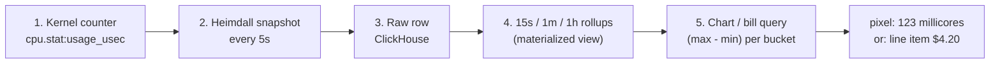
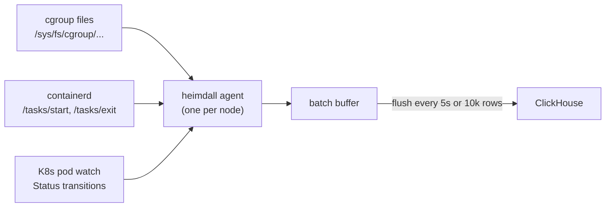

<Note>
  If something here is unclear, fix it here. Other docs in this section link to this one instead of re-explaining. That way we don't write the same thing five times.
</Note>

## The short version

The pipeline has five steps. Each step does one thing:

1. The Linux kernel already counts CPU, memory, disk, and network bytes for every container. We don't invent these numbers, we read them.
2. A small agent called **heimdall** runs on every node and reads those numbers every 5 seconds. Each reading becomes one row in a ClickHouse table.
3. ClickHouse groups those rows into 15-second buckets, keeping the `min` and `max` of each counter per bucket.
4. To draw a chart, we ask "give me `(max - min)` per 15-second bucket". That's the usage per bucket.
5. The same math works for any window — a 15-second chart bucket, a 1-hour dashboard, or eventually a monthly billing period. One shape of query, scaled by the window.

That's the whole thing. The rest of this doc explains why each step looks the way it does.

## What the kernel gives us (counter vs gauge)

The first thing to get right: there are two kinds of numbers we collect, and they work differently.

### Counters

Think of a counter like a car's odometer. It only ever goes up. If you want to know how far you drove last week, you look at the reading today and subtract the reading from last week. The odometer doesn't "emit distance" or "reset" between trips. You just read it twice and subtract.

CPU and network bytes are counters. A row saved at `t=100s` that says `cpu_usage_usec = 50_000_000` means: "this container has used 50 CPU-seconds total since it started". A row at `t=200s` might say 80 seconds. We subtract, and know this container used 30 seconds of CPU between those two readings.

The counters we collect:

- `cpu_usage_usec`. Microseconds of CPU consumed since the container started.
- `network_egress_public_bytes`, `network_egress_private_bytes`, and two ingress variants. Bytes sent or received through the pod's network interface since the BPF program started counting.

### Gauges

A gauge is like a speedometer. It tells you what's happening right now. The value goes up and down. Each sample is a current reading, not a running total.

Memory and disk usage are gauges:

- `memory_bytes`. How much memory the container is using right now.
- `disk_used_bytes`. How many bytes are on disk right now.

### Why the distinction matters

The two shapes are queried differently to get "how much was used in a window":

| Shape | Usage during a window | How we compute it |
|---|---|---|
| Counter (CPU, network) | the delta between the end-of-window and start-of-window reading | `max(counter) - min(counter)` |
| Gauge (memory, disk) | the time-weighted average over the window | `sum(value) / sample_count` |

That's the entire math of the system. Charts, bills, dashboards: all of them are one of those two queries over a window.

## The pipeline in detail



### Step 1. Kernel counter

A file at `/sys/fs/cgroup/.../cpu.stat` contains `usage_usec`, the total microseconds of CPU this container has used since it was created. The kernel writes it for its own bookkeeping. We just `cat` it (basically).

For network, we can't read a file because the kernel doesn't expose per-pod byte counts to userspace. Instead we run a tiny program inside the kernel that counts bytes as packets flow past. It writes into an in-memory table we can read. See [ebpf-primer](./ebpf-primer) if you want to understand how that works.

Either way, the kernel is doing the counting. We are only sampling.

### Step 2. Heimdall snapshot

Heimdall is a DaemonSet. One heimdall pod runs on every node. Every 5 seconds it:

1. Lists the customer pods on its node.
2. For each pod, reads the kernel files (or BPF counters) and records the current values.
3. Buffers one row per container into a batch.

Each row has the shape:

```text
container_uid:      pod_uid + restart_count    (stable per-container-incarnation ID)
instance_id:        pod name                    (for filtering charts to one replica)
ts:                 timestamp in ms             (when heimdall took the sample)
cpu_usage_usec:     12_000_000                  (the counter value at that moment)
memory_bytes:       524_288                     (the gauge value at that moment)
cpu_allocated:      1000                        (what the pod spec asked for)
event_kind:         "checkpoint"                (or "start" / "stop" for lifecycle events)
... plus 4 network counter values, 2 disk values, workspace/project/env labels
```

The row captures *"the state of this container at this moment"*. It is not the usage during any interval; it's a point-in-time reading.

### Step 3. Raw row in ClickHouse

Every few seconds, heimdall flushes the batch to ClickHouse as a bulk insert. The rows land in a table called `instance_checkpoints_v1`.

The table keeps rows for a few days. We don't need them forever because step 4 rolls them up into longer-retention tables.

### Step 4. Rollups

A "materialized view" in ClickHouse is a query that runs automatically every time new rows are inserted and writes its output into another table. Think of it as a background job that pre-computes aggregations so the chart doesn't have to.

We have three of them:

- `instance_resources_per_15s_v1` groups raw rows into 15-second buckets.
- `instance_resources_per_minute_v1` groups them into 1-minute buckets.
- `instance_resources_per_hour_v1` groups them into 1-hour buckets.

For each bucket, each container, each resource, the view stores:

```text
cpu_usage_usec_min         smallest raw value that landed in this bucket
cpu_usage_usec_max         largest raw value that landed in this bucket
memory_bytes_min           smallest gauge reading in this bucket
memory_bytes_max           largest gauge reading in this bucket
memory_bytes_sum           sum of gauge readings (for the time-weighted average)
sample_count               how many raw rows landed in this bucket
network_*_bytes_min/max    same as CPU (network bytes are counters too)
```

Shorter windows (15 minutes, 1 hour) read the 15s view. Longer windows (6+ hours, days) read the minute or hour view. That keeps charts snappy even for week-long windows.

### Step 5. The query shape

To turn a bucket into a chart value:

```sql
cpu_millicores   = (cpu_usage_usec_max - cpu_usage_usec_min) / bucket_seconds / 1000
bytes_per_second = (network_bytes_max - network_bytes_min) / bucket_seconds
memory_bytes     = memory_bytes_sum / sample_count
```

For counters: delta between max and min, divided by how long the bucket is, gives the average rate.

For gauges: sum divided by how many samples, gives the average value.

The same `max - min` math works over any window — a 15-second chart bucket, a 1-hour admin query, or a monthly roll-up — by changing the GROUP BY interval. One query shape, many time scales:

```sql
SELECT container_uid, max(cpu_usage_usec) - min(cpu_usage_usec) AS used_usec
FROM instance_checkpoints_v1
WHERE ts BETWEEN :start AND :end
GROUP BY container_uid
```

## The "latest bucket is incomplete" problem

Step 4's rollup only tells the truth once a bucket is "done". The currently-filling bucket always has a `max - min` that's artificially small, because we haven't seen the rest of the bucket yet.

Example: the 15-second bucket starting at `12:00:00` has `max - min = 30 CPU-seconds` once the full 15 seconds have been sampled. But at `12:00:03` (3 seconds in), `max - min` might only be 6 CPU-seconds because we've only seen the first few samples.

If the chart only used the rollup view, the rightmost bar would always be too short until the bucket closed (up to 15 seconds of lag). Not acceptable.

**Fix:** we query two sources and stitch them together.

- The rollup covers every closed bucket (everything before the current one).
- The raw table covers only the currently-filling bucket, running the same `max - min` math on however many raw rows have arrived.

One UNION later, the chart has accurate data all the way up to "a few seconds ago". The function that builds this query is `buildHybridQuery` in `web/internal/clickhouse/src/resources.ts`.

Queries over closed windows (anything ending in the past, including the eventual monthly roll-up) don't need the live-tip fix — they only read the rollup.

## Why not just write "CPU used in the last 15 seconds" directly

The obvious simpler design: forget raw snapshots. Have heimdall subtract consecutive readings itself, and write one row per bucket that says "container X used 234 microseconds of CPU between t=100 and t=115". Less math at query time. Simpler schema. Why not do that?

Four reasons, in order of importance:

### 1. Duplicate writes would inflate the aggregate

If any row ever gets written twice (network retry, rolling update, backfill), `sum(interval_usage)` double-counts. You can't dedupe after the fact without a perfect unique key, and we don't have one.

With the snapshot model, `max - min` ignores duplicates automatically. Writing the same row twice gives the same answer as writing it once. This is the biggest reason and the full argument lives in [why-counters-not-deltas](./why-counters-not-deltas).

### 2. Pod exits straddle bucket edges

A container that dies at `t=127.3s` used some CPU in the `120 to 135s` bucket. The interval-row model has to decide: write a partial row for that last bucket (what if another row already exists for it?), or wait for the bucket to close (but the container is gone)?

The snapshot model just writes one final `event_kind = stop` row at `t=127.3s` and moves on. `max - min` over whatever buckets overlap the container's life is automatically right.

### 3. Container restarts reset counters

When a container restarts, its CPU counter goes back to zero in the new cgroup. The snapshot model handles this by keying every row on `container_uid = pod_uid + restart_count`. Each incarnation is a separate logical series.

An interval-row model has to explicitly notice the reset and synthesize a final delta before the reset. More code, more edge cases.

### 4. Backfill becomes painful

If we later add a new aggregation (e.g. per-15-minute roll-ups for an internal report, or a monthly view for invoicing), the snapshot model is fine: write a new query, done. The interval-row model needs to re-derive every row from raw data, which we might not have anymore.

The snapshot model costs us one extra subtraction per query. It buys us idempotency, clean lifecycle handling, replayability, and future flexibility. Cheap trade.

## What heimdall actually collects

Heimdall uses three signals at once to decide when to write a row. All three feed the same code path and produce the same row shape. If two of them fire for the same event, we get two identical rows and `max - min` absorbs the duplicate.



**The 5-second tick.** The baseline. Every 5 seconds, walk the billable pods on this node, read cgroup files + BPF counters, write one row per container. Runs regardless of lifecycle events. This is 99% of all rows.

**containerd events (CRI).** Heimdall subscribes to containerd's event stream for `/tasks/start` and `/tasks/exit`. When a container starts or stops, we get notified within milliseconds. We immediately read the cgroup one more time and write a row marked `event_kind = start` or `event_kind = stop`. Purpose: ms-precise lifecycle boundaries so we don't miss CPU between the last 5-second tick and when the container died.

**K8s pod watch (informer) as backup.** containerd occasionally drops CRI events under load ([containerd#3177](https://github.com/containerd/containerd/issues/3177)). The K8s API provides an independent source for pod Running-to-Terminated transitions, so if CRI misses one, the informer catches it. Two identical rows are fine, so there's no harm in both firing.

The theme: **multiple unreliable signals feeding one idempotent aggregation.** No single signal has to be perfect because duplicate rows have zero effect on the bill, and a missing row only undercounts by one tick at most.

## Allocated vs used (why both are on every row)

Every row carries both "what was reserved" and "what was used":

| Column | Source | What it means |
|---|---|---|
| `cpu_usage_usec` | kernel `cpu.stat` | what actually happened |
| `cpu_allocated_millicores` | `pod.Spec.Containers[0].Resources.Requests.cpu` | what the customer reserved |
| `memory_bytes` | kernel `memory.current - memory.stat:inactive_file` | working set right now |
| `memory_allocated_bytes` | `pod.Spec.Containers[0].Resources.Limits.memory` | the pod's memory limit |
| `disk_used_bytes` | `statfs` on the ephemeral mount | bytes written to disk |
| `disk_allocated_bytes` | PVC request size | provisioned disk capacity |

Four reasons we store both, on every row:

1. **No spec-history join required.** "How over-provisioned was this container yesterday?" becomes one SELECT, not a join against a pod-spec table that we'd otherwise have to maintain.
2. **Allocation changes over time.** Customers scale up and down. The spec today isn't the spec during the window we're querying. Per-row allocation gives us time-series of *both* dimensions for free.
3. **Sentinels have allocation but not really "usage".** Sentinel pods bill by reservation, not by CPU cycles they burn. Without `allocated_*` per row, there'd be nothing meaningful to store for them. With it, they fit the same schema.
4. **Consumers can pick either column.** CPU/memory aggregates today tend to lean on allocated (reservation-based); network/disk lean on used (counter-based). The schema is agnostic either way.

Mental model: every row is a *snapshot of the container's state at this moment*, with both desired (allocated) and actual (used) side by side.

## Where failures land

The never-inflate rule propagates through every stage. Every failure mode is either (a) idempotent (a duplicate doesn't change the aggregate) or (b) fails open (missing data only undercounts). Nothing can inflate a reading.

| Failure | What happens | Effect on aggregate |
|---|---|---|
| Heimdall crashes mid-tick | Next tick starts fresh; no local state was lost because we don't keep any. | Undercount by at most 5 seconds |
| In-memory batch buffer lost (heimdall OOM) | A few seconds of rows weren't flushed. | Undercount by at most the buffer-flush interval |
| ClickHouse rejects a batch | Heimdall retries; `max - min` absorbs the duplicate on success. | No effect |
| CRI event dropped | Pod watch catches the lifecycle transition instead. | No effect |
| Both CRI and informer miss a lifecycle event | Last 5-second periodic tick is our best data. | Undercount by at most 5 seconds of CPU on exit |
| Rollup refresh lagged | Chart uses the raw table for the recent tip. | No effect on aggregates; chart shows a narrow bucket for a moment |
| Two heimdalls on the same node during rolling update | Both write identical snapshots. | No effect (idempotency) |
| Backfill replays a day of rows | `max - min` is unchanged by duplicates. | No effect |

Heimdall does **not** have a write-ahead log, deliberately. It doesn't need one because:
- The monotonic-counter pattern means any data we lose is silent and bounded (always an undercount).
- The batch flush interval is small, so worst-case loss is measured in seconds.

The one failure mode the design doesn't handle well: a **wrong allocation value** sampled from a stale pod-spec cache. An aggregate computed from those rows would reflect whatever was in the cache at sample time, not at the actual moment. Mitigation: the informer cache is eventually consistent with the K8s API, and any staleness is consistent across the whole platform.

## What shows up in the UI

The dashboard presents three layers to the user. Internals stay internal.

1. **Right-now numbers.** The panel header shows "123m / 1000m (12%)" for CPU, allocated vs used with a percent. Memory and disk show the same shape. Network shows peak rate and total transferred in the selected window. These come from a separate summary query, not the chart query.
2. **Trend charts.** One chart per resource. Each data point is one bucket. Y value is bytes per second (network), millicores (CPU), or bytes (memory / disk). The value represents a rate or average *over that bucket*, not an instantaneous reading.
3. **Window selector.** 15m / 1h / 3h / 6h / 12h / 1d / 1w. Changes which rollup table gets read and how wide the buckets are. Short windows = 15s buckets. Long windows = 1-minute or 1-hour buckets.

What the user never sees: raw counter values, bucket boundaries, query SQL. Only derived rates, averages, and totals.

Product decisions that come up in every UI conversation:

- **CPU as % or raw millicores?** We show millicores in the big number and a % in the tooltip. Both, because neither alone is sufficient.
- **Show both allocated and used?** Yes in the header ("123m / 1000m"). The chart plots used only.
- **Is 15-second granularity worth it?** For short windows, yes, you can see bursts. For longer windows, rollups handle it automatically.
- **How is the incomplete latest bucket shown?** Just like any other bar. The hybrid query makes it accurate-within-a-sample, so no visual distinction needed.

## FAQ

<AccordionGroup>
  <Accordion title="Why don't we just write one row per 15 seconds saying 'container X used Y CPU'?">
    Because a duplicate row would inflate any sum built on top. See the "Why not just write..." section above, or the full defence in [why-counters-not-deltas](./why-counters-not-deltas).
  </Accordion>

  <Accordion title="What's in the currently-filling bucket?">
    Whatever raw rows have landed so far. Its `max - min` is artificially small because the bucket isn't done. The chart query specifically reads the raw table for just the tip and the rollup for everything before, stitched together.
  </Accordion>

  <Accordion title="What happens when a container restarts?">
    The kernel counter resets to zero in the new cgroup. We handle this by keying every row on `container_uid = pod_uid + restart_count`, so each restart is a separate logical series. `max - min` within one `container_uid` is always valid. To get total usage across restarts, we sum across incarnations.
  </Accordion>

  <Accordion title="Why 5 seconds specifically for the tick interval?">
    Every 15-second bucket needs at least two samples or `max - min` is zero. Five seconds gives us three samples per bucket, with one spare so dropping a sample doesn't zero out the bucket. At 50 pods on a node times 3 files per tick, that's 30 file reads per second per node. Negligible.
  </Accordion>

  <Accordion title="Could `max - min` ever go negative and inflate an aggregate?">
    All counter columns are `Int64`, not `UInt64`. A negative result shows up as a visible negative number and fails a downstream sanity check loudly. Contrast with `UInt64`: underflow would wrap to roughly 1.8 × 10^19 — an 18-digit garbage number that any consumer would silently propagate. The sign bit is deliberate insurance.
  </Accordion>

  <Accordion title="Why not use Prometheus or cAdvisor or OpenTelemetry?">
    cAdvisor's per-container metrics broke for gVisor pods in 2021 and never fully recovered ([gvisor#6500](https://github.com/google/gvisor/issues/6500)). Prometheus would work for scraping but adds a scrape pipeline and a second source of truth; heimdall is already reading the same files, so it writes straight to ClickHouse. OpenTelemetry's SDK is for application instrumentation, not sampling kernel counters. Shortest path wins.
  </Accordion>
</AccordionGroup>

## Where to look in the code

- `svc/heimdall/internal/collector/`. The Go sampler: 5-second tick, CRI watcher, pod informer.
- `svc/heimdall/internal/network/`. The BPF byte counter side. See [ebpf-primer](./ebpf-primer).
- `svc/heimdall/internal/checkpoint/`. The `InstanceCheckpoint` row struct and the `ContainerUID()` helper.
- `pkg/clickhouse/schema/`. Table, materialized view, and migration files.
- `web/internal/clickhouse/src/resources.ts`. `buildHybridQuery()`, the MV-plus-raw-tip pattern.
- `web/apps/dashboard/app/.../resource-metrics.tsx`. The UI that renders the charts.

## Related docs

- [why-counters-not-deltas](./why-counters-not-deltas). The narrow defence of the `max - min` design with citations from Prometheus, OpenTelemetry, GCP, RRDtool, the Linux kernel.
- [heimdall](./heimdall). The agent's internal design: CRI watcher, informer backup, network-specific details.
- [ebpf-primer](./ebpf-primer). Background on eBPF for anyone touching the network metering code.
