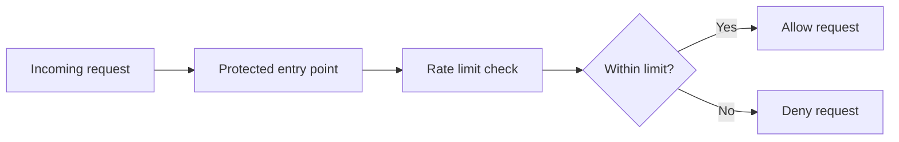
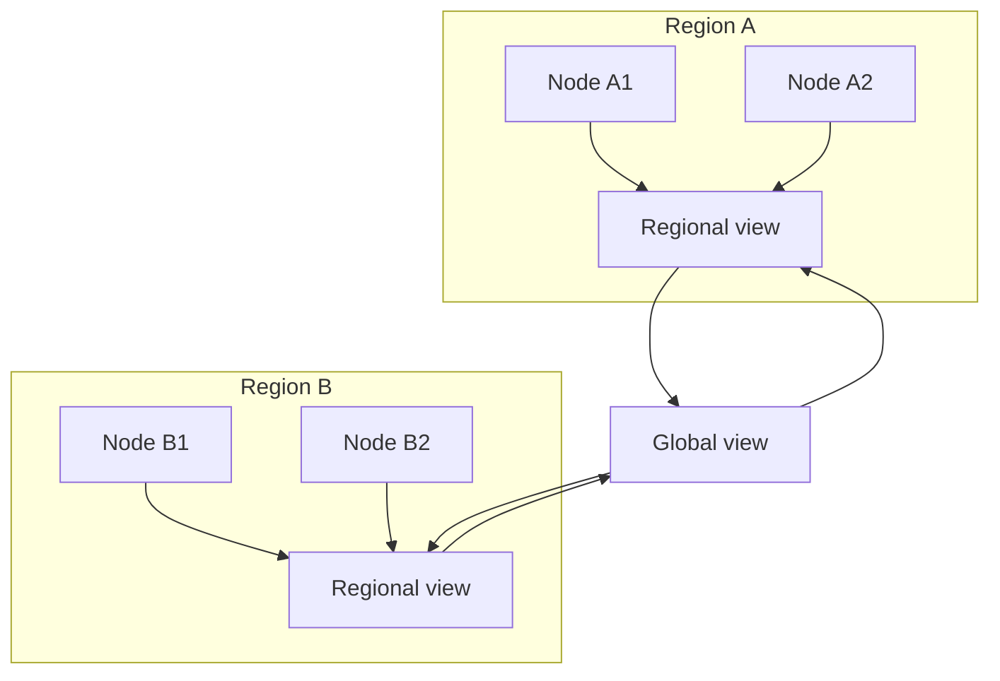

Unkey rate limiting checks requests close to your users and shares usage across regions. You get low-latency decisions, regional consistency, and global convergence without managing rate limit infrastructure yourself.

## Evaluate a request

Each rate limit check answers one question: can this identifier spend the requested cost inside this time window?



You choose the identifier. It can be a user ID, API key ID, IP address, organization ID, or any stable string that represents the actor you want to limit.

The response includes the limit state you need to decide what to do next. A successful response means your application can continue. A denied response usually maps to a `429 Too Many Requests` response, but your application can apply its own fallback behavior.

## Use a sliding window

Unkey uses a sliding window instead of a fixed window. A sliding window counts the current window plus a weighted portion of the previous window, so traffic can't burst at the exact moment a fixed window resets.

```plaintext
Previous minute                Current minute
|-----------------------------|-----------------------------|
                              ^ now, halfway through current minute

Effective count = current minute + 50% of previous minute + request cost
```

For example, with a limit of `100` per minute, a request halfway through the current minute counts all requests in the current minute plus half of the previous minute. This smooths traffic and prevents a user from sending 100 requests at `00:59` and another 100 at `01:00`.

## Share counts across regions

Unkey is globally distributed. A request first affects the node that handles it, then converges within the region, then contributes to the global view for longer windows.



Within a region, nodes converge so a request accepted by one node affects later decisions on neighboring nodes. Across regions, identifiers that are using a meaningful share of their limit are included in the global view and affect later decisions elsewhere.

This model is eventually consistent. Requests that arrive in different regions at the same time can be accepted before every region has the latest remote usage. After propagation, each region includes the other regions' observed traffic in its decision.

## Set expectations

Rate limiting is a safety control for distributed systems, not a financial ledger. The table below describes what to expect in common situations.

| Situation | What to expect |
| --- | --- |
| One region receives most traffic | Enforcement is tight because the local counter sees the pressure immediately. |
| Traffic is split across regions | Regions converge as usage propagates. A short burst can pass in more than one region before propagation catches up, especially during the first window. Sliding-window math reduces reset-boundary bursts after that. |
| Window duration is shorter than 60 seconds | Enforcement is regional. Use these windows for local burst protection. |
| Window duration is 60 seconds or longer | Regional usage can contribute to the global view before the window expires. Use these windows when cross-region convergence matters. |
| The identifier uses a low percentage of its limit in one region | Unkey doesn't share that region's count globally until it becomes meaningful for remote decisions. |
| A dependency has a temporary issue | Unkey fails gracefully by continuing to make local rate limit decisions and recovering convergence later. |

For most API protection use cases, this gives the right tradeoff: low request latency, strong local enforcement, and global convergence within seconds for identifiers approaching their limit.

## Read the response

Every rate limit check returns the current decision and state.

| Field | Type | Meaning |
| --- | --- | --- |
| `success` | `boolean` | `true` when the request fits inside the limit |
| `limit` | `number` | The configured maximum for the window |
| `remaining` | `number` | Tokens left after this request, clamped to `0` on denial |
| `reset` | `number` | Unix timestamp in milliseconds for the current window boundary |

`remaining` reflects the region's view at decision time. During cross-region propagation, another region may have accepted traffic that isn't reflected yet. Use `success` as the source of truth for the current request.

## Return rate limit headers

Forward rate limit state to your clients so they can back off before they hit the limit.

```typescript
const { success, limit, remaining, reset } = await limiter.limit(identifier);

const headers = {
  "RateLimit-Limit": limit.toString(),
  "RateLimit-Remaining": remaining.toString(),
  "RateLimit-Reset": reset.toString(),
};

if (!success) {
  const retryAfter = Math.ceil((reset - Date.now()) / 1000);

  return new Response("Rate limit exceeded", {
    status: 429,
    headers: {
      ...headers,
      "Retry-After": retryAfter.toString(),
    },
  });
}

return new Response("OK", { headers });
```

## Use cost-based limits

Not every request has the same cost. Pass `cost` when one operation consumes more than one token.

```typescript
// Normal request, costs 1 token.
await limiter.limit(userId);

// Expensive request, costs 5 tokens.
await limiter.limit(userId, { cost: 5 });
```

With a limit of `100` per minute, the identifier can make 100 cost-1 requests, 20 cost-5 requests, or any mix that stays within the same token budget.

### Track token consumption in the dashboard

When you use cost-based limiting, the rate limit overview in your Unkey dashboard surfaces token usage per identifier alongside request counts. Each row in the namespace logs table includes passed requests, blocked requests, passed tokens, and blocked tokens.

This helps you find identifiers that consume expensive capacity, not only identifiers that make many requests. If you don't pass `cost`, every request costs one token and the token columns match the request columns.

## Choose limits

Start with a limit that matches your product contract, then tune it from dashboard traffic data.

- Use longer windows for quota-style controls, such as 1,000 requests per hour.
- Use shorter windows for burst protection, such as 20 requests per 10 seconds.
- Use `cost` for expensive operations, such as AI generation or report exports.
- Use overrides when a specific customer needs a different limit.
- Use stable identifiers. Don't include random request IDs or timestamps in the identifier.

## Next steps

<CardGroup cols={2}>
  <Card
    title="Configure overrides"
    icon="sliders"
    href="/platform/ratelimiting/overrides"
  >
    Give specific identifiers different limits without redeploying.
  </Card>
  <Card
    title="TypeScript SDK reference"
    icon="book"
    href="/libraries/ts/ratelimit/ratelimit"
  >
    Review constructor options, response fields, and overrides.
  </Card>
</CardGroup>
